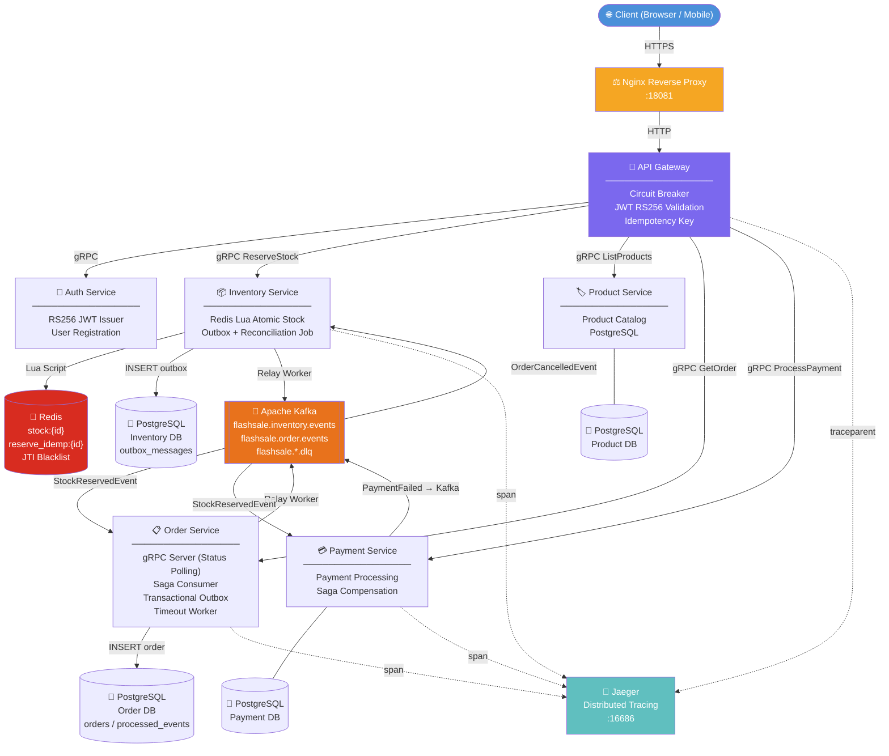

# ⚡ Mini Distributed Flash Sale System
### Go · Kafka · gRPC · Redis · PostgreSQL · OpenTelemetry & Jaeger

[](https://github.com/odealidj/go-distributed-flashsale-kf/actions/workflows/ci.yml)
[](https://go.dev/)
[](LICENSE)

A **production-grade microservices system** built to handle extreme concurrent traffic in Flash Sale scenarios — thousands of users competing to buy limited-stock items at the same time.

The core challenge: **prevent overselling** (stock going negative) while handling massive traffic spikes — achieving **sub-500ms latency at 3,000 Requests Per Second (RPS)** and guaranteeing absolute data consistency even under 5,000 concurrent users.

### 🏆 Core Engineering Skills
- **Distributed Systems Design:** Saga Pattern (Choreography), Transactional Outbox, Idempotency, Dead Letter Queues (DLQ).
- **High Concurrency & Synchronization:** Redis Lua Scripting for atomic operations, PostgreSQL Row-Level Locking (`SKIP LOCKED`).
- **Software Architecture:** Hexagonal Architecture (Ports and Adapters), Domain-Driven Design (DDD) principles.
- **Resilience & Reliability:** Circuit Breakers, Exponential Backoff Retries, Automated Reconciliation Jobs for self-healing.
- **Observability:** Distributed Tracing (OpenTelemetry + Jaeger) and RED Metrics (Prometheus + Grafana).

---

## Architecture Overview



---

## Tech Stack

| Layer | Technology | Why |
|---|---|---|
| **Language** | Go 1.21 | High concurrency, low memory, fast startup |
| **Framework** | Go-Kratos | gRPC + HTTP in one service |
| **Async Messaging** | Apache Kafka (KRaft, no Zookeeper) | Reliable event streaming, Saga choreography |
| **Cache & Lock** | Redis + Lua Script | Atomic stock deduction, O(1), zero oversell |
| **Database** | PostgreSQL + sqlx | Transactional Outbox, Idempotency guard |
| **Auth** | JWT RS256 Asymmetric | Stateless validation, no DB hit on every request |
| **Observability** | OpenTelemetry, Prometheus, Grafana, Jaeger | Distributed trace & metrics across all services |
| **Testing** | Testify + Testcontainers-Go + k6 | Unit, Integration, Load testing |
| **Container** | Docker Compose | Full local dev environment in one command |

---

## Key Features & Engineering Decisions

### 🏗️ Architected with Hexagonal Architecture (Ports and Adapters)
Designed each microservice with strict separation of concerns. Core domain logic is entirely isolated from external dependencies. Adapters (Kafka, PostgreSQL, Redis, gRPC) are injected via Dependency Injection, making the codebase highly testable and agnostic to infrastructure changes.

### 🔴 Engineered a Zero-Oversell Mechanism (Atomic Lua Script)
PostgreSQL `UPDATE stock` collapses under thousands of concurrent writes due to lock contention. To solve this, **I engineered stock deductions to run entirely inside a Redis Lua Script** — executing atomically and single-threaded. This guarantees absolute data consistency (zero oversell) under massive concurrency.

### 🔵 Orchestrated Distributed Transactions (Saga Choreography)
Eliminated the need for slow 2-Phase Commits (2PC) or distributed locks. Services react independently to Kafka events:
`Inventory Reserved → Order Created → Payment Processed → (if fail) → Refund Stock`

### 🔁 Implemented Automated Self-Healing (Saga Compensation)
Designed an automated compensation flow for unhappy paths. If a payment fails or an order times out, the system automatically publishes an `OrderCancelledEvent`. The Inventory service consumes this and restores the stock atomically. All compensation steps are built to be **100% idempotent**.

### 🟢 Solved the Dual-Write Problem (Transactional Outbox)
Prevented data inconsistencies between the database and the message broker. **Implemented the Transactional Outbox pattern** by writing business state and Kafka events into the same PostgreSQL transaction. A background Relay Worker guarantees at-least-once delivery to Kafka.

### 🟡 Built a Two-Layer Idempotency Guard
- **Layer 1 (Cache):** Fast-rejection in Redis (`reserve_idemp:{eventID}`) prevents double stock deduction on network retries.
- **Layer 2 (Database):** Persistent `processed_events` table in PostgreSQL prevents duplicate order creation from Kafka redeliveries.

### 🟠 Engineered a Crash Recovery Reconciliation Job
If a service crashes **after** cutting Redis stock but **before** writing to the PostgreSQL outbox, stock is "leaked". I implemented a background cron job that continually compares Redis idempotency keys against database outbox records, automatically refunding any detected inconsistencies.

### 🔷 Prevented Cascading Failures (Circuit Breaker)
Implemented `sony/gobreaker` in the API Gateway. If a downstream service degrades, the circuit trips open, immediately returning errors instead of exhausting connection pools. Protects the entire ecosystem from catastrophic cascading failures.

### 📭 Guaranteed No Event Loss (Dead Letter Queue & Retry Backoff)
Configured Kafka consumers with an exponential backoff retry mechanism (500ms → 5s). If an event fails after 3 retries, it is gracefully routed to a dedicated DLQ (`flashsale.order.dlq`), ensuring zero data loss and enabling manual replay.

### 🔶 Secured with Hybrid JWT Auth (RS256 Asymmetric Cryptography)
Decoupled token validation from the database. The **Auth Service** signs tokens with `private.pem`, while the **API Gateway** validates them independently using `public.pem`. Includes a Redis-based JTI blacklist for secure logout invalidation.

### 📡 Integrated Comprehensive Observability (OpenTelemetry)
Injected W3C `traceparent` context into every request, propagating through:
`HTTP Header → gRPC Metadata → Kafka Record Header`.
Enables full end-to-end distributed tracing in **Jaeger**. Additionally, collected RED (Rate, Errors, Duration) metrics via OpenTelemetry Collector, aggregated in **Prometheus**, and visualized on **Grafana**.

### 🔒 Implemented Race-Condition Safe Background Workers
Designed background timeout workers using PostgreSQL `FOR UPDATE SKIP LOCKED`. This pessimistic row-level lock safely allows multiple worker instances to run concurrently without deadlocks or overlapping executions—perfect for horizontal scaling in Kubernetes.

### 🧪 Automated with Real-Container Integration Testing
Avoided fragile mocks by testing Kafka, Redis, and PostgreSQL integrations against **real ephemeral containers** using Testcontainers-Go. Achieved high confidence by simulating 150 concurrent goroutines to assert the anti-oversell logic mathematically.

### 📊 K6 Performance Thresholds — Automated QoS Validation
k6 load tests include strict thresholds (`p(95) < 500ms`, `error_rate < 0.01`) that act as automated quality gates. If the system degrades under load, tests fail immediately — no manual analysis needed.

### 🛡️ High Availability & Chaos Testing (Production Setup)
The system includes a dedicated `docker-compose.prod.yml` that simulates a robust production environment. It features **Redis Sentinel (1 Master, 2 Replicas, 3 Sentinels)** for automatic failover. You can run k6 load tests while randomly killing the Redis Master container (`docker kill flashsale-redis-master`) to witness true zero-downtime auto-recovery.

---

## Project Structure

```
flashsale-kf-basic-go/
├── api-gateway/           # Entry point: HTTP → gRPC routing, JWT validation, Circuit Breaker
├── inventory-service/     # Stock management: Redis Lua, Outbox, Reconciliation Job
├── order-service/         # Order lifecycle: Saga consumer, Timeout worker, Outbox relay
├── payment-service/       # Payment processing: Saga compensation trigger
├── product-service/       # Product catalog: Read-only, PostgreSQL
├── auth-service/          # JWT issuer: RS256 signing, user registration/login
├── shared/                # Shared packages: telemetry, outbox relay, resilience, DB pool
├── proto/                 # Protocol Buffers: compiled .pb.go files for all services
├── performance-tests/     # k6 load test scripts + results
├── docs/                  # Architecture, ADR, API, observability documentation
├── docker-compose.yml     # Full local environment: Kafka, Redis, PostgreSQL x5, Jaeger
└── docker-compose.prod.yml# Production environment: Redis Sentinel HA + Kafka
```

---

## Quick Start

> **⚠️ Note:** Secrets (`.env` and `certs/*.pem`) are intentionally committed purely for demonstration and easy local setup.
> **💡 Local Infra Note:** The provided `docker-compose.yml` has been optimized for **Local Load Testing** (Kafka Heap is limited to 1GB, Redis maxmemory is limited to 512MB, and Kafka topics are pre-created with 10 partitions). Do NOT use this exact configuration for production.
```bash
# 1. Clone the repository
git clone https://github.com/odealidj/go-distributed-flashsale-kf.git
cd go-distributed-flashsale-kf

# 2. Start everything (infrastructure + all microservices)
make prod-up

# 3. Stop everything
make prod-down
```

**Services will be available at:**
| Service | URL |
|---|---|
| API Gateway (via Nginx) | `http://localhost:18081` |
| Jaeger UI (Distributed Tracing) | `http://localhost:16686` |
| Grafana (Metrics Dashboard) | `http://localhost:3000` (Login: `admin` / `admin`) |
| Prometheus | `http://localhost:9090` |
| Kafka UI | `http://localhost:18080` |

---

## Make Commands

| Command | Description |
|---|---|
| `make up` | Start infrastructure (Docker) + all Go microservices |
| `make down` | Stop all microservices + infrastructure |
| `make prod-up` | Start production infrastructure (Redis Sentinel HA + Kafka) |
| `make prod-down` | Stop production infrastructure |
| `make infra-up` | Start only Docker infra (for IDE debugging) |
| `make run-all` | Start all 6 Go services in background (Docker) |
| `make stop-all` | Stop all Go services (Docker) |
| `make run-local-all` | Run all 6 Go services locally on host (nohup) |
| `make stop-local-all` | Stop all local Go services on host |
| `make proto` | Recompile all `.proto` files to Go code |

---

## API Usage

> [!TIP]
> **OpenAPI / Swagger Documentation**
> - **Swagger UI**: You can access the interactive Swagger UI directly in your browser at `http://localhost:18082`.
> - **YAML Specification**: You can find the complete API specification in [docs/openapi.yaml](docs/openapi.yaml). You can import this file directly into **Postman**, **Insomnia**, or **Swagger Editor** to test all endpoints!

All APIs are available through the **API Gateway** at `http://localhost:18081`.

### Register
```bash
curl -X POST http://localhost:18081/api/v1/register \
  -H "Content-Type: application/json" \
  -d '{"username": "user1", "password": "password123"}'
```

### Login — Get JWT Token
```bash
curl -X POST http://localhost:18081/api/v1/login \
  -H "Content-Type: application/json" \
  -d '{"username": "user1", "password": "password123"}'
```

### Get Products
```bash
curl http://localhost:18081/api/v1/products?page=1&per_page=10
```

### Checkout (Reserve Stock)
We provide two checkout endpoints depending on your client needs:

#### 1. Pub/Sub (Asynchronous)
Best for high-throughput, returns immediately after queuing the event.
```bash
curl -X POST http://localhost:18081/api/v1/checkout/pubsub \
  -H "Content-Type: application/json" \
  -H "Authorization: Bearer <YOUR_TOKEN>" \
  -H "X-Idempotency-Key: $(uuidgen)" \
  -d '{"product_id": "prod_1"}'
```
**Response `202 Accepted`** — checkout queued successfully:
```json
{
  "meta": { 
    "trace_id": "...", 
    "event_id": "abc-123", 
    "message": "pesanan sedang diproses" 
  },
  "data": {
    "order_id": "abc-123"
  }
}
```

#### 2. Long-Polling (Synchronous Illusion)
Waits up to 5 seconds for the Saga to complete before returning.
```bash
curl -X POST http://localhost:18081/api/v1/checkout/long-polling \
  -H "Content-Type: application/json" \
  -H "Authorization: Bearer <YOUR_TOKEN>" \
  -H "X-Idempotency-Key: $(uuidgen)" \
  -d '{"product_id": "prod_1"}'
```
**Response `200 OK`** (if finished within 5s) or **`202 Accepted`** (if still processing).

> **Note on Polling:** If using pubsub or if long-polling returns 202, the checkout is asynchronous. Use the `order_id` from the response to poll the status before paying.

### Check Order Status (Polling)
```bash
curl http://localhost:18081/api/v1/orders/<ORDER_ID> \
  -H "Authorization: Bearer <YOUR_TOKEN>"
```

**Response `200 OK`**:
```json
{
  "meta": { "trace_id": "...", "message": "success" },
  "data": { "order_id": "<ORDER_ID>", "status": "PENDING", "total_amount": 150000 }
}
```

### Pay Order
```bash
curl -X POST http://localhost:18081/api/v1/pay \
  -H "Content-Type: application/json" \
  -H "Authorization: Bearer <YOUR_TOKEN>" \
  -d '{"order_id": "<ORDER_ID>", "amount": 150000}'
```
> 💡 Tip: If `amount` ends with `4` (e.g., `150004`), payment will **intentionally fail** and trigger the Saga Compensation (automatic stock refund).

---

## Test Data (Seed / Cleanup)

```bash
# Add dummy products to PostgreSQL + Redis stock
./scripts/manage_test_data.sh seed

# Clean up all dummy data
./scripts/manage_test_data.sh cleanup
```

---

## Performance Test Results

Load tested with **Grafana k6** on a full containerized environment.

| Scenario | Total Requests | Concurrency / Load | P95 Latency | Result |
|---|---|---|---|---|
| 🌊 **Thundering Herd** | 135,981 | 500 VUs (~3000 RPS) | **7.46ms** | ✅ PASS — 0.00% 5xx Error |
| 🔄 **Idempotency Test** | 600 (3x per user) | 200 VUs | **118.37ms** | ✅ PASS — 0 duplicates |
| 🚫 **No-Oversell Assert** | 5,000 | 5,000 VUs | **369.15ms** | ✅ PASS — exact stock match |
| 🚀 **Absolute Breakpoint (Prod)**| 156,019 | Ramp to **3,000 RPS** | **364ms** | ✅ PASS — **0.00% Error** |

```text
╔══════════════════════════════════════════════════════════╗
║              HASIL PENCARIAN BREAKPOINT                  ║
╠══════════════════════════════════════════════════════════╣
║ Total Request Terkirim      : 156019                    ║
║ 🛒 Checkout Sukses (202)    : 154659                    ║
║ 🚫 Stok Habis (409)         :  1358                    ║
║ 💀 Error Sistem (500/Timeout):  0.00 %                  ║
║ ⚡ P95 Latency API Checkout  :   364 ms                  ║
╚══════════════════════════════════════════════════════════╝
```

### 🛠️ How to Reproduce the Load Test
You can easily verify these claims on your local machine using the provided `Makefile`.

1. **Start Production Infrastructure** (Redis Sentinel HA + Kafka):
   ```bash
   make prod-up
   ```
2. **Seed Initial Stock**:
   ```bash
   make seed-stock-soak-prod
   ```
3. **Run a Scenario** (e.g., The Golden No-Oversell Test):
   ```bash
   make test-no-oversell
   # Or run: make test-breakpoint / make test-load-nginx
   ```
> 📖 **Read the guide:** Check out the [K6 Results Reading Tutorial](performance-tests/TUTORIAL_MEMBACA_HASIL_K6.md) to understand how to interpret the console output.

---

## Deep-Dive Technical Documentation

I have extensively documented every architectural decision, infrastructure configuration, and data contract in this repository. These documents serve as a blueprint for the entire system design:

| Focus Area | Document | Description |
|---|---|---|
| **Master Blueprint** | [`docs/BLUEPRINT.md`](docs/BLUEPRINT.md) | **Start Here:** A complete, technology-agnostic blueprint of the entire Flash Sale system architecture. |
| **System Overview** | [`docs/architecture/system-architecture.md`](docs/architecture/system-architecture.md) | High-level topology, component diagrams, and traffic flow. |
| **Domain Logic** | [`docs/architecture/domain-architecture.md`](docs/architecture/domain-architecture.md) | C4 Model, bounded contexts, and service responsibilities. |
| **Saga Pattern** | [`docs/architecture/checkout-saga.md`](docs/architecture/checkout-saga.md) | Step-by-step Mermaid diagrams of the happy path, compensation, and reconciliation flows. |
| **Reliability** | [`docs/architecture/resilience-patterns.md`](docs/architecture/resilience-patterns.md) | In-depth look at Circuit Breakers, Retry policies, DLQ, and Graceful Shutdowns. |
| **Background Jobs** | [`docs/architecture/background-workers.md`](docs/architecture/background-workers.md) | Details on the Relay, Timeout, and Reconciliation workers. |
| **Clean Code** | [`docs/implementation/go-hexagonal-architecture.md`](docs/implementation/go-hexagonal-architecture.md) | How Ports and Adapters are structured in this Go monorepo. |
| **Data & Storage** | [`docs/database/logical-data-model.md`](docs/database/logical-data-model.md) | Database schemas, ACID transaction boundaries, and Redis cache structures. |
| **Event Streaming** | [`docs/events/kafka-operational-design.md`](docs/events/kafka-operational-design.md) | Kafka topic design, consumer groups, offsets, and Idempotency handling. |
| **APIs** | [`docs/grpc/grpc-contracts.md`](docs/grpc/grpc-contracts.md) | Protobuf contracts and internal RPC communication strategies. |
| **Infrastructure** | [`docs/deployment/docker-compose-deep-dive.md`](docs/deployment/docker-compose-deep-dive.md) | Line-by-line explanation of the entire Docker infrastructure and observability stack. |

---

## Architecture Decision Records (ADRs)

Key architectural decisions are documented transparently:

| ADR | Decision | Status |
|---|---|---|
| ADR-001 | Redis Lua Script for atomic stock deduction | ✅ Accepted |
| ADR-002 | Kafka Saga Choreography for distributed transactions | ✅ Accepted |
| ADR-003 | Hexagonal Architecture per service | ✅ Accepted |
| ADR-004 | Two-layer idempotency (Redis + PostgreSQL) | ✅ Accepted |
| ADR-005 | Circuit Breaker + Retry + DLQ patterns | ✅ Accepted |
| ADR-006 | Reconciliation Job for crash recovery | ✅ Accepted |

---

<p align="center">Built with ❤️ to demonstrate production-grade distributed system design in Go</p>
