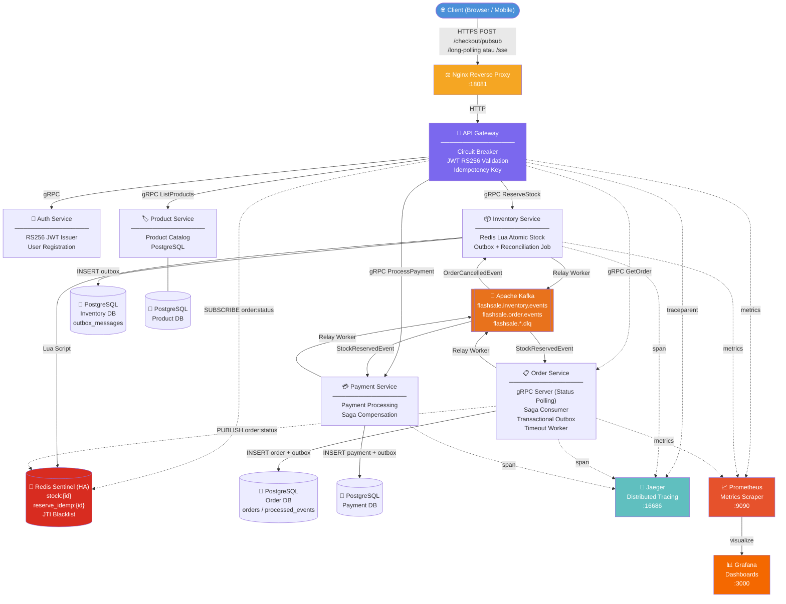

# Architecture Overview (Async-to-Sync Bridging)

Dokumen ini menjelaskan modifikasi arsitektur khusus untuk pendekatan *Async-to-Sync* pada endpoint Checkout (seperti `/checkout/long-polling`, `/checkout/sse`, dan `/checkout/pubsub`).

Di arsitektur standar, API Gateway merespons asinkron (202 Accepted) lalu klien harus melakukan Short Polling ke GET `/orders/{order_id}`.
Pada arsitektur modifikasi ini, API Gateway menjembatani proses asinkron Kafka menjadi sinkron di mata klien.

[🔍 Buka di Mermaid Live Editor (Gunakan Klik Kanan -> Open in New Tab)](https://mermaid.live/edit#base64:eyJjb2RlIjoiZ3JhcGggVERcbiAgICBDbGllbnQoW1wi8J+MkCBDbGllbnQgKEJyb3dzZXIgLyBNb2JpbGUpXCJdKVxuICAgIE5naW54W1wi4pqW77iPIE5naW54IFJldmVyc2UgUHJveHlcXG46MTgwODFcIl1cbiAgICBHV1tcIvCfmqogQVBJIEdhdGV3YXlcXG7ilIDilIDilIDilIDilIDilIDilIDilIDilIDilIDilIDilIDilIDilIDilIDilIDilIBcXG5DaXJjdWl0IEJyZWFrZXJcXG5KV1QgUlMyNTYgVmFsaWRhdGlvblxcbklkZW1wb3RlbmN5IEtleVwiXVxuICAgIEF1dGhbXCLwn5SQIEF1dGggU2VydmljZVxcbuKUgOKUgOKUgOKUgOKUgOKUgOKUgOKUgOKUgOKUgOKUgOKUgOKUgOKUgOKUgOKUgOKUgFxcblJTMjU2IEpXVCBJc3N1ZXJcXG5Vc2VyIFJlZ2lzdHJhdGlvblwiXVxuICAgIEludmVudG9yeVtcIvCfk6YgSW52ZW50b3J5IFNlcnZpY2VcXG7ilIDilIDilIDilIDilIDilIDilIDilIDilIDilIDilIDilIDilIDilIDilIDilIDilIBcXG5SZWRpcyBMdWEgQXRvbWljIFN0b2NrXFxuT3V0Ym94ICsgUmVjb25jaWxpYXRpb24gSm9iXCJdXG4gICAgUHJvZHVjdFtcIvCfj7fvuI8gUHJvZHVjdCBTZXJ2aWNlXFxu4pSA4pSA4pSA4pSA4pSA4pSA4pSA4pSA4pSA4pSA4pSA4pSA4pSA4pSA4pSA4pSA4pSAXFxuUHJvZHVjdCBDYXRhbG9nXFxuUG9zdGdyZVNRTFwiXVxuICAgIFJlZGlzWyhcIvCflLQgUmVkaXMgU2VudGluZWwgKEhBKVxcbnN0b2NrOntpZH1cXG5yZXNlcnZlX2lkZW1wOntpZH1cXG5KVEkgQmxhY2tsaXN0XCIpXVxuICAgIE9yZGVyW1wi8J+TiyBPcmRlciBTZXJ2aWNlXFxu4pSA4pSA4pSA4pSA4pSA4pSA4pSA4pSA4pSA4pSA4pSA4pSA4pSA4pSA4pSA4pSA4pSAXFxuZ1JQQyBTZXJ2ZXIgKFN0YXR1cyBQb2xsaW5nKVxcblNhZ2EgQ29uc3VtZXJcXG5UcmFuc2FjdGlvbmFsIE91dGJveFxcblRpbWVvdXQgV29ya2VyXCJdXG4gICAgUGF5bWVudFtcIvCfkrMgUGF5bWVudCBTZXJ2aWNlXFxu4pSA4pSA4pSA4pSA4pSA4pSA4pSA4pSA4pSA4pSA4pSA4pSA4pSA4pSA4pSA4pSA4pSAXFxuUGF5bWVudCBQcm9jZXNzaW5nXFxuU2FnYSBDb21wZW5zYXRpb25cIl1cbiAgICBLYWZrYVtbXCLwn5OoIEFwYWNoZSBLYWZrYVxcbmZsYXNoc2FsZS5pbnZlbnRvcnkuZXZlbnRzXFxuZmxhc2hzYWxlLm9yZGVyLmV2ZW50c1xcbmZsYXNoc2FsZS4qLmRscVwiXV1cbiAgICBQR19JTlZbKFwi8J+QmCBQb3N0Z3JlU1FMXFxuSW52ZW50b3J5IERCXFxub3V0Ym94X21lc3NhZ2VzXCIpXVxuICAgIFBHX09SRFsoXCLwn5CYIFBvc3RncmVTUUxcXG5PcmRlciBEQlxcbm9yZGVycyAvIHByb2Nlc3NlZF9ldmVudHNcIildXG4gICAgUEdfUEFZWyhcIvCfkJggUG9zdGdyZVNRTFxcblBheW1lbnQgREJcIildXG4gICAgUEdfUFJEWyhcIvCfkJggUG9zdGdyZVNRTFxcblByb2R1Y3QgREJcIildXG4gICAgSmFlZ2VyW1wi8J+UrSBKYWVnZXJcXG5EaXN0cmlidXRlZCBUcmFjaW5nXFxuOjE2Njg2XCJdXG4gICAgUHJvbWV0aGV1c1tcIvCfk4ggUHJvbWV0aGV1c1xcbk1ldHJpY3MgU2NyYXBlclxcbjo5MDkwXCJdXG4gICAgR3JhZmFuYVtcIvCfk4ogR3JhZmFuYVxcbkRhc2hib2FyZHNcXG46MzAwMFwiXVxuXG4gICAgQ2xpZW50IC0tXHUwMDNlfEhUVFBTIFBPU1QgL2NoZWNrb3V0L3B1YnN1Ylx1MDAzY2JyL1x1MDAzZS9sb25nLXBvbGxpbmcgYXRhdSAvc3NlfCBOZ2lueFxuICAgIE5naW54IC0tXHUwMDNlfEhUVFB8IEdXXG4gICAgR1cgLS1cdTAwM2V8Z1JQQ3wgQXV0aFxuICAgIEdXIC0tXHUwMDNlfGdSUEMgUmVzZXJ2ZVN0b2NrfCBJbnZlbnRvcnlcbiAgICBHVyAtLVx1MDAzZXxnUlBDIExpc3RQcm9kdWN0c3wgUHJvZHVjdFxuICAgIEdXIC0uLVx1MDAzZXxTVUJTQ1JJQkUgb3JkZXI6c3RhdHVzfCBSZWRpc1xuICAgIEdXIC0uLVx1MDAzZXxnUlBDIEdldE9yZGVyfCBPcmRlclxuICAgIEdXIC0tXHUwMDNlfGdSUEMgUHJvY2Vzc1BheW1lbnR8IFBheW1lbnRcbiAgICBJbnZlbnRvcnkgLS1cdTAwM2V8THVhIFNjcmlwdHwgUmVkaXNcbiAgICBJbnZlbnRvcnkgLS1cdTAwM2V8SU5TRVJUIG91dGJveHwgUEdfSU5WXG4gICAgSW52ZW50b3J5IC0tXHUwMDNlfFJlbGF5IFdvcmtlcnwgS2Fma2FcbiAgICBQcm9kdWN0IC0tLSBQR19QUkRcbiAgICBLYWZrYSAtLVx1MDAzZXxTdG9ja1Jlc2VydmVkRXZlbnR8IE9yZGVyXG4gICAgS2Fma2EgLS1cdTAwM2V8T3JkZXJDYW5jZWxsZWRFdmVudHwgSW52ZW50b3J5XG4gICAgT3JkZXIgLS1cdTAwM2V8SU5TRVJUIG9yZGVyICsgb3V0Ym94fCBQR19PUkRcbiAgICBPcmRlciAtLi1cdTAwM2V8UFVCTElTSCBvcmRlcjpzdGF0dXN8IFJlZGlzXG4gICAgT3JkZXIgLS1cdTAwM2V8UmVsYXkgV29ya2VyfCBLYWZrYVxuICAgIEthZmthIC0tXHUwMDNlfFN0b2NrUmVzZXJ2ZWRFdmVudHwgUGF5bWVudFxuICAgIFBheW1lbnQgLS1cdTAwM2V8SU5TRVJUIHBheW1lbnQgKyBvdXRib3h8IFBHX1BBWVxuICAgIFBheW1lbnQgLS1cdTAwM2V8UmVsYXkgV29ya2VyfCBLYWZrYVxuXG4gICAgR1cgLS4tXHUwMDNlfHRyYWNlcGFyZW50fCBKYWVnZXJcbiAgICBJbnZlbnRvcnkgLS4tXHUwMDNlfHNwYW58IEphZWdlclxuICAgIE9yZGVyIC0uLVx1MDAzZXxzcGFufCBKYWVnZXJcbiAgICBQYXltZW50IC0uLVx1MDAzZXxzcGFufCBKYWVnZXJcbiAgICBHVyAtLi1cdTAwM2V8bWV0cmljc3wgUHJvbWV0aGV1c1xuICAgIEludmVudG9yeSAtLi1cdTAwM2V8bWV0cmljc3wgUHJvbWV0aGV1c1xuICAgIE9yZGVyIC0uLVx1MDAzZXxtZXRyaWNzfCBQcm9tZXRoZXVzXG4gICAgUHJvbWV0aGV1cyAtLVx1MDAzZXx2aXN1YWxpemV8IEdyYWZhbmFcblxuICAgIHN0eWxlIENsaWVudCBmaWxsOiM0QTkwRDksY29sb3I6I2ZmZlxuICAgIHN0eWxlIE5naW54IGZpbGw6I0Y1QTYyMyxjb2xvcjojZmZmXG4gICAgc3R5bGUgR1cgZmlsbDojN0I2OEVFLGNvbG9yOiNmZmZcbiAgICBzdHlsZSBLYWZrYSBmaWxsOiNFODcyMUMsY29sb3I6I2ZmZlxuICAgIHN0eWxlIFJlZGlzIGZpbGw6I0Q4MkMyMCxjb2xvcjojZmZmXG4gICAgc3R5bGUgSmFlZ2VyIGZpbGw6IzYwQkZCRixjb2xvcjojZmZmXG4gICAgc3R5bGUgUHJvbWV0aGV1cyBmaWxsOiNFNjUyMkMsY29sb3I6I2ZmZlxuICAgIHN0eWxlIEdyYWZhbmEgZmlsbDojRjQ2ODAwLGNvbG9yOiNmZmYiLCJtZXJtYWlkIjoie1xuICBcInRoZW1lXCI6IFwiZGVmYXVsdFwiXG59IiwiYXV0b1N5bmMiOnRydWUsInVwZGF0ZURpYWdyYW0iOnRydWV9)

Pada diagram di atas, terdapat tambahan alur untuk menjembatani sistem *Event-Driven* yang asinkron menjadi API sinkron:

Ada 3 metode yang disediakan API Gateway:

### 1. Endpoint `/checkout/pubsub`
1. `API Gateway` memanggil *command* checkout terlebih dahulu untuk memvalidasi dan mereservasi stok secara O(1). Jika stok habis, proses ditolak seketika (`409 Conflict`) tanpa membebani koneksi Pub/Sub.
2. Jika stok aman, `API Gateway` melakukan `SUBSCRIBE order:status:{event_id}` ke `Redis Sentinel`. Kemudian Gateway mengeksekusi *Fast-Path Check* ke Order Service sebagai pencegahan _race condition_ (apabila Kafka selesai lebih cepat dari proses subscribe).
3. `Order Service` mendengarkan Kafka, membuat order, lalu melakukan `PUBLISH order:status:{event_id}` ke `Redis Sentinel`.
4. `API Gateway` menerima pesan via _channel_ Pub/Sub, langsung terbangun *(unblocked)*, mengambil detail Order ke `Order Service`, dan mengembalikan `200 OK` secara instan. Jika Kafka/Order Service sedang _overload_ dan pesan tak kunjung datang selama 10 detik, Gateway memutus langganan dan mengembalikan `202 Accepted` (Timeout).
*(Paling optimal dan dianjurkan untuk production).*

### 2. Endpoint `/checkout/long-polling`
1. `API Gateway` mengirim _command_ checkout, lalu masuk ke dalam loop interval setiap 500ms.
2. Pada setiap loop, Gateway memanggil `gRPC GetOrder` ke `Order Service` untuk memeriksa apakah status order sudah berubah menjadi selain `PENDING` (atau status sudah ada di DB).
3. Jika sudah berstatus, loop berhenti dan mengembalikan `200 OK`. Jika lebih dari 10 detik, memutus koneksi dan merespons `202 Accepted` (timeout).
*(Kurang efisien karena membebani DB Order Service dengan query berulang secara terus menerus, tapi mudah diimplementasikan).*

### 3. Endpoint `/checkout/sse` (Server-Sent Events)
1. `API Gateway` membuka koneksi HTTP dengan header `text/event-stream`.
2. `API Gateway` memvalidasi stok dan melakukan `SUBSCRIBE order:status:{event_id}` ke `Redis Sentinel`.
3. Selama menunggu notifikasi dari Redis, ia cukup mengirimkan _keepalive payload_ secara periodik agar koneksi tidak diputus Nginx (tanpa melakukan *polling* ke DB Order).
4. Ketika pesanan siap (ada sinyal dari Redis), ia mengirimkan _data event_ berisi hasil Checkout dan langsung memutus stream secara elegan.
*(Bagus untuk klien browser yang mensupport EventSource native).*

---

## Narasi Alur Eksekusi per Endpoint (Langkah demi Langkah)

Untuk memahami bagaimana ketiga arsitektur ini bekerja dari perspektif request klien hingga database, berikut adalah urutan eksekusinya secara mendetail untuk masing-masing endpoint:

### A. Alur Eksekusi Endpoint `/checkout/pubsub`

1. **Inisiasi Klien:** Pengguna menekan tombol "Beli". Klien mengirimkan HTTP POST ke `/api/v1/checkout/pubsub`. Request melewati *Nginx* menuju *API Gateway*.
2. **Validasi JWT & Reservasi Stok:** *API Gateway* memvalidasi token JWT pengguna. Gateway kemudian mengirim perintah gRPC ke `Inventory Service` untuk reservasi stok secara atomik di *Redis Sentinel*. Jika stok habis, langsung merespons `409 Conflict` (sehingga efisien memutus proses dari awal).
3. **Subscribe & Fast-Path:** Jika stok aman, *API Gateway* melakukan `SUBSCRIBE` ke Redis menggunakan _channel_ berdasarkan `event_id`. Gateway segera mengeksekusi "Fast-Path Double Check" ke `Order Service` untuk mencegah *race condition* jika Kafka sudah selesai duluan. Jika belum ada di Order, *Goroutine* HTTP ini ditahan (_blocked_ menunggu *channel*).
4. **Propagasi Kafka:** *Relay Worker* di `Inventory Service` membaca tabel outbox secara asinkron dan menembakkan pesan ke topik Kafka `flashsale.inventory.events`.
5. **Pembuatan Order & Publish:** `Order Service` menangkap pesan Kafka, memasukkan data pesanan ke database dengan status `PENDING`, dan seketika itu juga melakukan `PUBLISH` ke channel Redis yang sama dengan yang sedang didengarkan Gateway.
6. **Respons Sinkron / Fallback:** *API Gateway* terbangun dari blokirannya begitu ada pesan masuk. Ia segera melakukan panggilan gRPC singkat ke `Order Service` untuk mengambil detail pesanan akhir, lalu memberikan HTTP `200 OK` ke klien. (Namun, jika dalam 10 detik pesan tidak masuk, ia berasumsi sedang *overload* dan mengembalikan `202 Accepted` sebagai status *timeout* agar klien tidak *hang*).

*(Lewat modifikasi jembatan Pub/Sub ini, Klien merasa sedang menggunakan API sinkron (REST biasa) padahal di belakang memproses pesanan melalui antrian Kafka).*

### B. Alur Eksekusi Endpoint `/checkout/long-polling`

1. **Inisiasi Klien:** Pengguna menekan tombol "Beli". Klien mengirimkan HTTP POST ke `/api/v1/checkout/long-polling`.
2. **Validasi:** *API Gateway* memvalidasi token JWT pengguna.
3. **Reservasi Stok Atomik:** Sama seperti Pub/Sub, `Inventory Service` memotong stok via Redis dan menulis event ke outbox PostgreSQL.
4. **Loop Polling Internal:** Alih-alih melakukan Subscribe ke Redis, *API Gateway* langsung membuat _looping_ (perulangan) menggunakan `time.Sleep` (setiap 500ms).
5. **Pengecekan Status:** Pada setiap putaran loop, Gateway mengirimkan gRPC `GetOrder` ke `Order Service` untuk memeriksa apakah pesanan sudah tercatat di database Order.
6. **Propagasi (Background):** Di balik layar, pesan Kafka sedang diteruskan dari `Inventory Service` ke `Order Service` hingga akhirnya Order tercipta.
7. **Respons Sinkron:** Setelah sekian putaran loop, gRPC `GetOrder` akhirnya merespon dengan status selain kosong/error. Loop dihentikan, dan *API Gateway* mengembalikan HTTP `200 OK` ke klien. Jika lebih dari 10 detik belum ada hasil, ia memutus loop dan merespon HTTP `202 Accepted` (Timeout).

### C. Alur Eksekusi Endpoint `/checkout/sse` (Server-Sent Events)

1. **Inisiasi Klien:** Pengguna menekan tombol "Beli". Klien mengirimkan HTTP POST ke `/api/v1/checkout/sse`.
2. **Persiapan Streaming & Reservasi Stok:** *API Gateway* memvalidasi JWT, melakukan pemotongan stok ke Inventory, lalu mengatur header HTTP response menjadi `Content-Type: text/event-stream` agar koneksi dibiarkan terbuka terus menerus (_keep-alive_).
3. **Subscribe Redis & Fast-Path:** Sama seperti endpoint Pub/Sub, Gateway melakukan `SUBSCRIBE` ke Redis Channel dan mengeksekusi pengecekan Fast-Path agar event tak terlewat.
4. **Keep-Alive (Menunggu Event):** Gateway memasuki status menunggu di _channel_. Selama proses Kafka belum selesai dan _channel_ diam, Gateway menggunakan *ticker* (setiap 5 detik) murni untuk mengirimkan pesan dummy `: keepalive\n\n` ke klien agar koneksi tidak diputus oleh *Nginx* (tanpa mem-*polling* database).
5. **Propagasi (Background):** Pesan Kafka bergerak dari Inventory ke Order Service untuk menciptakan pesanan.
6. **Respons Streaming:** Ketika sinyal Pub/Sub masuk dari Order Service, *API Gateway* terbangun, menembak gRPC `GetOrder` (satu kali) untuk menyusun *payload event*, dan menuliskan string `data: {"order_id":"...", ...}\n\n` ke _stream_ klien.
7. **Penutupan Koneksi:** Setelah data terkirim, Gateway menghentikan loop, melakukan _flush_, menutup langganan Redis, dan menutup aliran (_stream_) HTTP secara normal.
