# Checkout Saga Design (Choreography-Based)

## 0. Pra-Kondisi: Register & Login

**Penjelasan Alur:**
- **Langkah 1-4 (Registrasi):** Klien mengirimkan request pendaftaran dengan `username` dan `password`. Nginx meneruskan request ke API Gateway (dengan pembatasan _rate limit_). Gateway memanggil Auth Service via gRPC untuk menyimpan *hash bcrypt* dari password ke database.
- **Langkah 5-8 (Login & Token Generation):** Klien melakukan login. Auth Service memvalidasi kredensial di database. Jika cocok, Auth Service menerbitkan JWT Token yang ditandatangani (_signed_) menggunakan kunci privat asimetris RSA. Token ini dikembalikan ke klien untuk otentikasi di request-request berikutnya.

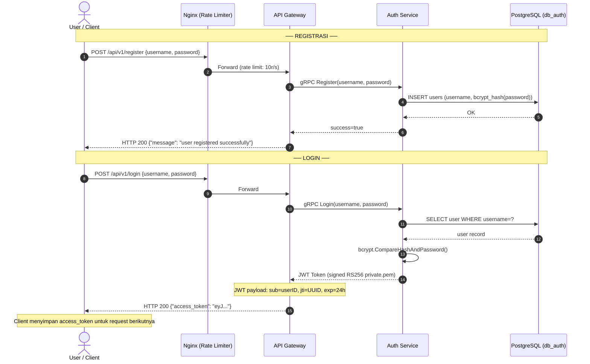

[🔍 Buka di Mermaid Live Editor (Gunakan Klik Kanan -> Open in New Tab)](https://mermaid.live/edit#base64:eyJjb2RlIjogInNlcXVlbmNlRGlhZ3JhbVxuICAgIGF1dG9udW1iZXJcbiAgICBhY3RvciBVIGFzIFVzZXIgLyBDbGllbnRcbiAgICBwYXJ0aWNpcGFudCBORyBhcyBOZ2lueCAoUmF0ZSBMaW1pdGVyKVxuICAgIHBhcnRpY2lwYW50IEdXIGFzIEFQSSBHYXRld2F5XG4gICAgcGFydGljaXBhbnQgQVUgYXMgQXV0aCBTZXJ2aWNlXG4gICAgcGFydGljaXBhbnQgREIgYXMgUG9zdGdyZVNRTCAoZGJfYXV0aClcblxuICAgIE5vdGUgb3ZlciBVLERCOiBcdTI1MDBcdTI1MDAgUkVHSVNUUkFTSSBcdTI1MDBcdTI1MDBcbiAgICBVLT4+Tkc6IFBPU1QgL2FwaS92MS9yZWdpc3RlciB7dXNlcm5hbWUsIHBhc3N3b3JkfVxuICAgIE5HLT4+R1c6IEZvcndhcmQgKHJhdGUgbGltaXQ6IDEwci9zKVxuICAgIEdXLT4+QVU6IGdSUEMgUmVnaXN0ZXIodXNlcm5hbWUsIHBhc3N3b3JkKVxuICAgIEFVLT4+REI6IElOU0VSVCB1c2VycyAodXNlcm5hbWUsIGJjcnlwdF9oYXNoKHBhc3N3b3JkKSlcbiAgICBEQi0tPj5BVTogT0tcbiAgICBBVS0tPj5HVzogc3VjY2Vzcz10cnVlXG4gICAgR1ctLT4+VTogSFRUUCAyMDAge1wibWVzc2FnZVwiOiBcInVzZXIgcmVnaXN0ZXJlZCBzdWNjZXNzZnVsbHlcIn1cblxuICAgIE5vdGUgb3ZlciBVLERCOiBcdTI1MDBcdTI1MDAgTE9HSU4gXHUyNTAwXHUyNTAwXG4gICAgVS0+Pk5HOiBQT1NUIC9hcGkvdjEvbG9naW4ge3VzZXJuYW1lLCBwYXNzd29yZH1cbiAgICBORy0+PkdXOiBGb3J3YXJkXG4gICAgR1ctPj5BVTogZ1JQQyBMb2dpbih1c2VybmFtZSwgcGFzc3dvcmQpXG4gICAgQVUtPj5EQjogU0VMRUNUIHVzZXIgV0hFUkUgdXNlcm5hbWU9P1xuICAgIERCLS0+PkFVOiB1c2VyIHJlY29yZFxuICAgIEFVLT4+QVU6IGJjcnlwdC5Db21wYXJlSGFzaEFuZFBhc3N3b3JkKClcbiAgICBBVS0tPj5HVzogSldUIFRva2VuIChzaWduZWQgUlMyNTYgcHJpdmF0ZS5wZW0pXG4gICAgTm90ZSBvdmVyIEdXOiBKV1QgcGF5bG9hZDogc3ViPXVzZXJJRCwganRpPVVVSUQsIGV4cD0yNGhcbiAgICBHVy0tPj5VOiBIVFRQIDIwMCB7XCJhY2Nlc3NfdG9rZW5cIjogXCJleUouLi5cIn1cbiAgICBOb3RlIG92ZXIgVTogQ2xpZW50IG1lbnlpbXBhbiBhY2Nlc3NfdG9rZW4gdW50dWsgcmVxdWVzdCBiZXJpa3V0bnlhIiwgIm1lcm1haWQiOiAie1xuICBcInRoZW1lXCI6IFwiZGVmYXVsdFwiXG59IiwgImF1dG9TeW5jIjogdHJ1ZSwgInVwZGF0ZURpYWdyYW0iOiB0cnVlfQ==)

## 1. Happy Path: Checkout & Payment Success
- **Checkout:** API Gateway -> Inventory Service (Redis Lua Script). Success -> HTTP 202 Accepted.
- **Async Order:** Relay Worker -> Kafka (`StockReservedEvent`) -> Order Service (Creates PENDING order).
- **Payment:** API Gateway -> Payment Service -> Kafka (`PaymentCompletedEvent`) -> Order Service (Updates to PAID).

Penyelesaian *Async Order* ke klien memiliki 3 variasi *(Async-to-Sync Bridging)*:

### 1A. Variasi PubSub (Paling Optimal)

**Penjelasan Alur:**
- **Langkah 1-3 (Inisiasi & Validasi):** Klien mengirimkan request checkout yang divalidasi oleh API Gateway.
- **Langkah 4-6 (Reservasi Stok / Fast Path):** Gateway memanggil Inventory. Inventory memotong stok di Redis secara atomik (menggunakan Lua Script) dan menyimpan pesan ke *outbox* database.
- **Langkah 7-8 (Blocking via Subscribe):** API Gateway menahan eksekusi (*block*) koneksi HTTP klien dengan melakukan `SUBSCRIBE` ke Redis menunggu penyelesaian.
- **Langkah 9-12 (Propagasi Asinkron):** Relay Worker mengambil pesan dari *outbox* dan mengirimkannya ke Kafka tanpa memblokir alur utama.
- **Langkah 13-16 (Pemrosesan Order):** Order Service mengkonsumsi pesan Kafka, menyimpan pesanan berstatus `PENDING`, lalu mem-`PUBLISH` sinyal keberhasilan ke channel Redis.
- **Langkah 17-19 (Resolusi Sinkron):** Sinyal tersebut membangunkan Gateway yang tadi tertidur. Gateway lalu melakukan satu _query_ ringan (`GetOrder`) untuk mengambil nominal detail pesanan dan membalas Klien dengan respons sinkron `200 OK`.

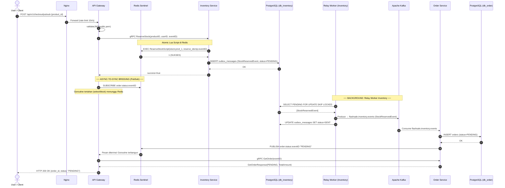

[🔍 Buka di Mermaid Live Editor (Gunakan Klik Kanan -> Open in New Tab)](https://mermaid.live/edit#base64:eyJjb2RlIjogInNlcXVlbmNlRGlhZ3JhbVxuICAgIGF1dG9udW1iZXJcbiAgICBhY3RvciBVIGFzIFVzZXIgLyBDbGllbnRcbiAgICBwYXJ0aWNpcGFudCBORyBhcyBOZ2lueFxuICAgIHBhcnRpY2lwYW50IEdXIGFzIEFQSSBHYXRld2F5XG4gICAgcGFydGljaXBhbnQgUkQgYXMgUmVkaXNcbiAgICBwYXJ0aWNpcGFudCBJIGFzIEludmVudG9yeSBTZXJ2aWNlXG4gICAgcGFydGljaXBhbnQgSURCIGFzIFBvc3RncmVTUUwgKGRiX2ludmVudG9yeSlcbiAgICBwYXJ0aWNpcGFudCBSVzEgYXMgUmVsYXkgV29ya2VyIChJbnZlbnRvcnkpXG4gICAgcGFydGljaXBhbnQgSyBhcyBBcGFjaGUgS2Fma2FcbiAgICBwYXJ0aWNpcGFudCBPIGFzIE9yZGVyIFNlcnZpY2VcbiAgICBwYXJ0aWNpcGFudCBPREIgYXMgUG9zdGdyZVNRTCAoZGJfb3JkZXIpXG5cbiAgICBVLT4+Tkc6IFBPU1QgL2FwaS92MS9jaGVja291dC9wdWJzdWIge3Byb2R1Y3RfaWR9XG4gICAgTkctPj5HVzogRm9yd2FyZCAocmF0ZSBsaW1pdCAxMHIvcylcbiAgICBHVy0+PkdXOiB2YWxpZGF0ZUpXVChwdWJsaWMucGVtKVxuICAgIEdXLT4+STogZ1JQQyBSZXNlcnZlU3RvY2socHJvZHVjdElELCB1c2VySUQsIGV2ZW50SUQpXG4gICAgXG4gICAgTm90ZSBvdmVyIEksUkQ6IEF0b21pYyBMdWEgU2NyaXB0IGRpIFJlZGlzXG4gICAgSS0+PlJEOiBFWEVDIFJlc2VydmVTdG9ja1NjcmlwdChzdG9jazpwcm9kXzEsIHJlc2VydmVfaWRlbXA6ZXZlbnRJRClcbiAgICBSRC0tPj5JOiAxIChTVUtTRVMpXG4gICAgXG4gICAgSS0+PklEQjogSU5TRVJUIG91dGJveF9tZXNzYWdlcyAoU3RvY2tSZXNlcnZlZEV2ZW50LCBzdGF0dXM9UEVORElORylcbiAgICBJREItLT4+STogT0tcbiAgICBJLS0+PkdXOiBzdWNjZXNzPXRydWVcbiAgICBcbiAgICBOb3RlIG92ZXIgR1csUkQ6IFx1MjUwMFx1MjUwMCBBU1lOQy1UTy1TWU5DIEJSSURHSU5HIChQdWJTdWIpIFx1MjUwMFx1MjUwMFxuICAgIEdXLT4+UkQ6IFNVQlNDUklCRSBvcmRlcjpzdGF0dXM6ZXZlbnRJRFxuICAgIE5vdGUgb3ZlciBHVzogR29yb3V0aW5lIHRlcnRhaGFuIChzZWxlY3QvYmxvY2spIG1lbnVuZ2d1IFJlZGlzXG5cbiAgICBOb3RlIG92ZXIgUlcxLEs6IFx1MjUwMFx1MjUwMCBCQUNLR1JPVU5EOiBSZWxheSBXb3JrZXIgSW52ZW50b3J5IFx1MjUwMFx1MjUwMFxuICAgIFJXMS0+PklEQjogU0VMRUNUIFBFTkRJTkcgRk9SIFVQREFURSBTS0lQIExPQ0tFRFxuICAgIElEQi0tPj5SVzE6IFtTdG9ja1Jlc2VydmVkRXZlbnRdXG4gICAgUlcxLT4+SzogUHJvZHVjZSBcdTIxOTIgZmxhc2hzYWxlLmludmVudG9yeS5ldmVudHMgKFN0b2NrUmVzZXJ2ZWRFdmVudClcbiAgICBSVzEtPj5JREI6IFVQREFURSBvdXRib3hfbWVzc2FnZXMgU0VUIHN0YXR1cz1TRU5UXG5cbiAgICBLLS0+Pk86IENvbnN1bWUgZmxhc2hzYWxlLmludmVudG9yeS5ldmVudHNcbiAgICBPLT4+T0RCOiBJTlNFUlQgb3JkZXJzIChzdGF0dXM9UEVORElORylcbiAgICBPREItLT4+TzogT0tcbiAgICBcbiAgICBPLT4+UkQ6IFBVQkxJU0ggb3JkZXI6c3RhdHVzOmV2ZW50SUQgXCJQRU5ESU5HXCJcbiAgICBSRC0tPj5HVzogUGVzYW4gZGl0ZXJpbWEhIEdvcm91dGluZSB0ZXJiYW5ndW5cbiAgICBcbiAgICBHVy0+Pk86IGdSUEMgR2V0T3JkZXIoZXZlbnRJRClcbiAgICBPLS0+PkdXOiBHZXRPcmRlclJlc3BvbnNlKFBFTkRJTkcsIFRvdGFsQW1vdW50KVxuICAgIEdXLS0+PlU6IEhUVFAgMjAwIE9LIHtvcmRlcl9pZCwgc3RhdHVzOiBcIlBFTkRJTkdcIn0iLCAibWVybWFpZCI6ICJ7XG4gIFwidGhlbWVcIjogXCJkZWZhdWx0XCJcbn0iLCAiYXV0b1N5bmMiOiB0cnVlLCAidXBkYXRlRGlhZ3JhbSI6IHRydWV9)

### 1B. Variasi Long-Polling

**Penjelasan Alur:**
- **Langkah 1-6 (Inisiasi & Reservasi):** Sama persis dengan metode Pub/Sub, request divalidasi, stok dipotong di Redis, lalu event masuk ke *outbox* PostgreSQL.
- **Langkah 7-9 (Looping Pengecekan):** Alih-alih melakukan *Subscribe* yang senyap, API Gateway secara agresif membuat perulangan (_loop_) yang memanggil `GetOrder` ke Order Service setiap 500ms.
- **Langkah 10-13 (Propagasi Latar Belakang):** Sementara Gateway terus me-_looping_, Relay Worker memindahkan pesan ke Kafka dan Order Service menyimpannya ke database secara asinkron.
- **Langkah 14-16 (Resolusi Sinkron):** Pada putaran loop kesekian kalinya, pemanggilan `GetOrder` akhirnya membuahkan hasil. Gateway segera memutus loop dan merespons Klien. (Jika terlalu lama, loop diputus paksa _timeout_ dengan HTTP 202).

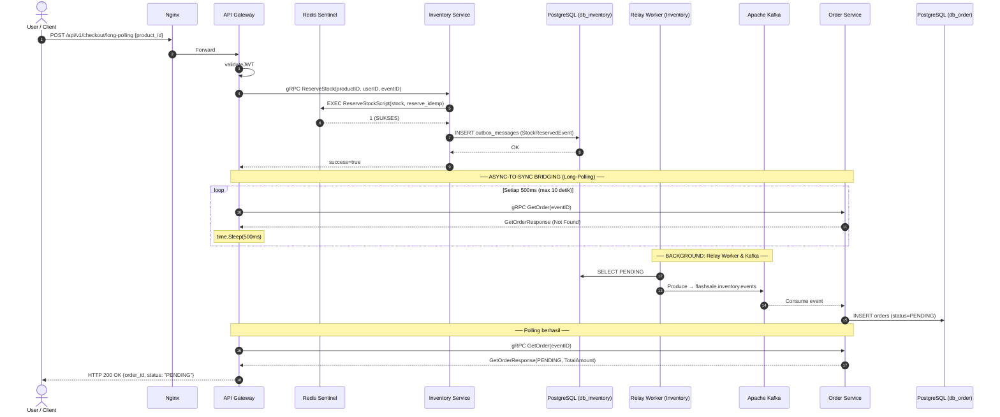

[🔍 Buka di Mermaid Live Editor (Gunakan Klik Kanan -> Open in New Tab)](https://mermaid.live/edit#base64:eyJjb2RlIjogInNlcXVlbmNlRGlhZ3JhbVxuICAgIGF1dG9udW1iZXJcbiAgICBhY3RvciBVIGFzIFVzZXIgLyBDbGllbnRcbiAgICBwYXJ0aWNpcGFudCBORyBhcyBOZ2lueFxuICAgIHBhcnRpY2lwYW50IEdXIGFzIEFQSSBHYXRld2F5XG4gICAgcGFydGljaXBhbnQgUkQgYXMgUmVkaXNcbiAgICBwYXJ0aWNpcGFudCBJIGFzIEludmVudG9yeSBTZXJ2aWNlXG4gICAgcGFydGljaXBhbnQgSURCIGFzIFBvc3RncmVTUUwgKGRiX2ludmVudG9yeSlcbiAgICBwYXJ0aWNpcGFudCBSVzEgYXMgUmVsYXkgV29ya2VyIChJbnZlbnRvcnkpXG4gICAgcGFydGljaXBhbnQgSyBhcyBBcGFjaGUgS2Fma2FcbiAgICBwYXJ0aWNpcGFudCBPIGFzIE9yZGVyIFNlcnZpY2VcbiAgICBwYXJ0aWNpcGFudCBPREIgYXMgUG9zdGdyZVNRTCAoZGJfb3JkZXIpXG5cbiAgICBVLT4+Tkc6IFBPU1QgL2FwaS92MS9jaGVja291dC9sb25nLXBvbGxpbmcge3Byb2R1Y3RfaWR9XG4gICAgTkctPj5HVzogRm9yd2FyZFxuICAgIEdXLT4+R1c6IHZhbGlkYXRlSldUXG4gICAgR1ctPj5JOiBnUlBDIFJlc2VydmVTdG9jayhwcm9kdWN0SUQsIHVzZXJJRCwgZXZlbnRJRClcbiAgICBcbiAgICBJLT4+UkQ6IEVYRUMgUmVzZXJ2ZVN0b2NrU2NyaXB0KHN0b2NrLCByZXNlcnZlX2lkZW1wKVxuICAgIFJELS0+Pkk6IDEgKFNVS1NFUylcbiAgICBJLT4+SURCOiBJTlNFUlQgb3V0Ym94X21lc3NhZ2VzIChTdG9ja1Jlc2VydmVkRXZlbnQpXG4gICAgSURCLS0+Pkk6IE9LXG4gICAgSS0tPj5HVzogc3VjY2Vzcz10cnVlXG4gICAgXG4gICAgTm90ZSBvdmVyIEdXLE86IFx1MjUwMFx1MjUwMCBBU1lOQy1UTy1TWU5DIEJSSURHSU5HIChMb25nLVBvbGxpbmcpIFx1MjUwMFx1MjUwMFxuICAgIGxvb3AgU2V0aWFwIDUwMG1zIChtYXggMTAgZGV0aWspXG4gICAgICAgIEdXLT4+TzogZ1JQQyBHZXRPcmRlcihldmVudElEKVxuICAgICAgICBPLS0+PkdXOiBHZXRPcmRlclJlc3BvbnNlIChOb3QgRm91bmQpXG4gICAgICAgIE5vdGUgb3ZlciBHVzogdGltZS5TbGVlcCg1MDBtcylcbiAgICBlbmRcblxuICAgIE5vdGUgb3ZlciBSVzEsSzogXHUyNTAwXHUyNTAwIEJBQ0tHUk9VTkQ6IFJlbGF5IFdvcmtlciAmIEthZmthIFx1MjUwMFx1MjUwMFxuICAgIFJXMS0+PklEQjogU0VMRUNUIFBFTkRJTkdcbiAgICBSVzEtPj5LOiBQcm9kdWNlIFx1MjE5MiBmbGFzaHNhbGUuaW52ZW50b3J5LmV2ZW50c1xuICAgIEstLT4+TzogQ29uc3VtZSBldmVudFxuICAgIE8tPj5PREI6IElOU0VSVCBvcmRlcnMgKHN0YXR1cz1QRU5ESU5HKVxuICAgIFxuICAgIE5vdGUgb3ZlciBHVyxPOiBcdTI1MDBcdTI1MDAgUG9sbGluZyBiZXJoYXNpbCBcdTI1MDBcdTI1MDBcbiAgICBHVy0+Pk86IGdSUEMgR2V0T3JkZXIoZXZlbnRJRClcbiAgICBPLS0+PkdXOiBHZXRPcmRlclJlc3BvbnNlKFBFTkRJTkcsIFRvdGFsQW1vdW50KVxuICAgIEdXLS0+PlU6IEhUVFAgMjAwIE9LIHtvcmRlcl9pZCwgc3RhdHVzOiBcIlBFTkRJTkdcIn0iLCAibWVybWFpZCI6ICJ7XG4gIFwidGhlbWVcIjogXCJkZWZhdWx0XCJcbn0iLCAiYXV0b1N5bmMiOiB0cnVlLCAidXBkYXRlRGlhZ3JhbSI6IHRydWV9)

### 1C. Variasi SSE (Server-Sent Events)

**Penjelasan Alur:**
- **Langkah 1-6 (Validasi & Reservasi Stok):** Gateway memvalidasi stok terlebih dahulu ke Inventory. Jika sukses, baru membalas klien dengan HTTP 200 ber-header `text/event-stream`. Koneksi kini dibiarkan terus terbuka (persisten).
- **Langkah 7-10 (Subscribe & Fast-Path):** Gateway melakukan `SUBSCRIBE` ke Redis Channel dan memanggil `GetOrder` untuk "Fast-Path Check" berjaga-jaga event tidak terlewat.
- **Langkah 11-12 (Keep-Alive Loop):** Gateway memasuki loop hanya untuk mengirimkan teks `: keepalive\n\n` setiap 5 detik ke klien (tanpa mem-polling DB) agar koneksi tidak diputus Nginx.
- **Langkah 13-17 (Propagasi Latar Belakang):** Secara asinkron event mengalir dari Kafka menuju pembuatan Order. Order Service me-`PUBLISH` sinyal sukses ke Redis.
- **Langkah 18-21 (Resolusi Streaming):** Saat sinyal Pub/Sub Redis masuk, Gateway terbangun, memanggil `GetOrder` untuk merangkai format _payload_ `data: {...}` ke _stream_ klien, lalu menutup alirannya secara elegan (_graceful closure_).

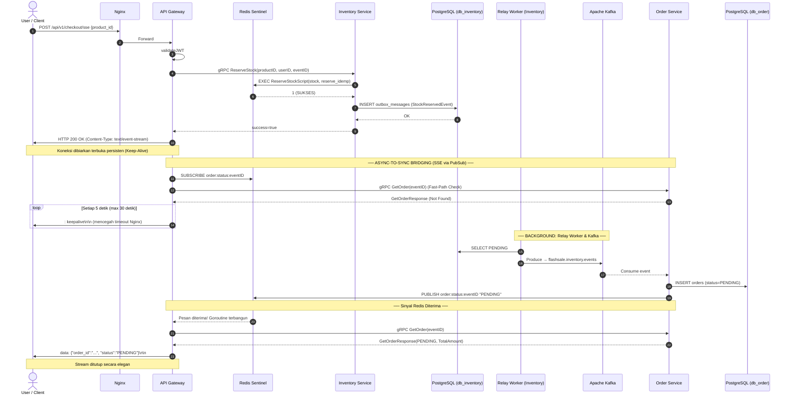

### 1D. Pembayaran (Payment Success)

**Penjelasan Alur:**
- **Langkah 1-6 (Pembayaran Instan):** Klien memanggil endpoint `/pay` dengan menyertakan `order_id`. Gateway meneruskan ke Payment Service. Payment memvalidasi (di sini menggunakan simulasi modulus), lalu langsung mencatat keberhasilan ke database sekaligus menyimpan `PaymentCompletedEvent` ke *outbox*.
- **Langkah 7-10 (Propagasi Payment):** Relay Worker mengirimkan status sukses pembayaran tersebut ke Kafka.
- **Langkah 11-14 (Finalisasi Order):** Order Service menerima konfirmasi dari Kafka, memastikan ini bukan event duplikat, lalu mengubah status akhir pesanan menjadi `PAID`.

*(Catatan: Alur pembayaran ini berlaku sama terlepas dari apakah klien mendapatkan Order ID berstatus PENDING lewat jalur PubSub, Polling, ataupun SSE).*
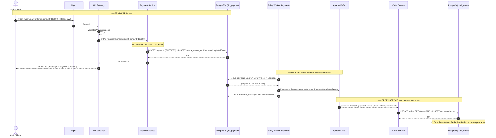

[🔍 Buka di Mermaid Live Editor (Gunakan Klik Kanan -> Open in New Tab)](https://mermaid.live/edit#base64:eyJjb2RlIjogInNlcXVlbmNlRGlhZ3JhbVxuICAgIGF1dG9udW1iZXJcbiAgICBhY3RvciBVIGFzIFVzZXIgLyBDbGllbnRcbiAgICBwYXJ0aWNpcGFudCBORyBhcyBOZ2lueFxuICAgIHBhcnRpY2lwYW50IEdXIGFzIEFQSSBHYXRld2F5XG4gICAgcGFydGljaXBhbnQgUCBhcyBQYXltZW50IFNlcnZpY2VcbiAgICBwYXJ0aWNpcGFudCBQREIgYXMgUG9zdGdyZVNRTCAoZGJfcGF5bWVudClcbiAgICBwYXJ0aWNpcGFudCBSVzIgYXMgUmVsYXkgV29ya2VyIChQYXltZW50KVxuICAgIHBhcnRpY2lwYW50IEsgYXMgQXBhY2hlIEthZmthXG4gICAgcGFydGljaXBhbnQgTyBhcyBPcmRlciBTZXJ2aWNlXG4gICAgcGFydGljaXBhbnQgT0RCIGFzIFBvc3RncmVTUUwgKGRiX29yZGVyKVxuXG4gICAgTm90ZSBvdmVyIFUsUERCOiBcdTI1MDBcdTI1MDAgUEVNQkFZQVJBTiBcdTI1MDBcdTI1MDBcbiAgICBVLT4+Tkc6IFBPU1QgL2FwaS92MS9wYXkge29yZGVyX2lkLCBhbW91bnQ9MTUwMDAwfSArIEJlYXJlciBKV1RcbiAgICBORy0+PkdXOiBGb3J3YXJkXG4gICAgR1ctPj5HVzogdmFsaWRhdGVKV1QocHVibGljLnBlbSlcbiAgICBHVy0+PlA6IGdSUEMgUHJvY2Vzc1BheW1lbnQob3JkZXJJRCwgYW1vdW50PTE1MDAwMClcbiAgICBOb3RlIG92ZXIgUDogMTUwMDAwIG1vZCAxMCA9IDAgXHUyMjYwIDQgXHUyMTkyIFNVS1NFU1xuICAgIFAtPj5QREI6IElOU0VSVCBwYXltZW50cyAoU1VDQ0VTUykgKyBJTlNFUlQgb3V0Ym94X21lc3NhZ2VzIChQYXltZW50Q29tcGxldGVkRXZlbnQpXG4gICAgUERCLS0+PlA6IE9LXG4gICAgUC0tPj5HVzogc3VjY2Vzcz10cnVlXG4gICAgR1ctLT4+VTogSFRUUCAyMDAge1wibWVzc2FnZVwiOiBcInBheW1lbnQgc3VjY2Vzc1wifVxuXG4gICAgTm90ZSBvdmVyIFJXMixLOiBcdTI1MDBcdTI1MDAgQkFDS0dST1VORDogUmVsYXkgV29ya2VyIFBheW1lbnQgXHUyNTAwXHUyNTAwXG4gICAgUlcyLT4+UERCOiBTRUxFQ1QgUEVORElORyBGT1IgVVBEQVRFIFNLSVAgTE9DS0VEXG4gICAgUERCLS0+PlJXMjogW1BheW1lbnRDb21wbGV0ZWRFdmVudF1cbiAgICBSVzItPj5LOiBQcm9kdWNlIFx1MjE5MiBmbGFzaHNhbGUucGF5bWVudC5ldmVudHMgKFBheW1lbnRDb21wbGV0ZWRFdmVudClcbiAgICBSVzItPj5QREI6IFVQREFURSBvdXRib3hfbWVzc2FnZXMgU0VUIHN0YXR1cz1TRU5UXG5cbiAgICBOb3RlIG92ZXIgSyxPREI6IFx1MjUwMFx1MjUwMCBPUkRFUiBTRVJWSUNFIG1lbXBlcmJhcnVpIHN0YXR1cyBcdTI1MDBcdTI1MDBcbiAgICBLLS0+Pk86IENvbnN1bWUgZmxhc2hzYWxlLnBheW1lbnQuZXZlbnRzIChQYXltZW50Q29tcGxldGVkRXZlbnQpXG4gICAgTy0+Pk9EQjogVVBEQVRFIG9yZGVycyBTRVQgc3RhdHVzPVBBSUQgKyBJTlNFUlQgcHJvY2Vzc2VkX2V2ZW50c1xuICAgIE9EQi0tPj5POiBPS1xuICAgIE5vdGUgb3ZlciBPREI6IFx1MjcwNSBPcmRlciBmaW5hbCBzdGF0dXMgPSBQQUlELiBTdG9rIFJlZGlzIGJlcmt1cmFuZyBwZXJtYW5lbi4iLCAibWVybWFpZCI6ICJ7XG4gIFwidGhlbWVcIjogXCJkZWZhdWx0XCJcbn0iLCAiYXV0b1N5bmMiOiB0cnVlLCAidXBkYXRlRGlhZ3JhbSI6IHRydWV9)

## 2. Sad Path: Stock Empty / Duplicates
*(Catatan: Sad path terjadi instan di tahap awal (Redis Lua Script) sebelum asinkronus berjalan. Oleh karena itu, skenario di bawah ini identik (sama persis) tidak peduli apakah Anda menggunakan `/checkout/pubsub`, `/long-polling`, atau `/sse`)*

**Penjelasan Singkat:**
- Seluruh validasi stok (_stock availability_) dan pengecekan duplikasi (_idempotency_) disatukan dalam **satu transaksi atomik di Redis (Lua Script)**.
- Pendekatan ini mencegah sistem untuk perlu melakukan _query_ ke PostgreSQL sama sekali jika kondisinya gagal, sehingga API sanggup memberikan respons penolakan (`409 Conflict`) yang super kilat dan mengeliminasi masalah *Zero Double-Deduction* secara absolut.

### A. Skenario: Stok Habis (Empty)

**Penjelasan Alur:**
- **Langkah 1-3:** Klien melakukan request checkout. Gateway memvalidasi token JWT secara instan tanpa perlu memanggil Auth Service.
- **Langkah 4-5:** Gateway memanggil prosedur gRPC `ReserveStock` ke Inventory Service.
- **Langkah 6-7:** Inventory Service menjalankan Lua Script di Redis. Skrip mengecek stok yang ternyata sudah 0. Skrip langsung mengembalikan kode 0 (gagal).
- **Langkah 8-9:** Inventory membalas Gateway dengan pesan kegagalan. Gateway mengembalikan respons `409 Conflict` ke Klien. Seluruh proses ini sangat cepat karena tidak membebani PostgreSQL.

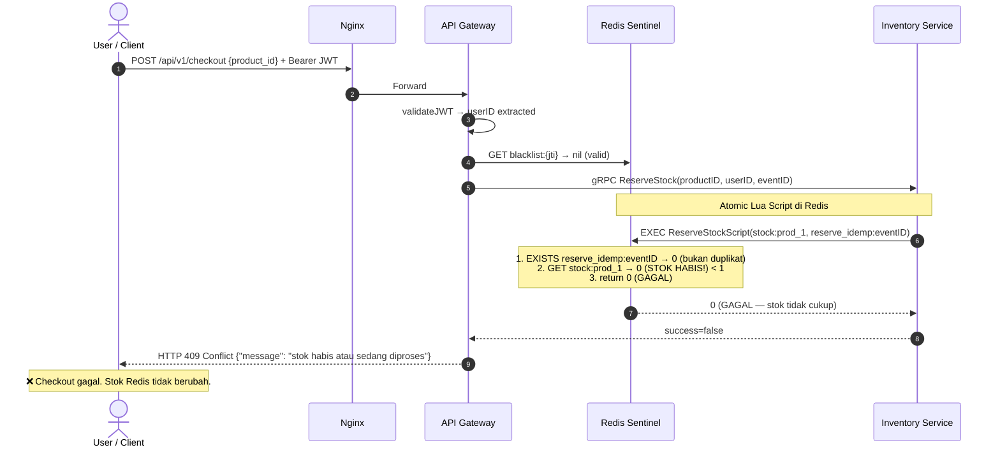

[🔍 Buka di Mermaid Live Editor (Gunakan Klik Kanan -> Open in New Tab)](https://mermaid.live/edit#base64:eyJjb2RlIjogInNlcXVlbmNlRGlhZ3JhbVxuICAgIGF1dG9udW1iZXJcbiAgICBhY3RvciBVIGFzIFVzZXIgLyBDbGllbnRcbiAgICBwYXJ0aWNpcGFudCBORyBhcyBOZ2lueFxuICAgIHBhcnRpY2lwYW50IEdXIGFzIEFQSSBHYXRld2F5XG4gICAgcGFydGljaXBhbnQgUkQgYXMgUmVkaXNcbiAgICBwYXJ0aWNpcGFudCBJIGFzIEludmVudG9yeSBTZXJ2aWNlXG5cbiAgICBVLT4+Tkc6IFBPU1QgL2FwaS92MS9jaGVja291dCB7cHJvZHVjdF9pZH0gKyBCZWFyZXIgSldUXG4gICAgTkctPj5HVzogRm9yd2FyZFxuICAgIEdXLT4+R1c6IHZhbGlkYXRlSldUIFx1MjE5MiB1c2VySUQgZXh0cmFjdGVkXG4gICAgR1ctPj5SRDogR0VUIGJsYWNrbGlzdDp7anRpfSBcdTIxOTIgbmlsICh2YWxpZClcbiAgICBHVy0+Pkk6IGdSUEMgUmVzZXJ2ZVN0b2NrKHByb2R1Y3RJRCwgdXNlcklELCBldmVudElEKVxuXG4gICAgTm90ZSBvdmVyIEksUkQ6IEF0b21pYyBMdWEgU2NyaXB0IGRpIFJlZGlzXG4gICAgSS0+PlJEOiBFWEVDIFJlc2VydmVTdG9ja1NjcmlwdChzdG9jazpwcm9kXzEsIHJlc2VydmVfaWRlbXA6ZXZlbnRJRClcbiAgICBOb3RlIG92ZXIgUkQ6IDEuIEVYSVNUUyByZXNlcnZlX2lkZW1wOmV2ZW50SUQgXHUyMTkyIDAgKGJ1a2FuIGR1cGxpa2F0KTxici8+Mi4gR0VUIHN0b2NrOnByb2RfMSBcdTIxOTIgMCAoU1RPSyBIQUJJUyEpIDwgMTxici8+My4gcmV0dXJuIDAgKEdBR0FMKVxuICAgIFJELS0+Pkk6IDAgKEdBR0FMIFx1MjAxNCBzdG9rIHRpZGFrIGN1a3VwKVxuXG4gICAgSS0tPj5HVzogc3VjY2Vzcz1mYWxzZVxuICAgIEdXLS0+PlU6IEhUVFAgNDA5IENvbmZsaWN0IHtcIm1lc3NhZ2VcIjogXCJzdG9rIGhhYmlzIGF0YXUgc2VkYW5nIGRpcHJvc2VzXCJ9XG4gICAgTm90ZSBvdmVyIFU6IFx1Mjc0YyBDaGVja291dCBnYWdhbC4gU3RvayBSZWRpcyB0aWRhayBiZXJ1YmFoLiIsICJtZXJtYWlkIjogIntcbiAgXCJ0aGVtZVwiOiBcImRlZmF1bHRcIlxufSIsICJhdXRvU3luYyI6IHRydWUsICJ1cGRhdGVEaWFncmFtIjogdHJ1ZX0=)

### B. Skenario: Duplikasi Request (Idempotency)

**Penjelasan Alur:**
- **Langkah 1-6 (Request Pertama):** Klien mengirimkan request dengan header `X-Idempotency-Key` (misal: "abc-123"). Request ini lolos validasi Lua Script di Redis karena kunci belum ada. Stok dikurangi, pesanan diproses, Klien menerima respons Sukses.
- **Langkah 7-10 (Request Kedua/Retries):** Karena masalah jaringan, Klien (atau *retry* otomatis) mengulang kembali request yang identik dengan `X-Idempotency-Key` yang sama ("abc-123"). 
- **Langkah 11-13:** Lua Script mengecek dan mendeteksi bahwa kunci "abc-123" `EXISTS` (sudah pernah diproses). Skrip seketika menghentikan eksekusi dan mengembalikan 0 (gagal) tanpa melakukan pemotongan stok berulang (*Zero Double-Deduction*).

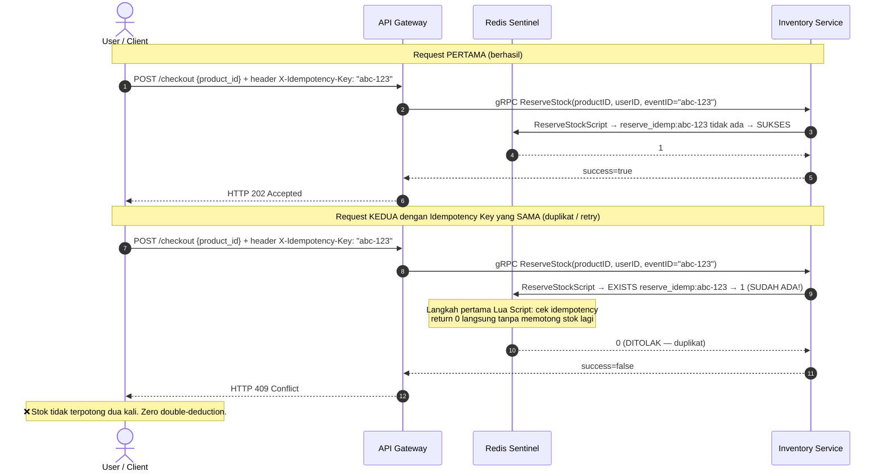

[🔍 Buka di Mermaid Live Editor (Gunakan Klik Kanan -> Open in New Tab)](https://mermaid.live/edit#base64:eyJjb2RlIjogInNlcXVlbmNlRGlhZ3JhbVxuICAgIGF1dG9udW1iZXJcbiAgICBhY3RvciBVIGFzIFVzZXIgLyBDbGllbnRcbiAgICBwYXJ0aWNpcGFudCBHVyBhcyBBUEkgR2F0ZXdheVxuICAgIHBhcnRpY2lwYW50IFJEIGFzIFJlZGlzXG4gICAgcGFydGljaXBhbnQgSSBhcyBJbnZlbnRvcnkgU2VydmljZVxuXG4gICAgTm90ZSBvdmVyIFUsSTogUmVxdWVzdCBQRVJUQU1BIChiZXJoYXNpbClcbiAgICBVLT4+R1c6IFBPU1QgL2NoZWNrb3V0IHtwcm9kdWN0X2lkfSArIGhlYWRlciBYLUlkZW1wb3RlbmN5LUtleTogXCJhYmMtMTIzXCJcbiAgICBHVy0+Pkk6IGdSUEMgUmVzZXJ2ZVN0b2NrKHByb2R1Y3RJRCwgdXNlcklELCBldmVudElEPVwiYWJjLTEyM1wiKVxuICAgIEktPj5SRDogUmVzZXJ2ZVN0b2NrU2NyaXB0IFx1MjE5MiByZXNlcnZlX2lkZW1wOmFiYy0xMjMgdGlkYWsgYWRhIFx1MjE5MiBTVUtTRVNcbiAgICBSRC0tPj5JOiAxXG4gICAgSS0tPj5HVzogc3VjY2Vzcz10cnVlXG4gICAgR1ctLT4+VTogSFRUUCAyMDIgQWNjZXB0ZWRcblxuICAgIE5vdGUgb3ZlciBVLEk6IFJlcXVlc3QgS0VEVUEgZGVuZ2FuIElkZW1wb3RlbmN5IEtleSB5YW5nIFNBTUEgKGR1cGxpa2F0IC8gcmV0cnkpXG4gICAgVS0+PkdXOiBQT1NUIC9jaGVja291dCB7cHJvZHVjdF9pZH0gKyBoZWFkZXIgWC1JZGVtcG90ZW5jeS1LZXk6IFwiYWJjLTEyM1wiXG4gICAgR1ctPj5JOiBnUlBDIFJlc2VydmVTdG9jayhwcm9kdWN0SUQsIHVzZXJJRCwgZXZlbnRJRD1cImFiYy0xMjNcIilcbiAgICBJLT4+UkQ6IFJlc2VydmVTdG9ja1NjcmlwdCBcdTIxOTIgRVhJU1RTIHJlc2VydmVfaWRlbXA6YWJjLTEyMyBcdTIxOTIgMSAoU1VEQUggQURBISlcbiAgICBOb3RlIG92ZXIgUkQ6IExhbmdrYWggcGVydGFtYSBMdWEgU2NyaXB0OiBjZWsgaWRlbXBvdGVuY3k8YnIvPnJldHVybiAwIGxhbmdzdW5nIHRhbnBhIG1lbW90b25nIHN0b2sgbGFnaVxuICAgIFJELS0+Pkk6IDAgKERJVE9MQUsgXHUyMDE0IGR1cGxpa2F0KVxuICAgIEktLT4+R1c6IHN1Y2Nlc3M9ZmFsc2VcbiAgICBHVy0tPj5VOiBIVFRQIDQwOSBDb25mbGljdFxuICAgIE5vdGUgb3ZlciBVOiBcdTI3NGMgU3RvayB0aWRhayB0ZXJwb3RvbmcgZHVhIGthbGkuIFplcm8gZG91YmxlLWRlZHVjdGlvbi4iLCAibWVybWFpZCI6ICJ7XG4gIFwidGhlbWVcIjogXCJkZWZhdWx0XCJcbn0iLCAiYXV0b1N5bmMiOiB0cnVlLCAidXBkYXRlRGlhZ3JhbSI6IHRydWV9)

## 3. Compensation Path (Saga)
*(Catatan: Compensation path murni berjalan di ranah internal/backend antar-mikroservis lewat pesan Kafka. Oleh karenanya, skenario ini sepenuhnya identik (sama persis) untuk ketiga jenis endpoint Checkout)*

**Penjelasan Alur (Saga Pembatalan):**
- Apabila sistem hilir (contoh: Payment Service) menjumpai kendala dan menolak pembayaran, ia akan melempar `PaymentFailedEvent` ke dalam Kafka.
- Event kegagalan ini akan "berjalan mundur" (dibaca oleh sistem sebelumnya, yaitu Order Service) yang bertugas membatalkan pesanan menjadi status `CANCELLED`.
- Order Service yang membatalkan ini lantas melempar `OrderCancelledEvent` yang pada gilirannya akan dibaca oleh Inventory Service di ujung rantai, guna memulihkan (_refund_) stok barang kembali ke Redis.

### A. Pembatalan Akibat Payment Gagal

**Penjelasan Alur:**
- **Langkah 1-6 (Pembayaran Ditolak):** Klien mencoba membayar pesanan namun ditolak (misal: kartu kredit bermasalah / saldo tidak cukup). Payment Service merespons error ke Klien dan menyisipkan `PaymentFailedEvent` ke dalam *outbox* database.
- **Langkah 7-10 (Broadcast Kegagalan):** *Relay Worker* milik Payment Service mengambil event gagal bayar tersebut dan menyebarkannya ke *topic* Kafka.
- **Langkah 11-15 (Order Dibatalkan):** Order Service mendengar `PaymentFailedEvent`. Ia segera mengubah status pesanan dari `PENDING` menjadi `CANCELLED` secara permanen, lalu mengeluarkan `OrderCancelledEvent` ke *outbox* miliknya.
- **Langkah 16-19 (Propagasi Pembatalan):** *Relay Worker* milik Order Service mengirimkan `OrderCancelledEvent` ke Kafka.
- **Langkah 20-24 (Pengembalian Stok):** Inventory Service menyerap event pembatalan ini dan mengeksekusi perintah Lua Script `RefundStockScript` di Redis untuk menambahkan +1 pada stok barang, membuat kuota kembali terbuka untuk pembeli lain.

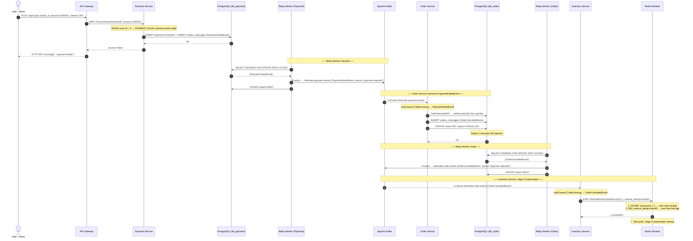

[🔍 Buka di Mermaid Live Editor (Gunakan Klik Kanan -> Open in New Tab)](https://mermaid.live/edit#base64:eyJjb2RlIjogInNlcXVlbmNlRGlhZ3JhbVxuICAgIGF1dG9udW1iZXJcbiAgICBhY3RvciBVIGFzIFVzZXIgLyBDbGllbnRcbiAgICBwYXJ0aWNpcGFudCBHVyBhcyBBUEkgR2F0ZXdheVxuICAgIHBhcnRpY2lwYW50IFAgYXMgUGF5bWVudCBTZXJ2aWNlXG4gICAgcGFydGljaXBhbnQgUERCIGFzIFBvc3RncmVTUUwgKGRiX3BheW1lbnQpXG4gICAgcGFydGljaXBhbnQgUlcgYXMgUmVsYXkgV29ya2VyIChQYXltZW50KVxuICAgIHBhcnRpY2lwYW50IEsgYXMgQXBhY2hlIEthZmthXG4gICAgcGFydGljaXBhbnQgTyBhcyBPcmRlciBTZXJ2aWNlXG4gICAgcGFydGljaXBhbnQgT0RCIGFzIFBvc3RncmVTUUwgKGRiX29yZGVyKVxuICAgIHBhcnRpY2lwYW50IFJXMiBhcyBSZWxheSBXb3JrZXIgKE9yZGVyKVxuICAgIHBhcnRpY2lwYW50IEkgYXMgSW52ZW50b3J5IFNlcnZpY2VcbiAgICBwYXJ0aWNpcGFudCBSRCBhcyBSZWRpc1xuXG4gICAgVS0+PkdXOiBQT1NUIC9hcGkvdjEvcGF5IHtvcmRlcl9pZCwgYW1vdW50PTE1MDAwNH0gKyBCZWFyZXIgSldUXG4gICAgR1ctPj5QOiBnUlBDIFByb2Nlc3NQYXltZW50KG9yZGVySUQsIGFtb3VudD0xNTAwMDQpXG4gICAgTm90ZSBvdmVyIFA6IDE1MDAwNCBtb2QgMTAgPSA0IFx1MjE5MiBQQVlNRU5UIEdBR0FMIChzaW11bGFzaSBiYW5rIHRvbGFrKVxuICAgIFAtPj5QREI6IElOU0VSVCBwYXltZW50cyAoRkFJTEVEKSArIElOU0VSVCBvdXRib3hfbWVzc2FnZXMgKFBheW1lbnRGYWlsZWRFdmVudClcbiAgICBQREItLT4+UDogT0tcbiAgICBQLS0+PkdXOiBzdWNjZXNzPWZhbHNlXG4gICAgR1ctLT4+VTogSFRUUCA1MDAge1wibWVzc2FnZVwiOiBcInBheW1lbnQgZmFpbGVkXCJ9XG5cbiAgICBOb3RlIG92ZXIgUlcsSzogXHUyNTAwXHUyNTAwIFJlbGF5IFdvcmtlciBQYXltZW50IFx1MjUwMFx1MjUwMFxuICAgIFJXLT4+UERCOiBTRUxFQ1QgUEVORElORyBGT1IgVVBEQVRFIFNLSVAgTE9DS0VEXG4gICAgUERCLS0+PlJXOiBbUGF5bWVudEZhaWxlZEV2ZW50XVxuICAgIFJXLT4+SzogUHJvZHVjZSBcdTIxOTIgZmxhc2hzYWxlLnBheW1lbnQuZXZlbnRzIChQYXltZW50RmFpbGVkRXZlbnQsIHJlYXNvbj1cInBheW1lbnQgcmVqZWN0ZWRcIilcbiAgICBSVy0+PlBEQjogVVBEQVRFIHN0YXR1cz1TRU5UXG5cbiAgICBOb3RlIG92ZXIgSyxPREI6IFx1MjUwMFx1MjUwMCBPcmRlciBTZXJ2aWNlIG1lbmVyaW1hIFBheW1lbnRGYWlsZWRFdmVudCBcdTI1MDBcdTI1MDBcbiAgICBLLS0+Pk86IENvbnN1bWUgZmxhc2hzYWxlLnBheW1lbnQuZXZlbnRzXG4gICAgTm90ZSBvdmVyIE86IHJhd1tcInJlYXNvblwiXSB0aWRhayBrb3NvbmcgXHUyMTkyIFBheW1lbnRGYWlsZWRFdmVudFxuICAgIE8tPj5PREI6IEdldE9yZGVyKG9yZGVySUQpIFx1MjE5MiBhbWJpbCBwcm9kdWN0SUQgZGFuIHF1YW50aXR5XG4gICAgTy0+Pk9EQjogSU5TRVJUIG91dGJveF9tZXNzYWdlcyAoT3JkZXJDYW5jZWxsZWRFdmVudClcbiAgICBPLT4+T0RCOiBVUERBVEUgb3JkZXJzIFNFVCBzdGF0dXM9Q0FOQ0VMTEVEXG4gICAgTm90ZSBvdmVyIE9EQjogRGFsYW0gMSB0cmFuc2Frc2kgREIgKGF0b21pYylcbiAgICBPREItLT4+TzogT0tcblxuICAgIE5vdGUgb3ZlciBSVzIsSzogXHUyNTAwXHUyNTAwIFJlbGF5IFdvcmtlciBPcmRlciBcdTI1MDBcdTI1MDBcbiAgICBSVzItPj5PREI6IFNFTEVDVCBQRU5ESU5HIEZPUiBVUERBVEUgU0tJUCBMT0NLRURcbiAgICBPREItLT4+UlcyOiBbT3JkZXJDYW5jZWxsZWRFdmVudF1cbiAgICBSVzItPj5LOiBQcm9kdWNlIFx1MjE5MiBmbGFzaHNhbGUub3JkZXIuZXZlbnRzIChPcmRlckNhbmNlbGxlZEV2ZW50LCByZWFzb249XCJwYXltZW50IHJlamVjdGVkXCIpXG4gICAgUlcyLT4+T0RCOiBVUERBVEUgc3RhdHVzPVNFTlRcblxuICAgIE5vdGUgb3ZlciBLLFJEOiBcdTI1MDBcdTI1MDAgSW52ZW50b3J5IFNlcnZpY2U6IFNhZ2EgQ29tcGVuc2F0aW9uIFx1MjUwMFx1MjUwMFxuICAgIEstLT4+STogQ29uc3VtZSBmbGFzaHNhbGUub3JkZXIuZXZlbnRzIChPcmRlckNhbmNlbGxlZEV2ZW50KVxuICAgIE5vdGUgb3ZlciBJOiByYXdbXCJyZWFzb25cIl0gdGlkYWsga29zb25nIFx1MjE5MiBPcmRlckNhbmNlbGxlZEV2ZW50XG4gICAgSS0+PlJEOiBFWEVDIFJlZnVuZFN0b2NrU2NyaXB0KHN0b2NrOnByb2RfMSwgcmVzZXJ2ZV9pZGVtcDpldmVudElEKVxuICAgIE5vdGUgb3ZlciBSRDogMS4gSU5DUkJZIHN0b2NrOnByb2RfMSAxIFx1MjE5MiBzdG9rIG5haWsga2VtYmFsaTxici8+Mi4gREVMIHJlc2VydmVfaWRlbXA6ZXZlbnRJRCBcdTIxOTIgdXNlciBiaXNhIGJlbGkgbGFnaVxuICAgIFJELS0+Pkk6IDEgKFNVS1NFUylcbiAgICBOb3RlIG92ZXIgUkQ6IFx1MjcwNSBTdG9rIHB1bGloLiBTYWdhIENvbXBlbnNhdGlvbiBzZWxlc2FpLiIsICJtZXJtYWlkIjogIntcbiAgXCJ0aGVtZVwiOiBcImRlZmF1bHRcIlxufSIsICJhdXRvU3luYyI6IHRydWUsICJ1cGRhdGVEaWFncmFtIjogdHJ1ZX0=)

### B. Pembatalan Akibat Order Timeout
*(Background Worker akan mencari order yang tidak kunjung dibayar setelah 15 menit, lalu memicu event pembatalan yang sama)*

**Penjelasan Alur:**
- **Langkah 1-5 (Pemindaian Timeout):** Sebuah pekerjaan latar (*Timeout Worker*) milik Order Service secara rutin aktif setiap 30 detik. Ia akan mengeksekusi _query_ ke PostgreSQL untuk mencari semua transaksi berstatus `PENDING` yang usianya sudah lebih dari 15 menit.
- **Langkah 6-10 (Tandai Batal Beruntun):** Lewat _loop_, ia akan mengupdate status pesanan yang hangus tersebut menjadi `CANCELLED` dan menyisipkan `OrderCancelledEvent` ke dalam *outbox* di dalam satu transaksi aman.
- **Langkah 11-14 (Propagasi Kafka):** *Relay Worker* menyapu seluruh rekaman pembatalan baru dari *outbox* tersebut dan memproduksinya secara bertahap ke dalam *topic* pesanan Kafka.
- **Langkah 15-19 (Stok Kembali):** Mirip dengan kejadian gagal bayar, Inventory Service akan mengkonsumsi rentetan event pembatalan tersebut dan satu-per-satu mengeksekusi `RefundStockScript` di Redis untuk merestorasi kuota barang secara otomatis.

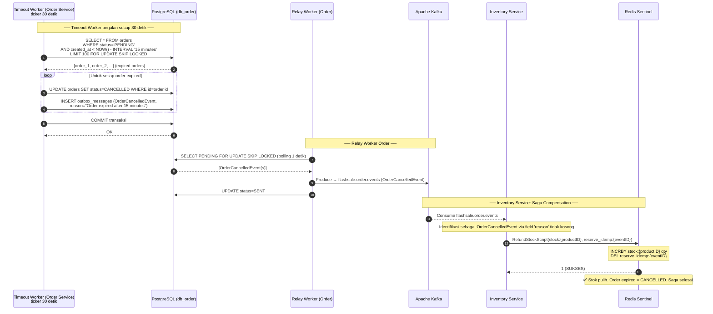

[🔍 Buka di Mermaid Live Editor (Gunakan Klik Kanan -> Open in New Tab)](https://mermaid.live/edit#base64:eyJjb2RlIjogInNlcXVlbmNlRGlhZ3JhbVxuICAgIGF1dG9udW1iZXJcbiAgICBwYXJ0aWNpcGFudCBUVyBhcyBUaW1lb3V0IFdvcmtlciAoT3JkZXIgU2VydmljZSk8YnIvPnRpY2tlciAzMCBkZXRpa1xuICAgIHBhcnRpY2lwYW50IE9EQiBhcyBQb3N0Z3JlU1FMIChkYl9vcmRlcilcbiAgICBwYXJ0aWNpcGFudCBSVyBhcyBSZWxheSBXb3JrZXIgKE9yZGVyKVxuICAgIHBhcnRpY2lwYW50IEsgYXMgQXBhY2hlIEthZmthXG4gICAgcGFydGljaXBhbnQgSSBhcyBJbnZlbnRvcnkgU2VydmljZVxuICAgIHBhcnRpY2lwYW50IFJEIGFzIFJlZGlzXG5cbiAgICBOb3RlIG92ZXIgVFcsT0RCOiBcdTI1MDBcdTI1MDAgVGltZW91dCBXb3JrZXIgYmVyamFsYW4gc2V0aWFwIDMwIGRldGlrIFx1MjUwMFx1MjUwMFxuICAgIFRXLT4+T0RCOiBTRUxFQ1QgKiBGUk9NIG9yZGVyczxici8+V0hFUkUgc3RhdHVzPSdQRU5ESU5HJzxici8+QU5EIGNyZWF0ZWRfYXQgPCBOT1coKSAtIElOVEVSVkFMICcxNSBtaW51dGVzJzxici8+TElNSVQgMTAwIEZPUiBVUERBVEUgU0tJUCBMT0NLRURcbiAgICBPREItLT4+VFc6IFtvcmRlcl8xLCBvcmRlcl8yLCAuLi5dIChleHBpcmVkIG9yZGVycylcbiAgICBcbiAgICBsb29wIFVudHVrIHNldGlhcCBvcmRlciBleHBpcmVkXG4gICAgICAgIFRXLT4+T0RCOiBVUERBVEUgb3JkZXJzIFNFVCBzdGF0dXM9Q0FOQ0VMTEVEIFdIRVJFIGlkPW9yZGVyLmlkXG4gICAgICAgIFRXLT4+T0RCOiBJTlNFUlQgb3V0Ym94X21lc3NhZ2VzIChPcmRlckNhbmNlbGxlZEV2ZW50LDxici8+cmVhc29uPVwiT3JkZXIgZXhwaXJlZCBhZnRlciAxNSBtaW51dGVzXCIpXG4gICAgZW5kXG4gICAgVFctPj5PREI6IENPTU1JVCB0cmFuc2Frc2lcbiAgICBPREItLT4+VFc6IE9LXG5cbiAgICBOb3RlIG92ZXIgUlcsSzogXHUyNTAwXHUyNTAwIFJlbGF5IFdvcmtlciBPcmRlciBcdTI1MDBcdTI1MDBcbiAgICBSVy0+Pk9EQjogU0VMRUNUIFBFTkRJTkcgRk9SIFVQREFURSBTS0lQIExPQ0tFRCAocG9sbGluZyAxIGRldGlrKVxuICAgIE9EQi0tPj5SVzogW09yZGVyQ2FuY2VsbGVkRXZlbnQocyldXG4gICAgUlctPj5LOiBQcm9kdWNlIFx1MjE5MiBmbGFzaHNhbGUub3JkZXIuZXZlbnRzIChPcmRlckNhbmNlbGxlZEV2ZW50KVxuICAgIFJXLT4+T0RCOiBVUERBVEUgc3RhdHVzPVNFTlRcblxuICAgIE5vdGUgb3ZlciBLLFJEOiBcdTI1MDBcdTI1MDAgSW52ZW50b3J5IFNlcnZpY2U6IFNhZ2EgQ29tcGVuc2F0aW9uIFx1MjUwMFx1MjUwMFxuICAgIEstLT4+STogQ29uc3VtZSBmbGFzaHNhbGUub3JkZXIuZXZlbnRzXG4gICAgTm90ZSBvdmVyIEk6IElkZW50aWZpa2FzaSBzZWJhZ2FpIE9yZGVyQ2FuY2VsbGVkRXZlbnQgdmlhIGZpZWxkICdyZWFzb24nIHRpZGFrIGtvc29uZ1xuICAgIEktPj5SRDogUmVmdW5kU3RvY2tTY3JpcHQoc3RvY2s6e3Byb2R1Y3RJRH0sIHJlc2VydmVfaWRlbXA6e2V2ZW50SUR9KVxuICAgIE5vdGUgb3ZlciBSRDogSU5DUkJZIHN0b2NrOntwcm9kdWN0SUR9IHF0eTxici8+REVMIHJlc2VydmVfaWRlbXA6e2V2ZW50SUR9XG4gICAgUkQtLT4+STogMSAoU1VLU0VTKVxuICAgIE5vdGUgb3ZlciBSRDogXHUyNzA1IFN0b2sgcHVsaWguIE9yZGVyIGV4cGlyZWQgPSBDQU5DRUxMRUQuIFNhZ2Egc2VsZXNhaS4iLCAibWVybWFpZCI6ICJ7XG4gIFwidGhlbWVcIjogXCJkZWZhdWx0XCJcbn0iLCAiYXV0b1N5bmMiOiB0cnVlLCAidXBkYXRlRGlhZ3JhbSI6IHRydWV9)

## 4. Resilience Mechanisms
*(Catatan: Mekanisme ketahanan dan toleransi kesalahan ini diatur pada level Consumer (Kafka) dan Background Worker. Semua metode integrasi Gateway (PubSub, Polling, SSE) secara otomatis dilindungi oleh mekanisme Self-Healing di bawah ini)*

**Penjelasan Singkat (Ketahanan Sistem):**
- **Reconciliation Job (Penyembuh Kebocoran Stok):** Bertugas mencari celah ketidaksesuaian antara memori _cache_ dan _database_. Jika sistem *crash* di tengah jalan setelah memotong stok Redis tapi sebelum menyimpan *outbox* Postgres, maka stok "menggantung". _Job_ ini memonitor TTL (_Time-To-Live_) Idempotency Key, lalu melakukan pengembalian stok paksa secara otomatis bila tidak ada jejaknya di Postgres.
- **Dead Letter Queue / DLQ (Penampung Error Kafka):** Mencegah *stuck* antrian (*head-of-line blocking*). Jika _consumer_ berulang-kali gagal memproses satu pesan (misal karena _database_ lambat), pesan dialihkan ke kotak karantina spesifik (_DLQ topic_) untuk dievaluasi manusia belakangan, sementara sistem terus melaju memproses pesan klien yang antre berikutnya.

### A. Reconciliation Job (Self-Healing Stock Leak)

**Penjelasan Alur:**
- **Langkah 1-3 (Deteksi Idempotency):** *Reconciliation Job* aktif secara periodik dan menggunakan `SCAN` pada Redis untuk mendata seluruh kunci reservasi (`reserve_idemp:*`).
- **Langkah 4-7 (Verifikasi Integritas Data - Normal):** Untuk kunci `event-A` yang telah kedaluwarsa masa tenggangnya (grace period), _Job_ mencari rekam jejak event tersebut di database PostgreSQL. Jika rekaman *outbox*-nya ada, maka sinkronisasi dianggap berhasil.
- **Langkah 8-10 (Deteksi Inkonsistensi - Leak):** _Job_ kemudian memeriksa `event-B`. Ternyata data tersebut hilang / tidak ada satupun *record* pemotongan stok di PostgreSQL. Hal ini membuktikan telah terjadi *crash* di masa lalu (stok terpotong di Redis, tapi gagal persisten di DB).
- **Langkah 11-15 (Penyembuhan Stok Berjalan):** Tanpa panik, sistem melog adanya peringatan *stock leak*, membedah metadata _event_ (untuk mengidentifikasi produk), dan otomatis mengeksekusi `RefundStockScript` di Redis untuk memulihkan stok yang menggantung ke kapasitas asalnya.

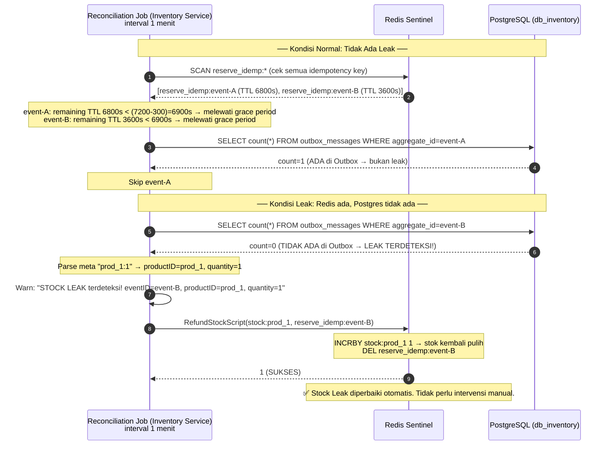

[🔍 Buka di Mermaid Live Editor (Gunakan Klik Kanan -> Open in New Tab)](https://mermaid.live/edit#base64:eyJjb2RlIjogInNlcXVlbmNlRGlhZ3JhbVxuICAgIGF1dG9udW1iZXJcbiAgICBwYXJ0aWNpcGFudCBSSiBhcyBSZWNvbmNpbGlhdGlvbiBKb2IgKEludmVudG9yeSBTZXJ2aWNlKTxici8+aW50ZXJ2YWwgMSBtZW5pdFxuICAgIHBhcnRpY2lwYW50IFJEIGFzIFJlZGlzXG4gICAgcGFydGljaXBhbnQgSURCIGFzIFBvc3RncmVTUUwgKGRiX2ludmVudG9yeSlcblxuICAgIE5vdGUgb3ZlciBSSixJREI6IFx1MjUwMFx1MjUwMCBLb25kaXNpIE5vcm1hbDogVGlkYWsgQWRhIExlYWsgXHUyNTAwXHUyNTAwXG4gICAgUkotPj5SRDogU0NBTiByZXNlcnZlX2lkZW1wOiogKGNlayBzZW11YSBpZGVtcG90ZW5jeSBrZXkpXG4gICAgUkQtLT4+Uko6IFtyZXNlcnZlX2lkZW1wOmV2ZW50LUEgKFRUTCA2ODAwcyksIHJlc2VydmVfaWRlbXA6ZXZlbnQtQiAoVFRMIDM2MDBzKV1cbiAgICBOb3RlIG92ZXIgUko6IGV2ZW50LUE6IHJlbWFpbmluZyBUVEwgNjgwMHMgPCAoNzIwMC0zMDApPTY5MDBzIFx1MjE5MiBtZWxld2F0aSBncmFjZSBwZXJpb2Q8YnIvPmV2ZW50LUI6IHJlbWFpbmluZyBUVEwgMzYwMHMgPCA2OTAwcyBcdTIxOTIgbWVsZXdhdGkgZ3JhY2UgcGVyaW9kXG4gICAgXG4gICAgUkotPj5JREI6IFNFTEVDVCBjb3VudCgqKSBGUk9NIG91dGJveF9tZXNzYWdlcyBXSEVSRSBhZ2dyZWdhdGVfaWQ9ZXZlbnQtQVxuICAgIElEQi0tPj5SSjogY291bnQ9MSAoQURBIGRpIE91dGJveCBcdTIxOTIgYnVrYW4gbGVhaylcbiAgICBOb3RlIG92ZXIgUko6IFNraXAgZXZlbnQtQVxuXG4gICAgTm90ZSBvdmVyIFJKLElEQjogXHUyNTAwXHUyNTAwIEtvbmRpc2kgTGVhazogUmVkaXMgYWRhLCBQb3N0Z3JlcyB0aWRhayBhZGEgXHUyNTAwXHUyNTAwXG4gICAgUkotPj5JREI6IFNFTEVDVCBjb3VudCgqKSBGUk9NIG91dGJveF9tZXNzYWdlcyBXSEVSRSBhZ2dyZWdhdGVfaWQ9ZXZlbnQtQlxuICAgIElEQi0tPj5SSjogY291bnQ9MCAoVElEQUsgQURBIGRpIE91dGJveCBcdTIxOTIgTEVBSyBURVJERVRFS1NJISlcbiAgICBcbiAgICBOb3RlIG92ZXIgUko6IFBhcnNlIG1ldGEgXCJwcm9kXzE6MVwiIFx1MjE5MiBwcm9kdWN0SUQ9cHJvZF8xLCBxdWFudGl0eT0xXG4gICAgUkotPj5SSjogV2FybjogXCJTVE9DSyBMRUFLIHRlcmRldGVrc2khIGV2ZW50SUQ9ZXZlbnQtQiwgcHJvZHVjdElEPXByb2RfMSwgcXVhbnRpdHk9MVwiXG4gICAgXG4gICAgUkotPj5SRDogUmVmdW5kU3RvY2tTY3JpcHQoc3RvY2s6cHJvZF8xLCByZXNlcnZlX2lkZW1wOmV2ZW50LUIpXG4gICAgTm90ZSBvdmVyIFJEOiBJTkNSQlkgc3RvY2s6cHJvZF8xIDEgXHUyMTkyIHN0b2sga2VtYmFsaSBwdWxpaDxici8+REVMIHJlc2VydmVfaWRlbXA6ZXZlbnQtQlxuICAgIFJELS0+PlJKOiAxIChTVUtTRVMpXG4gICAgTm90ZSBvdmVyIFJEOiBcdTI3MDUgU3RvY2sgTGVhayBkaXBlcmJhaWtpIG90b21hdGlzLiBUaWRhayBwZXJsdSBpbnRlcnZlbnNpIG1hbnVhbC4iLCAibWVybWFpZCI6ICJ7XG4gIFwidGhlbWVcIjogXCJkZWZhdWx0XCJcbn0iLCAiYXV0b1N5bmMiOiB0cnVlLCAidXBkYXRlRGlhZ3JhbSI6IHRydWV9)

### B. Dead Letter Queue (Isolasi Pesan Gagal)

**Penjelasan Alur:**
- **Langkah 1-6 (Retries yang Gagal):** Consumer Kafka mendengarkan event. Saat mencoba memproses, terjadi kendala (seperti koneksi database putus sesaat). Consumer akan berusaha mengulang (`attempt 2`, `attempt 3`) menggunakan taktik *exponential backoff* dengan harapan masalahnya hanyalah sementara (*transient error*).
- **Langkah 7-9 (Pengalihan ke Karantina):** Jika hingga percobaan maksimal (*max retries*) pesan tersebut tidak juga kunjung berhasil diolah, ia tidak boleh menghalangi sisa pesan lain di antrian. Consumer secara elegan akan membuang / memindahkan (Produce) pesan merepotkan tersebut ke _topic_ karantina bernama **Dead Letter Queue (DLQ)**.
- **Langkah 10-12 (Terselamatkan):** Pesan yang cacat tersebut kini aman bersemayam di DLQ, menyertakan *header* kronologis seperti _error_ dan sumber topiknya untuk kemudian direviu oleh teknisi/administrator secara manual di kemudian hari. Consumer lalu melakukan *commit* untuk melaju melanjutkan pemrosesan sisa pesan antrian dengan normal.

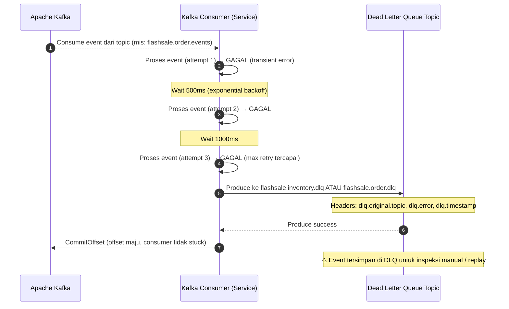

[🔍 Buka di Mermaid Live Editor (Gunakan Klik Kanan -> Open in New Tab)](https://mermaid.live/edit#base64:eyJjb2RlIjogInNlcXVlbmNlRGlhZ3JhbVxuICAgIGF1dG9udW1iZXJcbiAgICBwYXJ0aWNpcGFudCBLIGFzIEFwYWNoZSBLYWZrYVxuICAgIHBhcnRpY2lwYW50IEMgYXMgS2Fma2EgQ29uc3VtZXIgKFNlcnZpY2UpXG4gICAgcGFydGljaXBhbnQgRExRIGFzIERlYWQgTGV0dGVyIFF1ZXVlIFRvcGljXG5cbiAgICBLLS0+PkM6IENvbnN1bWUgZXZlbnQgZGFyaSB0b3BpYyAobWlzOiBmbGFzaHNhbGUub3JkZXIuZXZlbnRzKVxuICAgIFxuICAgIEMtPj5DOiBQcm9zZXMgZXZlbnQgKGF0dGVtcHQgMSkgXHUyMTkyIEdBR0FMICh0cmFuc2llbnQgZXJyb3IpXG4gICAgTm90ZSBvdmVyIEM6IFdhaXQgNTAwbXMgKGV4cG9uZW50aWFsIGJhY2tvZmYpXG4gICAgQy0+PkM6IFByb3NlcyBldmVudCAoYXR0ZW1wdCAyKSBcdTIxOTIgR0FHQUxcbiAgICBOb3RlIG92ZXIgQzogV2FpdCAxMDAwbXNcbiAgICBDLT4+QzogUHJvc2VzIGV2ZW50IChhdHRlbXB0IDMpIFx1MjE5MiBHQUdBTCAobWF4IHJldHJ5IHRlcmNhcGFpKVxuXG4gICAgQy0+PkRMUTogUHJvZHVjZSBrZSBmbGFzaHNhbGUuaW52ZW50b3J5LmRscSBBVEFVIGZsYXNoc2FsZS5vcmRlci5kbHFcbiAgICBOb3RlIG92ZXIgRExROiBIZWFkZXJzOiBkbHEub3JpZ2luYWwudG9waWMsIGRscS5lcnJvciwgZGxxLnRpbWVzdGFtcFxuICAgIERMUS0tPj5DOiBQcm9kdWNlIHN1Y2Nlc3NcbiAgICBDLT4+SzogQ29tbWl0T2Zmc2V0IChvZmZzZXQgbWFqdSwgY29uc3VtZXIgdGlkYWsgc3R1Y2spXG4gICAgTm90ZSBvdmVyIERMUTogXHUyNmEwXHVmZTBmIEV2ZW50IHRlcnNpbXBhbiBkaSBETFEgdW50dWsgaW5zcGVrc2kgbWFudWFsIC8gcmVwbGF5IiwgIm1lcm1haWQiOiAie1xuICBcInRoZW1lXCI6IFwiZGVmYXVsdFwiXG59IiwgImF1dG9TeW5jIjogdHJ1ZSwgInVwZGF0ZURpYWdyYW0iOiB0cnVlfQ==)

