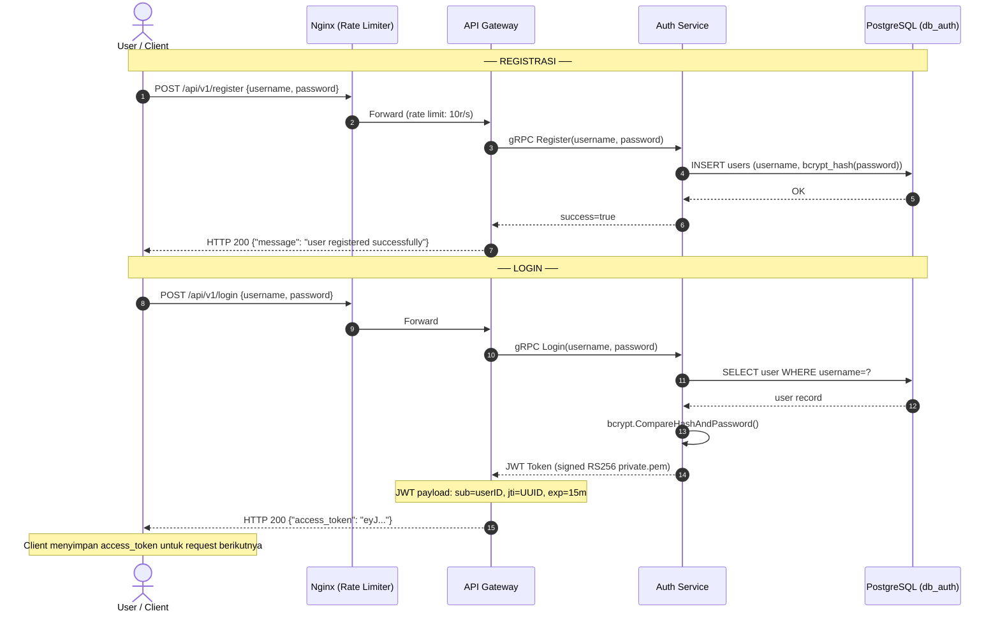
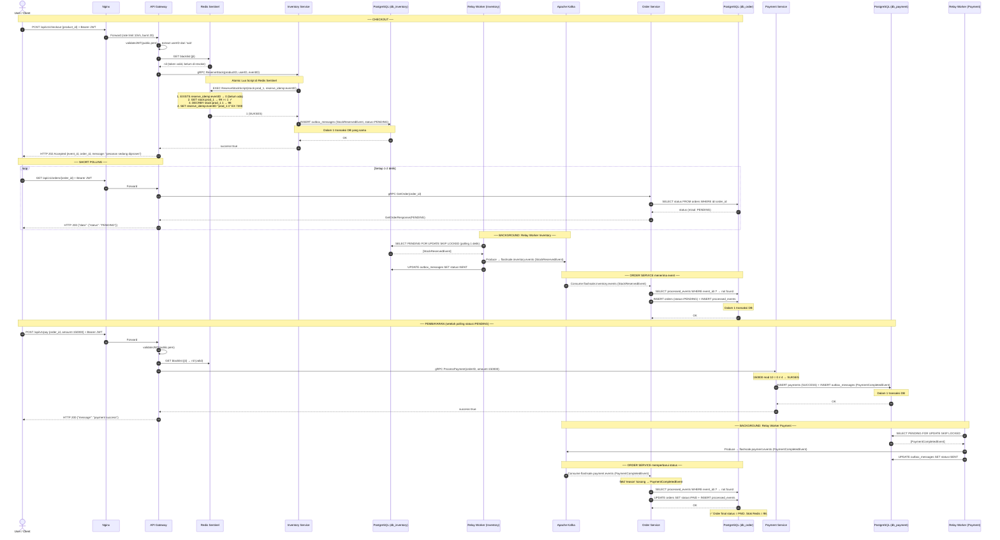
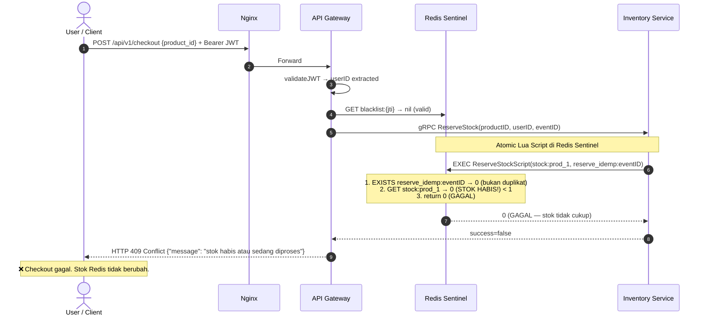
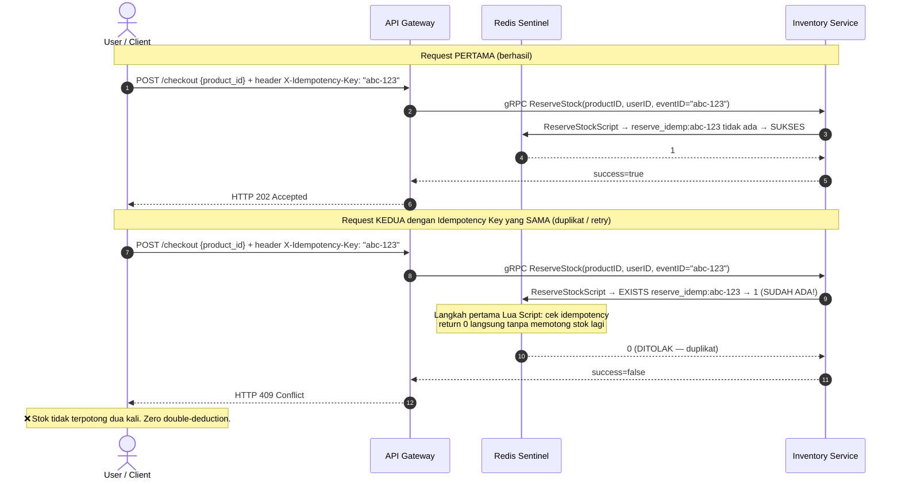
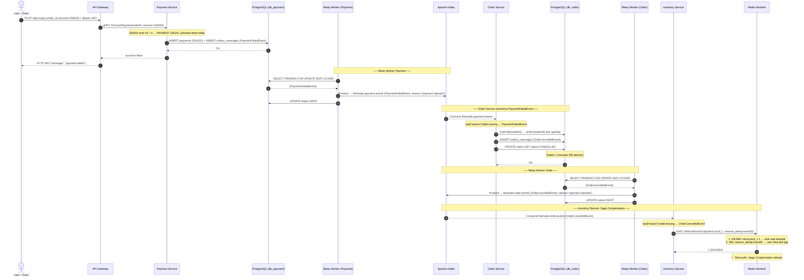
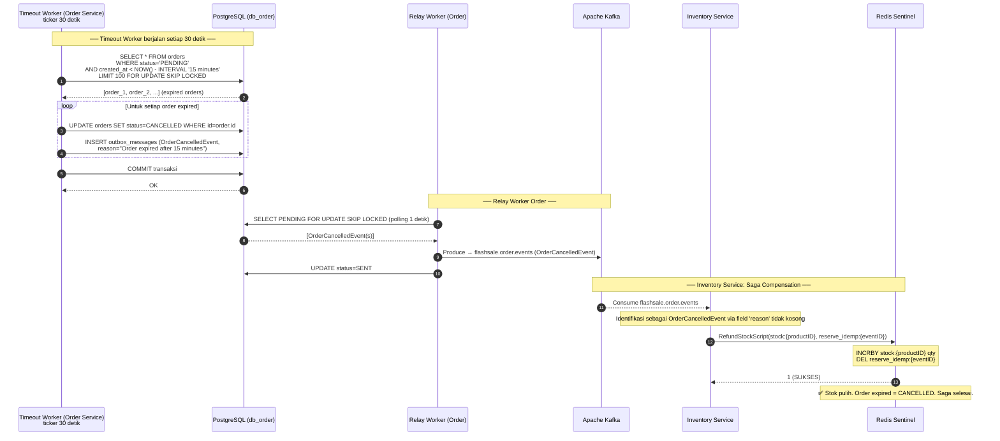
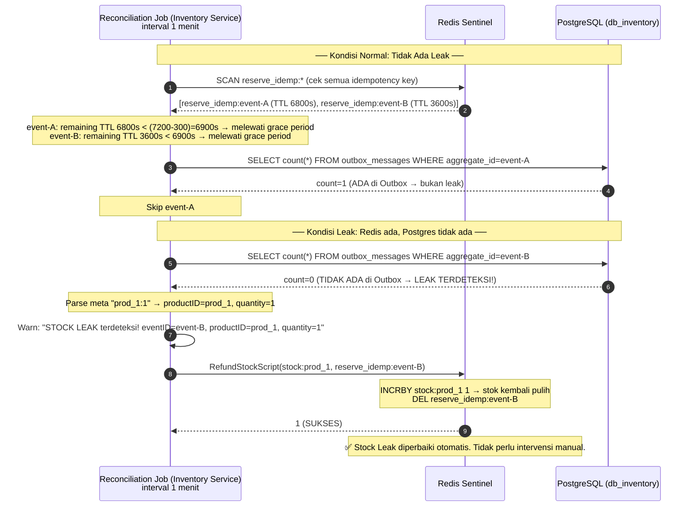
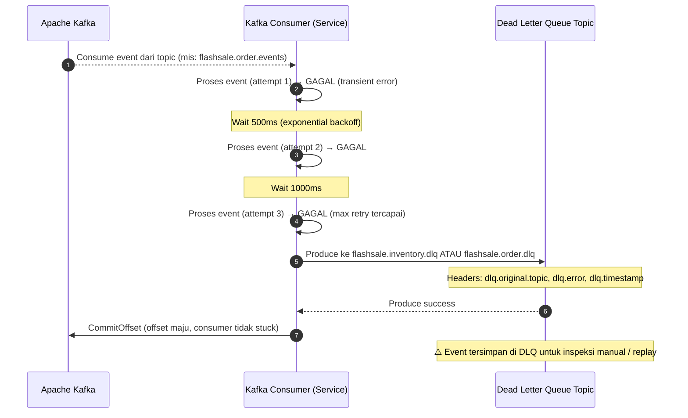

# Checkout Saga Design (Choreography-Based)

## 0. Pra-Kondisi: Register & Login

**Penjelasan Alur:**
- **Langkah 1-4 (Registrasi):** Klien mengirimkan request pendaftaran dengan `username` dan `password`. Nginx meneruskan request ke API Gateway (dengan pembatasan _rate limit_). Gateway memanggil Auth Service via gRPC untuk menyimpan *hash bcrypt* dari password ke database.
- **Langkah 5-8 (Login & Token Generation):** Klien melakukan login. Auth Service memvalidasi kredensial di database. Jika cocok, Auth Service menerbitkan JWT Token yang ditandatangani (_signed_) menggunakan kunci privat asimetris RSA. Token ini dikembalikan ke klien untuk otentikasi di request-request berikutnya.

[🔍 Buka di Mermaid Live Editor (Gunakan Klik Kanan -> Open in New Tab)](https://mermaid.live/edit#base64:eyJjb2RlIjoic2VxdWVuY2VEaWFncmFtXG4gICAgYXV0b251bWJlclxuICAgIGFjdG9yIFUgYXMgVXNlciAvIENsaWVudFxuICAgIHBhcnRpY2lwYW50IE5HIGFzIE5naW54IChSYXRlIExpbWl0ZXIpXG4gICAgcGFydGljaXBhbnQgR1cgYXMgQVBJIEdhdGV3YXlcbiAgICBwYXJ0aWNpcGFudCBBVSBhcyBBdXRoIFNlcnZpY2VcbiAgICBwYXJ0aWNpcGFudCBEQiBhcyBQb3N0Z3JlU1FMIChkYl9hdXRoKVxuXG4gICAgTm90ZSBvdmVyIFUsREI6IOKUgOKUgCBSRUdJU1RSQVNJIOKUgOKUgFxuICAgIFUtXHUwMDNlXHUwMDNlTkc6IFBPU1QgL2FwaS92MS9yZWdpc3RlciB7dXNlcm5hbWUsIHBhc3N3b3JkfVxuICAgIE5HLVx1MDAzZVx1MDAzZUdXOiBGb3J3YXJkIChyYXRlIGxpbWl0OiAxMHIvcylcbiAgICBHVy1cdTAwM2VcdTAwM2VBVTogZ1JQQyBSZWdpc3Rlcih1c2VybmFtZSwgcGFzc3dvcmQpXG4gICAgQVUtXHUwMDNlXHUwMDNlREI6IElOU0VSVCB1c2VycyAodXNlcm5hbWUsIGJjcnlwdF9oYXNoKHBhc3N3b3JkKSlcbiAgICBEQi0tXHUwMDNlXHUwMDNlQVU6IE9LXG4gICAgQVUtLVx1MDAzZVx1MDAzZUdXOiBzdWNjZXNzPXRydWVcbiAgICBHVy0tXHUwMDNlXHUwMDNlVTogSFRUUCAyMDAge1wibWVzc2FnZVwiOiBcInVzZXIgcmVnaXN0ZXJlZCBzdWNjZXNzZnVsbHlcIn1cblxuICAgIE5vdGUgb3ZlciBVLERCOiDilIDilIAgTE9HSU4g4pSA4pSAXG4gICAgVS1cdTAwM2VcdTAwM2VORzogUE9TVCAvYXBpL3YxL2xvZ2luIHt1c2VybmFtZSwgcGFzc3dvcmR9XG4gICAgTkctXHUwMDNlXHUwMDNlR1c6IEZvcndhcmRcbiAgICBHVy1cdTAwM2VcdTAwM2VBVTogZ1JQQyBMb2dpbih1c2VybmFtZSwgcGFzc3dvcmQpXG4gICAgQVUtXHUwMDNlXHUwMDNlREI6IFNFTEVDVCB1c2VyIFdIRVJFIHVzZXJuYW1lPT9cbiAgICBEQi0tXHUwMDNlXHUwMDNlQVU6IHVzZXIgcmVjb3JkXG4gICAgQVUtXHUwMDNlXHUwMDNlQVU6IGJjcnlwdC5Db21wYXJlSGFzaEFuZFBhc3N3b3JkKClcbiAgICBBVS0tXHUwMDNlXHUwMDNlR1c6IEpXVCBUb2tlbiAoc2lnbmVkIFJTMjU2IHByaXZhdGUucGVtKVxuICAgIE5vdGUgb3ZlciBHVzogSldUIHBheWxvYWQ6IHN1Yj11c2VySUQsIGp0aT1VVUlELCBleHA9MTVtXG4gICAgR1ctLVx1MDAzZVx1MDAzZVU6IEhUVFAgMjAwIHtcImFjY2Vzc190b2tlblwiOiBcImV5Si4uLlwifVxuICAgIE5vdGUgb3ZlciBVOiBDbGllbnQgbWVueWltcGFuIGFjY2Vzc190b2tlbiB1bnR1ayByZXF1ZXN0IGJlcmlrdXRueWEiLCJtZXJtYWlkIjoie1xuICBcInRoZW1lXCI6IFwiZGVmYXVsdFwiXG59IiwiYXV0b1N5bmMiOnRydWUsInVwZGF0ZURpYWdyYW0iOnRydWV9)

## 1. Happy Path: Checkout & Payment Success (Short Polling)

**Penjelasan Alur:**
- **Langkah 1-6 (Validasi & Reservasi Fast-Path):** Klien memanggil `/api/v1/checkout`. Gateway memvalidasi JWT Token (tanpa ke Auth Service, cukup dengan kunci publik) lalu mengecek _blacklist_ di Redis Sentinel. Gateway kemudian memerintahkan Inventory Service memotong stok di Redis melalui transaksi Lua Script atomik.
- **Langkah 7-10 (Response Instan):** Setelah stok Redis terpotong dan pesan asinkron disimpan di tabel _outbox_ PostgreSQL, Gateway langsung membalas Klien dengan respons asinkron `HTTP 202 Accepted` tanda pesanan diterima tapi belum sepenuhnya dikonfirmasi.
- **Langkah 11-14 (Short Polling):** Klien secara mandiri (via _loop_) menanyakan status pesanannya ke endpoint `GET /api/v1/orders/{order_id}` ke Gateway berulang kali (setiap 1-2 detik).
- **Langkah 15-20 (Propagasi & Realisasi Background):** Di saat yang sama, _Relay Worker_ di latar belakang secara agresif memungut pesan dari tabel _outbox_ dan mengirimkannya ke Kafka. Order Service yang membaca Kafka akan menyadari reservasi berhasil dan membuat _record_ pesanan dengan status `PENDING` di database miliknya.
- **Langkah 21-31 (Resolusi Pembayaran):** Segera setelah klien melihat pesanan berstatus `PENDING` dari _polling_-nya, klien memanggil `/api/v1/pay`. Transaksi pembayaran divalidasi dan disimpan. _Relay Worker_ payment mengirim `PaymentCompletedEvent` ke Kafka yang akhirnya dikonsumsi oleh Order Service untuk meresmikan pesanan ke status akhir `PAID`.

[🔍 Buka di Mermaid Live Editor (Gunakan Klik Kanan -> Open in New Tab)](https://mermaid.live/edit#base64:eyJjb2RlIjoic2VxdWVuY2VEaWFncmFtXG4gICAgYXV0b251bWJlclxuICAgIGFjdG9yIFUgYXMgVXNlciAvIENsaWVudFxuICAgIHBhcnRpY2lwYW50IE5HIGFzIE5naW54XG4gICAgcGFydGljaXBhbnQgR1cgYXMgQVBJIEdhdGV3YXlcbiAgICBwYXJ0aWNpcGFudCBSRCBhcyBSZWRpcyBTZW50aW5lbFxuICAgIHBhcnRpY2lwYW50IEkgYXMgSW52ZW50b3J5IFNlcnZpY2VcbiAgICBwYXJ0aWNpcGFudCBJREIgYXMgUG9zdGdyZVNRTCAoZGJfaW52ZW50b3J5KVxuICAgIHBhcnRpY2lwYW50IFJXMSBhcyBSZWxheSBXb3JrZXIgKEludmVudG9yeSlcbiAgICBwYXJ0aWNpcGFudCBLIGFzIEFwYWNoZSBLYWZrYVxuICAgIHBhcnRpY2lwYW50IE8gYXMgT3JkZXIgU2VydmljZVxuICAgIHBhcnRpY2lwYW50IE9EQiBhcyBQb3N0Z3JlU1FMIChkYl9vcmRlcilcbiAgICBwYXJ0aWNpcGFudCBQIGFzIFBheW1lbnQgU2VydmljZVxuICAgIHBhcnRpY2lwYW50IFBEQiBhcyBQb3N0Z3JlU1FMIChkYl9wYXltZW50KVxuICAgIHBhcnRpY2lwYW50IFJXMiBhcyBSZWxheSBXb3JrZXIgKFBheW1lbnQpXG5cbiAgICBOb3RlIG92ZXIgVSxPREI6IOKUgOKUgCBDSEVDS09VVCDilIDilIBcbiAgICBVLVx1MDAzZVx1MDAzZU5HOiBQT1NUIC9hcGkvdjEvY2hlY2tvdXQge3Byb2R1Y3RfaWR9ICsgQmVhcmVyIEpXVFxuICAgIE5HLVx1MDAzZVx1MDAzZUdXOiBGb3J3YXJkIChyYXRlIGxpbWl0IDEwci9zLCBidXJzdCAyMClcbiAgICBHVy1cdTAwM2VcdTAwM2VHVzogdmFsaWRhdGVKV1QocHVibGljLnBlbSkg4oaSIGV4dHJhY3QgdXNlcklEIGRhcmkgJ3N1YidcbiAgICBHVy1cdTAwM2VcdTAwM2VSRDogR0VUIGJsYWNrbGlzdDp7anRpfVxuICAgIFJELS1cdTAwM2VcdTAwM2VHVzogbmlsICh0b2tlbiB2YWxpZCwgYmVsdW0gZGktcmV2b2tlKVxuICAgIEdXLVx1MDAzZVx1MDAzZUk6IGdSUEMgUmVzZXJ2ZVN0b2NrKHByb2R1Y3RJRCwgdXNlcklELCBldmVudElEKVxuICAgIFxuICAgIE5vdGUgb3ZlciBJLFJEOiBBdG9taWMgTHVhIFNjcmlwdCBkaSBSZWRpcyBTZW50aW5lbFxuICAgIEktXHUwMDNlXHUwMDNlUkQ6IEVYRUMgUmVzZXJ2ZVN0b2NrU2NyaXB0KHN0b2NrOnByb2RfMSwgcmVzZXJ2ZV9pZGVtcDpldmVudElEKVxuICAgIE5vdGUgb3ZlciBSRDogMS4gRVhJU1RTIHJlc2VydmVfaWRlbXA6ZXZlbnRJRCDihpIgMCAoYmVsdW0gYWRhKVx1MDAzY2JyL1x1MDAzZTIuIEdFVCBzdG9jazpwcm9kXzEg4oaSIDk5IFx1MDAzZT0gMSDinJNcdTAwM2Nici9cdTAwM2UzLiBERUNSQlkgc3RvY2s6cHJvZF8xIDEg4oaSIDk4XHUwMDNjYnIvXHUwMDNlNC4gU0VUIHJlc2VydmVfaWRlbXA6ZXZlbnRJRCBcInByb2RfMToxXCIgRVggNzIwMFxuICAgIFJELS1cdTAwM2VcdTAwM2VJOiAxIChTVUtTRVMpXG4gICAgXG4gICAgSS1cdTAwM2VcdTAwM2VJREI6IElOU0VSVCBvdXRib3hfbWVzc2FnZXMgKFN0b2NrUmVzZXJ2ZWRFdmVudCwgc3RhdHVzPVBFTkRJTkcpXG4gICAgTm90ZSBvdmVyIEksSURCOiBEYWxhbSAxIHRyYW5zYWtzaSBEQiB5YW5nIHNhbWFcbiAgICBJREItLVx1MDAzZVx1MDAzZUk6IE9LXG4gICAgSS0tXHUwMDNlXHUwMDNlR1c6IHN1Y2Nlc3M9dHJ1ZVxuICAgIEdXLS1cdTAwM2VcdTAwM2VVOiBIVFRQIDIwMiBBY2NlcHRlZCB7ZXZlbnRfaWQsIG9yZGVyX2lkLCBtZXNzYWdlOiBcInBlc2FuYW4gc2VkYW5nIGRpcHJvc2VzXCJ9XG5cbiAgICBOb3RlIG92ZXIgVSxHVzog4pSA4pSAIFNIT1JUIFBPTExJTkcg4pSA4pSAXG4gICAgbG9vcCBTZXRpYXAgMS0yIGRldGlrXG4gICAgICAgIFUtXHUwMDNlXHUwMDNlTkc6IEdFVCAvYXBpL3YxL29yZGVycy97b3JkZXJfaWR9ICsgQmVhcmVyIEpXVFxuICAgICAgICBORy1cdTAwM2VcdTAwM2VHVzogRm9yd2FyZFxuICAgICAgICBHVy1cdTAwM2VcdTAwM2VPOiBnUlBDIEdldE9yZGVyKG9yZGVyX2lkKVxuICAgICAgICBPLVx1MDAzZVx1MDAzZU9EQjogU0VMRUNUIHN0YXR1cyBGUk9NIG9yZGVycyBXSEVSRSBpZD1vcmRlcl9pZFxuICAgICAgICBPREItLVx1MDAzZVx1MDAzZU86IHN0YXR1cyAobWlzYWw6IFBFTkRJTkcpXG4gICAgICAgIE8tLVx1MDAzZVx1MDAzZUdXOiBHZXRPcmRlclJlc3BvbnNlKFBFTkRJTkcpXG4gICAgICAgIEdXLS1cdTAwM2VcdTAwM2VVOiBIVFRQIDIwMCB7XCJkYXRhXCI6IHtcInN0YXR1c1wiOiBcIlBFTkRJTkdcIn19XG4gICAgZW5kXG5cbiAgICBOb3RlIG92ZXIgUlcxLEs6IOKUgOKUgCBCQUNLR1JPVU5EOiBSZWxheSBXb3JrZXIgSW52ZW50b3J5IOKUgOKUgFxuICAgIFJXMS1cdTAwM2VcdTAwM2VJREI6IFNFTEVDVCBQRU5ESU5HIEZPUiBVUERBVEUgU0tJUCBMT0NLRUQgKHBvbGxpbmcgMSBkZXRpaylcbiAgICBJREItLVx1MDAzZVx1MDAzZVJXMTogW1N0b2NrUmVzZXJ2ZWRFdmVudF1cbiAgICBSVzEtXHUwMDNlXHUwMDNlSzogUHJvZHVjZSDihpIgZmxhc2hzYWxlLmludmVudG9yeS5ldmVudHMgKFN0b2NrUmVzZXJ2ZWRFdmVudClcbiAgICBSVzEtXHUwMDNlXHUwMDNlSURCOiBVUERBVEUgb3V0Ym94X21lc3NhZ2VzIFNFVCBzdGF0dXM9U0VOVFxuXG4gICAgTm90ZSBvdmVyIEssT0RCOiDilIDilIAgT1JERVIgU0VSVklDRSBtZW5lcmltYSBldmVudCDilIDilIBcbiAgICBLLS1cdTAwM2VcdTAwM2VPOiBDb25zdW1lIGZsYXNoc2FsZS5pbnZlbnRvcnkuZXZlbnRzIChTdG9ja1Jlc2VydmVkRXZlbnQpXG4gICAgTy1cdTAwM2VcdTAwM2VPREI6IFNFTEVDVCBwcm9jZXNzZWRfZXZlbnRzIFdIRVJFIGV2ZW50X2lkPT8g4oaSIG5vdCBmb3VuZFxuICAgIE8tXHUwMDNlXHUwMDNlT0RCOiBJTlNFUlQgb3JkZXJzIChzdGF0dXM9UEVORElORykgKyBJTlNFUlQgcHJvY2Vzc2VkX2V2ZW50c1xuICAgIE5vdGUgb3ZlciBPREI6IERhbGFtIDEgdHJhbnNha3NpIERCXG4gICAgT0RCLS1cdTAwM2VcdTAwM2VPOiBPS1xuXG4gICAgTm90ZSBvdmVyIFUsUERCOiDilIDilIAgUEVNQkFZQVJBTiAoc2V0ZWxhaCBwb2xsaW5nIHN0YXR1cz1QRU5ESU5HKSDilIDilIBcbiAgICBVLVx1MDAzZVx1MDAzZU5HOiBQT1NUIC9hcGkvdjEvcGF5IHtvcmRlcl9pZCwgYW1vdW50PTE1MDAwMH0gKyBCZWFyZXIgSldUXG4gICAgTkctXHUwMDNlXHUwMDNlR1c6IEZvcndhcmRcbiAgICBHVy1cdTAwM2VcdTAwM2VHVzogdmFsaWRhdGVKV1QocHVibGljLnBlbSlcbiAgICBHVy1cdTAwM2VcdTAwM2VSRDogR0VUIGJsYWNrbGlzdDp7anRpfSDihpIgbmlsICh2YWxpZClcbiAgICBHVy1cdTAwM2VcdTAwM2VQOiBnUlBDIFByb2Nlc3NQYXltZW50KG9yZGVySUQsIGFtb3VudD0xNTAwMDApXG4gICAgTm90ZSBvdmVyIFA6IDE1MDAwMCBtb2QgMTAgPSAwIOKJoCA0IOKGkiBTVUtTRVNcbiAgICBQLVx1MDAzZVx1MDAzZVBEQjogSU5TRVJUIHBheW1lbnRzIChTVUNDRVNTKSArIElOU0VSVCBvdXRib3hfbWVzc2FnZXMgKFBheW1lbnRDb21wbGV0ZWRFdmVudClcbiAgICBOb3RlIG92ZXIgUERCOiBEYWxhbSAxIHRyYW5zYWtzaSBEQlxuICAgIFBEQi0tXHUwMDNlXHUwMDNlUDogT0tcbiAgICBQLS1cdTAwM2VcdTAwM2VHVzogc3VjY2Vzcz10cnVlXG4gICAgR1ctLVx1MDAzZVx1MDAzZVU6IEhUVFAgMjAwIHtcIm1lc3NhZ2VcIjogXCJwYXltZW50IHN1Y2Nlc3NcIn1cblxuICAgIE5vdGUgb3ZlciBSVzIsSzog4pSA4pSAIEJBQ0tHUk9VTkQ6IFJlbGF5IFdvcmtlciBQYXltZW50IOKUgOKUgFxuICAgIFJXMi1cdTAwM2VcdTAwM2VQREI6IFNFTEVDVCBQRU5ESU5HIEZPUiBVUERBVEUgU0tJUCBMT0NLRURcbiAgICBQREItLVx1MDAzZVx1MDAzZVJXMjogW1BheW1lbnRDb21wbGV0ZWRFdmVudF1cbiAgICBSVzItXHUwMDNlXHUwMDNlSzogUHJvZHVjZSDihpIgZmxhc2hzYWxlLnBheW1lbnQuZXZlbnRzIChQYXltZW50Q29tcGxldGVkRXZlbnQpXG4gICAgUlcyLVx1MDAzZVx1MDAzZVBEQjogVVBEQVRFIG91dGJveF9tZXNzYWdlcyBTRVQgc3RhdHVzPVNFTlRcblxuICAgIE5vdGUgb3ZlciBLLE9EQjog4pSA4pSAIE9SREVSIFNFUlZJQ0UgbWVtcGVyYmFydWkgc3RhdHVzIOKUgOKUgFxuICAgIEstLVx1MDAzZVx1MDAzZU86IENvbnN1bWUgZmxhc2hzYWxlLnBheW1lbnQuZXZlbnRzIChQYXltZW50Q29tcGxldGVkRXZlbnQpXG4gICAgTm90ZSBvdmVyIE86IGZpZWxkICdyZWFzb24nIGtvc29uZyDihpIgUGF5bWVudENvbXBsZXRlZEV2ZW50XG4gICAgTy1cdTAwM2VcdTAwM2VPREI6IFNFTEVDVCBwcm9jZXNzZWRfZXZlbnRzIFdIRVJFIGV2ZW50X2lkPT8g4oaSIG5vdCBmb3VuZFxuICAgIE8tXHUwMDNlXHUwMDNlT0RCOiBVUERBVEUgb3JkZXJzIFNFVCBzdGF0dXM9UEFJRCArIElOU0VSVCBwcm9jZXNzZWRfZXZlbnRzXG4gICAgT0RCLS1cdTAwM2VcdTAwM2VPOiBPS1xuICAgIE5vdGUgb3ZlciBPREI6IOKchSBPcmRlciBmaW5hbCBzdGF0dXMgPSBQQUlELiBTdG9rIFJlZGlzID0gOTguIiwibWVybWFpZCI6IntcbiAgXCJ0aGVtZVwiOiBcImRlZmF1bHRcIlxufSIsImF1dG9TeW5jIjp0cnVlLCJ1cGRhdGVEaWFncmFtIjp0cnVlfQ==)

## 2. Sad Path: Stock Empty / Duplicates

**Penjelasan Singkat:**
- Seluruh validasi stok (_stock availability_) dan pengecekan duplikasi (_idempotency_) disatukan dalam **satu transaksi atomik di Redis (Lua Script)**.
- Pendekatan ini mencegah sistem untuk perlu melakukan _query_ ke PostgreSQL sama sekali jika kondisinya gagal, sehingga API sanggup memberikan respons penolakan (`409 Conflict`) yang super kilat dan mengeliminasi masalah *Zero Double-Deduction* secara absolut.

### A. Skenario: Stok Habis (Empty)

**Penjelasan Alur:**
- **Langkah 1-3:** Klien melakukan request checkout. Gateway memvalidasi token JWT secara instan tanpa perlu memanggil Auth Service.
- **Langkah 4-5:** Gateway memanggil prosedur gRPC `ReserveStock` ke Inventory Service.
- **Langkah 6-7:** Inventory Service menjalankan Lua Script di Redis. Skrip mengecek stok yang ternyata sudah 0. Skrip langsung mengembalikan kode 0 (gagal).
- **Langkah 8-9:** Inventory membalas Gateway dengan pesan kegagalan. Gateway mengembalikan respons `409 Conflict` ke Klien. Seluruh proses ini sangat cepat karena tidak membebani PostgreSQL.

[🔍 Buka di Mermaid Live Editor (Gunakan Klik Kanan -> Open in New Tab)](https://mermaid.live/edit#base64:eyJjb2RlIjoic2VxdWVuY2VEaWFncmFtXG4gICAgYXV0b251bWJlclxuICAgIGFjdG9yIFUgYXMgVXNlciAvIENsaWVudFxuICAgIHBhcnRpY2lwYW50IE5HIGFzIE5naW54XG4gICAgcGFydGljaXBhbnQgR1cgYXMgQVBJIEdhdGV3YXlcbiAgICBwYXJ0aWNpcGFudCBSRCBhcyBSZWRpcyBTZW50aW5lbFxuICAgIHBhcnRpY2lwYW50IEkgYXMgSW52ZW50b3J5IFNlcnZpY2VcblxuICAgIFUtXHUwMDNlXHUwMDNlTkc6IFBPU1QgL2FwaS92MS9jaGVja291dCB7cHJvZHVjdF9pZH0gKyBCZWFyZXIgSldUXG4gICAgTkctXHUwMDNlXHUwMDNlR1c6IEZvcndhcmRcbiAgICBHVy1cdTAwM2VcdTAwM2VHVzogdmFsaWRhdGVKV1Qg4oaSIHVzZXJJRCBleHRyYWN0ZWRcbiAgICBHVy1cdTAwM2VcdTAwM2VSRDogR0VUIGJsYWNrbGlzdDp7anRpfSDihpIgbmlsICh2YWxpZClcbiAgICBHVy1cdTAwM2VcdTAwM2VJOiBnUlBDIFJlc2VydmVTdG9jayhwcm9kdWN0SUQsIHVzZXJJRCwgZXZlbnRJRClcblxuICAgIE5vdGUgb3ZlciBJLFJEOiBBdG9taWMgTHVhIFNjcmlwdCBkaSBSZWRpcyBTZW50aW5lbFxuICAgIEktXHUwMDNlXHUwMDNlUkQ6IEVYRUMgUmVzZXJ2ZVN0b2NrU2NyaXB0KHN0b2NrOnByb2RfMSwgcmVzZXJ2ZV9pZGVtcDpldmVudElEKVxuICAgIE5vdGUgb3ZlciBSRDogMS4gRVhJU1RTIHJlc2VydmVfaWRlbXA6ZXZlbnRJRCDihpIgMCAoYnVrYW4gZHVwbGlrYXQpXHUwMDNjYnIvXHUwMDNlMi4gR0VUIHN0b2NrOnByb2RfMSDihpIgMCAoU1RPSyBIQUJJUyEpIFx1MDAzYyAxXHUwMDNjYnIvXHUwMDNlMy4gcmV0dXJuIDAgKEdBR0FMKVxuICAgIFJELS1cdTAwM2VcdTAwM2VJOiAwIChHQUdBTCDigJQgc3RvayB0aWRhayBjdWt1cClcblxuICAgIEktLVx1MDAzZVx1MDAzZUdXOiBzdWNjZXNzPWZhbHNlXG4gICAgR1ctLVx1MDAzZVx1MDAzZVU6IEhUVFAgNDA5IENvbmZsaWN0IHtcIm1lc3NhZ2VcIjogXCJzdG9rIGhhYmlzIGF0YXUgc2VkYW5nIGRpcHJvc2VzXCJ9XG4gICAgTm90ZSBvdmVyIFU6IOKdjCBDaGVja291dCBnYWdhbC4gU3RvayBSZWRpcyB0aWRhayBiZXJ1YmFoLiIsIm1lcm1haWQiOiJ7XG4gIFwidGhlbWVcIjogXCJkZWZhdWx0XCJcbn0iLCJhdXRvU3luYyI6dHJ1ZSwidXBkYXRlRGlhZ3JhbSI6dHJ1ZX0=)

### B. Skenario: Duplikasi Request (Idempotency)

**Penjelasan Alur:**
- **Langkah 1-6 (Request Pertama):** Klien mengirimkan request dengan header `X-Idempotency-Key` (misal: "abc-123"). Request ini lolos validasi Lua Script di Redis karena kunci belum ada. Stok dikurangi, pesanan diproses, Klien menerima respons Sukses.
- **Langkah 7-10 (Request Kedua/Retries):** Karena masalah jaringan, Klien (atau *retry* otomatis) mengulang kembali request yang identik dengan `X-Idempotency-Key` yang sama ("abc-123"). 
- **Langkah 11-13:** Lua Script mengecek dan mendeteksi bahwa kunci "abc-123" `EXISTS` (sudah pernah diproses). Skrip seketika menghentikan eksekusi dan mengembalikan 0 (gagal) tanpa melakukan pemotongan stok berulang (*Zero Double-Deduction*).

[🔍 Buka di Mermaid Live Editor (Gunakan Klik Kanan -> Open in New Tab)](https://mermaid.live/edit#base64:eyJjb2RlIjoic2VxdWVuY2VEaWFncmFtXG4gICAgYXV0b251bWJlclxuICAgIGFjdG9yIFUgYXMgVXNlciAvIENsaWVudFxuICAgIHBhcnRpY2lwYW50IEdXIGFzIEFQSSBHYXRld2F5XG4gICAgcGFydGljaXBhbnQgUkQgYXMgUmVkaXMgU2VudGluZWxcbiAgICBwYXJ0aWNpcGFudCBJIGFzIEludmVudG9yeSBTZXJ2aWNlXG5cbiAgICBOb3RlIG92ZXIgVSxJOiBSZXF1ZXN0IFBFUlRBTUEgKGJlcmhhc2lsKVxuICAgIFUtXHUwMDNlXHUwMDNlR1c6IFBPU1QgL2NoZWNrb3V0IHtwcm9kdWN0X2lkfSArIGhlYWRlciBYLUlkZW1wb3RlbmN5LUtleTogXCJhYmMtMTIzXCJcbiAgICBHVy1cdTAwM2VcdTAwM2VJOiBnUlBDIFJlc2VydmVTdG9jayhwcm9kdWN0SUQsIHVzZXJJRCwgZXZlbnRJRD1cImFiYy0xMjNcIilcbiAgICBJLVx1MDAzZVx1MDAzZVJEOiBSZXNlcnZlU3RvY2tTY3JpcHQg4oaSIHJlc2VydmVfaWRlbXA6YWJjLTEyMyB0aWRhayBhZGEg4oaSIFNVS1NFU1xuICAgIFJELS1cdTAwM2VcdTAwM2VJOiAxXG4gICAgSS0tXHUwMDNlXHUwMDNlR1c6IHN1Y2Nlc3M9dHJ1ZVxuICAgIEdXLS1cdTAwM2VcdTAwM2VVOiBIVFRQIDIwMiBBY2NlcHRlZFxuXG4gICAgTm90ZSBvdmVyIFUsSTogUmVxdWVzdCBLRURVQSBkZW5nYW4gSWRlbXBvdGVuY3kgS2V5IHlhbmcgU0FNQSAoZHVwbGlrYXQgLyByZXRyeSlcbiAgICBVLVx1MDAzZVx1MDAzZUdXOiBQT1NUIC9jaGVja291dCB7cHJvZHVjdF9pZH0gKyBoZWFkZXIgWC1JZGVtcG90ZW5jeS1LZXk6IFwiYWJjLTEyM1wiXG4gICAgR1ctXHUwMDNlXHUwMDNlSTogZ1JQQyBSZXNlcnZlU3RvY2socHJvZHVjdElELCB1c2VySUQsIGV2ZW50SUQ9XCJhYmMtMTIzXCIpXG4gICAgSS1cdTAwM2VcdTAwM2VSRDogUmVzZXJ2ZVN0b2NrU2NyaXB0IOKGkiBFWElTVFMgcmVzZXJ2ZV9pZGVtcDphYmMtMTIzIOKGkiAxIChTVURBSCBBREEhKVxuICAgIE5vdGUgb3ZlciBSRDogTGFuZ2thaCBwZXJ0YW1hIEx1YSBTY3JpcHQ6IGNlayBpZGVtcG90ZW5jeVx1MDAzY2JyL1x1MDAzZXJldHVybiAwIGxhbmdzdW5nIHRhbnBhIG1lbW90b25nIHN0b2sgbGFnaVxuICAgIFJELS1cdTAwM2VcdTAwM2VJOiAwIChESVRPTEFLIOKAlCBkdXBsaWthdClcbiAgICBJLS1cdTAwM2VcdTAwM2VHVzogc3VjY2Vzcz1mYWxzZVxuICAgIEdXLS1cdTAwM2VcdTAwM2VVOiBIVFRQIDQwOSBDb25mbGljdFxuICAgIE5vdGUgb3ZlciBVOiDinYwgU3RvayB0aWRhayB0ZXJwb3RvbmcgZHVhIGthbGkuIFplcm8gZG91YmxlLWRlZHVjdGlvbi4iLCJtZXJtYWlkIjoie1xuICBcInRoZW1lXCI6IFwiZGVmYXVsdFwiXG59IiwiYXV0b1N5bmMiOnRydWUsInVwZGF0ZURpYWdyYW0iOnRydWV9)

## 3. Compensation Path (Saga)

**Penjelasan Alur (Saga Pembatalan):**
- Apabila sistem hilir (contoh: Payment Service) menjumpai kendala dan menolak pembayaran, ia akan melempar `PaymentFailedEvent` ke dalam Kafka.
- Event kegagalan ini akan "berjalan mundur" (dibaca oleh sistem sebelumnya, yaitu Order Service) yang bertugas membatalkan pesanan menjadi status `CANCELLED`.
- Order Service yang membatalkan ini lantas melempar `OrderCancelledEvent` yang pada gilirannya akan dibaca oleh Inventory Service di ujung rantai, guna memulihkan (_refund_) stok barang kembali ke Redis.

### A. Pembatalan Akibat Payment Gagal

**Penjelasan Alur:**
- **Langkah 1-6 (Pembayaran Ditolak):** Klien mencoba membayar pesanan namun ditolak (misal: kartu kredit bermasalah / saldo tidak cukup). Payment Service merespons error ke Klien dan menyisipkan `PaymentFailedEvent` ke dalam *outbox* database.
- **Langkah 7-10 (Broadcast Kegagalan):** *Relay Worker* milik Payment Service mengambil event gagal bayar tersebut dan menyebarkannya ke *topic* Kafka.
- **Langkah 11-15 (Order Dibatalkan):** Order Service mendengar `PaymentFailedEvent`. Ia segera mengubah status pesanan dari `PENDING` menjadi `CANCELLED` secara permanen, lalu mengeluarkan `OrderCancelledEvent` ke *outbox* miliknya.
- **Langkah 16-19 (Propagasi Pembatalan):** *Relay Worker* milik Order Service mengirimkan `OrderCancelledEvent` ke Kafka.
- **Langkah 20-24 (Pengembalian Stok):** Inventory Service menyerap event pembatalan ini dan mengeksekusi perintah Lua Script `RefundStockScript` di Redis untuk menambahkan +1 pada stok barang, membuat kuota kembali terbuka untuk pembeli lain.

[🔍 Buka di Mermaid Live Editor (Gunakan Klik Kanan -> Open in New Tab)](https://mermaid.live/edit#base64:eyJjb2RlIjoic2VxdWVuY2VEaWFncmFtXG4gICAgYXV0b251bWJlclxuICAgIGFjdG9yIFUgYXMgVXNlciAvIENsaWVudFxuICAgIHBhcnRpY2lwYW50IEdXIGFzIEFQSSBHYXRld2F5XG4gICAgcGFydGljaXBhbnQgUCBhcyBQYXltZW50IFNlcnZpY2VcbiAgICBwYXJ0aWNpcGFudCBQREIgYXMgUG9zdGdyZVNRTCAoZGJfcGF5bWVudClcbiAgICBwYXJ0aWNpcGFudCBSVyBhcyBSZWxheSBXb3JrZXIgKFBheW1lbnQpXG4gICAgcGFydGljaXBhbnQgSyBhcyBBcGFjaGUgS2Fma2FcbiAgICBwYXJ0aWNpcGFudCBPIGFzIE9yZGVyIFNlcnZpY2VcbiAgICBwYXJ0aWNpcGFudCBPREIgYXMgUG9zdGdyZVNRTCAoZGJfb3JkZXIpXG4gICAgcGFydGljaXBhbnQgUlcyIGFzIFJlbGF5IFdvcmtlciAoT3JkZXIpXG4gICAgcGFydGljaXBhbnQgSSBhcyBJbnZlbnRvcnkgU2VydmljZVxuICAgIHBhcnRpY2lwYW50IFJEIGFzIFJlZGlzIFNlbnRpbmVsXG5cbiAgICBVLVx1MDAzZVx1MDAzZUdXOiBQT1NUIC9hcGkvdjEvcGF5IHtvcmRlcl9pZCwgYW1vdW50PTE1MDAwNH0gKyBCZWFyZXIgSldUXG4gICAgR1ctXHUwMDNlXHUwMDNlUDogZ1JQQyBQcm9jZXNzUGF5bWVudChvcmRlcklELCBhbW91bnQ9MTUwMDA0KVxuICAgIE5vdGUgb3ZlciBQOiAxNTAwMDQgbW9kIDEwID0gNCDihpIgUEFZTUVOVCBHQUdBTCAoc2ltdWxhc2kgYmFuayB0b2xhaylcbiAgICBQLVx1MDAzZVx1MDAzZVBEQjogSU5TRVJUIHBheW1lbnRzIChGQUlMRUQpICsgSU5TRVJUIG91dGJveF9tZXNzYWdlcyAoUGF5bWVudEZhaWxlZEV2ZW50KVxuICAgIFBEQi0tXHUwMDNlXHUwMDNlUDogT0tcbiAgICBQLS1cdTAwM2VcdTAwM2VHVzogc3VjY2Vzcz1mYWxzZVxuICAgIEdXLS1cdTAwM2VcdTAwM2VVOiBIVFRQIDUwMCB7XCJtZXNzYWdlXCI6IFwicGF5bWVudCBmYWlsZWRcIn1cblxuICAgIE5vdGUgb3ZlciBSVyxLOiDilIDilIAgUmVsYXkgV29ya2VyIFBheW1lbnQg4pSA4pSAXG4gICAgUlctXHUwMDNlXHUwMDNlUERCOiBTRUxFQ1QgUEVORElORyBGT1IgVVBEQVRFIFNLSVAgTE9DS0VEXG4gICAgUERCLS1cdTAwM2VcdTAwM2VSVzogW1BheW1lbnRGYWlsZWRFdmVudF1cbiAgICBSVy1cdTAwM2VcdTAwM2VLOiBQcm9kdWNlIOKGkiBmbGFzaHNhbGUucGF5bWVudC5ldmVudHMgKFBheW1lbnRGYWlsZWRFdmVudCwgcmVhc29uPVwicGF5bWVudCByZWplY3RlZFwiKVxuICAgIFJXLVx1MDAzZVx1MDAzZVBEQjogVVBEQVRFIHN0YXR1cz1TRU5UXG5cbiAgICBOb3RlIG92ZXIgSyxPREI6IOKUgOKUgCBPcmRlciBTZXJ2aWNlIG1lbmVyaW1hIFBheW1lbnRGYWlsZWRFdmVudCDilIDilIBcbiAgICBLLS1cdTAwM2VcdTAwM2VPOiBDb25zdW1lIGZsYXNoc2FsZS5wYXltZW50LmV2ZW50c1xuICAgIE5vdGUgb3ZlciBPOiByYXdbXCJyZWFzb25cIl0gdGlkYWsga29zb25nIOKGkiBQYXltZW50RmFpbGVkRXZlbnRcbiAgICBPLVx1MDAzZVx1MDAzZU9EQjogR2V0T3JkZXIob3JkZXJJRCkg4oaSIGFtYmlsIHByb2R1Y3RJRCBkYW4gcXVhbnRpdHlcbiAgICBPLVx1MDAzZVx1MDAzZU9EQjogSU5TRVJUIG91dGJveF9tZXNzYWdlcyAoT3JkZXJDYW5jZWxsZWRFdmVudClcbiAgICBPLVx1MDAzZVx1MDAzZU9EQjogVVBEQVRFIG9yZGVycyBTRVQgc3RhdHVzPUNBTkNFTExFRFxuICAgIE5vdGUgb3ZlciBPREI6IERhbGFtIDEgdHJhbnNha3NpIERCIChhdG9taWMpXG4gICAgT0RCLS1cdTAwM2VcdTAwM2VPOiBPS1xuXG4gICAgTm90ZSBvdmVyIFJXMixLOiDilIDilIAgUmVsYXkgV29ya2VyIE9yZGVyIOKUgOKUgFxuICAgIFJXMi1cdTAwM2VcdTAwM2VPREI6IFNFTEVDVCBQRU5ESU5HIEZPUiBVUERBVEUgU0tJUCBMT0NLRURcbiAgICBPREItLVx1MDAzZVx1MDAzZVJXMjogW09yZGVyQ2FuY2VsbGVkRXZlbnRdXG4gICAgUlcyLVx1MDAzZVx1MDAzZUs6IFByb2R1Y2Ug4oaSIGZsYXNoc2FsZS5vcmRlci5ldmVudHMgKE9yZGVyQ2FuY2VsbGVkRXZlbnQsIHJlYXNvbj1cInBheW1lbnQgcmVqZWN0ZWRcIilcbiAgICBSVzItXHUwMDNlXHUwMDNlT0RCOiBVUERBVEUgc3RhdHVzPVNFTlRcblxuICAgIE5vdGUgb3ZlciBLLFJEOiDilIDilIAgSW52ZW50b3J5IFNlcnZpY2U6IFNhZ2EgQ29tcGVuc2F0aW9uIOKUgOKUgFxuICAgIEstLVx1MDAzZVx1MDAzZUk6IENvbnN1bWUgZmxhc2hzYWxlLm9yZGVyLmV2ZW50cyAoT3JkZXJDYW5jZWxsZWRFdmVudClcbiAgICBOb3RlIG92ZXIgSTogcmF3W1wicmVhc29uXCJdIHRpZGFrIGtvc29uZyDihpIgT3JkZXJDYW5jZWxsZWRFdmVudFxuICAgIEktXHUwMDNlXHUwMDNlUkQ6IEVYRUMgUmVmdW5kU3RvY2tTY3JpcHQoc3RvY2s6cHJvZF8xLCByZXNlcnZlX2lkZW1wOmV2ZW50SUQpXG4gICAgTm90ZSBvdmVyIFJEOiAxLiBJTkNSQlkgc3RvY2s6cHJvZF8xIDEg4oaSIHN0b2sgbmFpayBrZW1iYWxpXHUwMDNjYnIvXHUwMDNlMi4gREVMIHJlc2VydmVfaWRlbXA6ZXZlbnRJRCDihpIgdXNlciBiaXNhIGJlbGkgbGFnaVxuICAgIFJELS1cdTAwM2VcdTAwM2VJOiAxIChTVUtTRVMpXG4gICAgTm90ZSBvdmVyIFJEOiDinIUgU3RvayBwdWxpaC4gU2FnYSBDb21wZW5zYXRpb24gc2VsZXNhaS4iLCJtZXJtYWlkIjoie1xuICBcInRoZW1lXCI6IFwiZGVmYXVsdFwiXG59IiwiYXV0b1N5bmMiOnRydWUsInVwZGF0ZURpYWdyYW0iOnRydWV9)

### B. Pembatalan Akibat Order Timeout
*(Background Worker akan mencari order yang tidak kunjung dibayar setelah 15 menit, lalu memicu event pembatalan yang sama)*

**Penjelasan Alur:**
- **Langkah 1-5 (Pemindaian Timeout):** Sebuah pekerjaan latar (*Timeout Worker*) milik Order Service secara rutin aktif setiap 30 detik. Ia akan mengeksekusi _query_ ke PostgreSQL untuk mencari semua transaksi berstatus `PENDING` yang usianya sudah lebih dari 15 menit.
- **Langkah 6-10 (Tandai Batal Beruntun):** Lewat _loop_, ia akan mengupdate status pesanan yang hangus tersebut menjadi `CANCELLED` dan menyisipkan `OrderCancelledEvent` ke dalam *outbox* di dalam satu transaksi aman.
- **Langkah 11-14 (Propagasi Kafka):** *Relay Worker* menyapu seluruh rekaman pembatalan baru dari *outbox* tersebut dan memproduksinya secara bertahap ke dalam *topic* pesanan Kafka.
- **Langkah 15-19 (Stok Kembali):** Mirip dengan kejadian gagal bayar, Inventory Service akan mengkonsumsi rentetan event pembatalan tersebut dan satu-per-satu mengeksekusi `RefundStockScript` di Redis untuk merestorasi kuota barang secara otomatis.

[🔍 Buka di Mermaid Live Editor (Gunakan Klik Kanan -> Open in New Tab)](https://mermaid.live/edit#base64:eyJjb2RlIjoic2VxdWVuY2VEaWFncmFtXG4gICAgYXV0b251bWJlclxuICAgIHBhcnRpY2lwYW50IFRXIGFzIFRpbWVvdXQgV29ya2VyIChPcmRlciBTZXJ2aWNlKVx1MDAzY2JyL1x1MDAzZXRpY2tlciAzMCBkZXRpa1xuICAgIHBhcnRpY2lwYW50IE9EQiBhcyBQb3N0Z3JlU1FMIChkYl9vcmRlcilcbiAgICBwYXJ0aWNpcGFudCBSVyBhcyBSZWxheSBXb3JrZXIgKE9yZGVyKVxuICAgIHBhcnRpY2lwYW50IEsgYXMgQXBhY2hlIEthZmthXG4gICAgcGFydGljaXBhbnQgSSBhcyBJbnZlbnRvcnkgU2VydmljZVxuICAgIHBhcnRpY2lwYW50IFJEIGFzIFJlZGlzIFNlbnRpbmVsXG5cbiAgICBOb3RlIG92ZXIgVFcsT0RCOiDilIDilIAgVGltZW91dCBXb3JrZXIgYmVyamFsYW4gc2V0aWFwIDMwIGRldGlrIOKUgOKUgFxuICAgIFRXLVx1MDAzZVx1MDAzZU9EQjogU0VMRUNUICogRlJPTSBvcmRlcnNcdTAwM2Nici9cdTAwM2VXSEVSRSBzdGF0dXM9J1BFTkRJTkcnXHUwMDNjYnIvXHUwMDNlQU5EIGNyZWF0ZWRfYXQgXHUwMDNjIE5PVygpIC0gSU5URVJWQUwgJzE1IG1pbnV0ZXMnXHUwMDNjYnIvXHUwMDNlTElNSVQgMTAwIEZPUiBVUERBVEUgU0tJUCBMT0NLRURcbiAgICBPREItLVx1MDAzZVx1MDAzZVRXOiBbb3JkZXJfMSwgb3JkZXJfMiwgLi4uXSAoZXhwaXJlZCBvcmRlcnMpXG4gICAgXG4gICAgbG9vcCBVbnR1ayBzZXRpYXAgb3JkZXIgZXhwaXJlZFxuICAgICAgICBUVy1cdTAwM2VcdTAwM2VPREI6IFVQREFURSBvcmRlcnMgU0VUIHN0YXR1cz1DQU5DRUxMRUQgV0hFUkUgaWQ9b3JkZXIuaWRcbiAgICAgICAgVFctXHUwMDNlXHUwMDNlT0RCOiBJTlNFUlQgb3V0Ym94X21lc3NhZ2VzIChPcmRlckNhbmNlbGxlZEV2ZW50LFx1MDAzY2JyL1x1MDAzZXJlYXNvbj1cIk9yZGVyIGV4cGlyZWQgYWZ0ZXIgMTUgbWludXRlc1wiKVxuICAgIGVuZFxuICAgIFRXLVx1MDAzZVx1MDAzZU9EQjogQ09NTUlUIHRyYW5zYWtzaVxuICAgIE9EQi0tXHUwMDNlXHUwMDNlVFc6IE9LXG5cbiAgICBOb3RlIG92ZXIgUlcsSzog4pSA4pSAIFJlbGF5IFdvcmtlciBPcmRlciDilIDilIBcbiAgICBSVy1cdTAwM2VcdTAwM2VPREI6IFNFTEVDVCBQRU5ESU5HIEZPUiBVUERBVEUgU0tJUCBMT0NLRUQgKHBvbGxpbmcgMSBkZXRpaylcbiAgICBPREItLVx1MDAzZVx1MDAzZVJXOiBbT3JkZXJDYW5jZWxsZWRFdmVudChzKV1cbiAgICBSVy1cdTAwM2VcdTAwM2VLOiBQcm9kdWNlIOKGkiBmbGFzaHNhbGUub3JkZXIuZXZlbnRzIChPcmRlckNhbmNlbGxlZEV2ZW50KVxuICAgIFJXLVx1MDAzZVx1MDAzZU9EQjogVVBEQVRFIHN0YXR1cz1TRU5UXG5cbiAgICBOb3RlIG92ZXIgSyxSRDog4pSA4pSAIEludmVudG9yeSBTZXJ2aWNlOiBTYWdhIENvbXBlbnNhdGlvbiDilIDilIBcbiAgICBLLS1cdTAwM2VcdTAwM2VJOiBDb25zdW1lIGZsYXNoc2FsZS5vcmRlci5ldmVudHNcbiAgICBOb3RlIG92ZXIgSTogSWRlbnRpZmlrYXNpIHNlYmFnYWkgT3JkZXJDYW5jZWxsZWRFdmVudCB2aWEgZmllbGQgJ3JlYXNvbicgdGlkYWsga29zb25nXG4gICAgSS1cdTAwM2VcdTAwM2VSRDogUmVmdW5kU3RvY2tTY3JpcHQoc3RvY2s6e3Byb2R1Y3RJRH0sIHJlc2VydmVfaWRlbXA6e2V2ZW50SUR9KVxuICAgIE5vdGUgb3ZlciBSRDogSU5DUkJZIHN0b2NrOntwcm9kdWN0SUR9IHF0eVx1MDAzY2JyL1x1MDAzZURFTCByZXNlcnZlX2lkZW1wOntldmVudElEfVxuICAgIFJELS1cdTAwM2VcdTAwM2VJOiAxIChTVUtTRVMpXG4gICAgTm90ZSBvdmVyIFJEOiDinIUgU3RvayBwdWxpaC4gT3JkZXIgZXhwaXJlZCA9IENBTkNFTExFRC4gU2FnYSBzZWxlc2FpLiIsIm1lcm1haWQiOiJ7XG4gIFwidGhlbWVcIjogXCJkZWZhdWx0XCJcbn0iLCJhdXRvU3luYyI6dHJ1ZSwidXBkYXRlRGlhZ3JhbSI6dHJ1ZX0=)

## 4. Resilience Mechanisms

**Penjelasan Singkat (Ketahanan Sistem):**
- **Reconciliation Job (Penyembuh Kebocoran Stok):** Bertugas mencari celah ketidaksesuaian antara memori _cache_ dan _database_. Jika sistem *crash* di tengah jalan setelah memotong stok Redis tapi sebelum menyimpan *outbox* Postgres, maka stok "menggantung". _Job_ ini memonitor TTL (_Time-To-Live_) Idempotency Key, lalu melakukan pengembalian stok paksa secara otomatis bila tidak ada jejaknya di Postgres.
- **Dead Letter Queue / DLQ (Penampung Error Kafka):** Mencegah *stuck* antrian (*head-of-line blocking*). Jika _consumer_ berulang-kali gagal memproses satu pesan (misal karena _database_ lambat), pesan dialihkan ke kotak karantina spesifik (_DLQ topic_) untuk dievaluasi manusia belakangan, sementara sistem terus melaju memproses pesan klien yang antre berikutnya.

### A. Reconciliation Job (Self-Healing Stock Leak)

**Penjelasan Alur:**
- **Langkah 1-3 (Deteksi Idempotency):** *Reconciliation Job* aktif secara periodik dan menggunakan `SCAN` pada Redis untuk mendata seluruh kunci reservasi (`reserve_idemp:*`).
- **Langkah 4-7 (Verifikasi Integritas Data - Normal):** Untuk kunci `event-A` yang telah kedaluwarsa masa tenggangnya (grace period), _Job_ mencari rekam jejak event tersebut di database PostgreSQL. Jika rekaman *outbox*-nya ada, maka sinkronisasi dianggap berhasil.
- **Langkah 8-10 (Deteksi Inkonsistensi - Leak):** _Job_ kemudian memeriksa `event-B`. Ternyata data tersebut hilang / tidak ada satupun *record* pemotongan stok di PostgreSQL. Hal ini membuktikan telah terjadi *crash* di masa lalu (stok terpotong di Redis, tapi gagal persisten di DB).
- **Langkah 11-15 (Penyembuhan Stok Berjalan):** Tanpa panik, sistem melog adanya peringatan *stock leak*, membedah metadata _event_ (untuk mengidentifikasi produk), dan otomatis mengeksekusi `RefundStockScript` di Redis untuk memulihkan stok yang menggantung ke kapasitas asalnya.

[🔍 Buka di Mermaid Live Editor (Gunakan Klik Kanan -> Open in New Tab)](https://mermaid.live/edit#base64:eyJjb2RlIjoic2VxdWVuY2VEaWFncmFtXG4gICAgYXV0b251bWJlclxuICAgIHBhcnRpY2lwYW50IFJKIGFzIFJlY29uY2lsaWF0aW9uIEpvYiAoSW52ZW50b3J5IFNlcnZpY2UpXHUwMDNjYnIvXHUwMDNlaW50ZXJ2YWwgMSBtZW5pdFxuICAgIHBhcnRpY2lwYW50IFJEIGFzIFJlZGlzIFNlbnRpbmVsXG4gICAgcGFydGljaXBhbnQgSURCIGFzIFBvc3RncmVTUUwgKGRiX2ludmVudG9yeSlcblxuICAgIE5vdGUgb3ZlciBSSixJREI6IOKUgOKUgCBLb25kaXNpIE5vcm1hbDogVGlkYWsgQWRhIExlYWsg4pSA4pSAXG4gICAgUkotXHUwMDNlXHUwMDNlUkQ6IFNDQU4gcmVzZXJ2ZV9pZGVtcDoqIChjZWsgc2VtdWEgaWRlbXBvdGVuY3kga2V5KVxuICAgIFJELS1cdTAwM2VcdTAwM2VSSjogW3Jlc2VydmVfaWRlbXA6ZXZlbnQtQSAoVFRMIDY4MDBzKSwgcmVzZXJ2ZV9pZGVtcDpldmVudC1CIChUVEwgMzYwMHMpXVxuICAgIE5vdGUgb3ZlciBSSjogZXZlbnQtQTogcmVtYWluaW5nIFRUTCA2ODAwcyBcdTAwM2MgKDcyMDAtMzAwKT02OTAwcyDihpIgbWVsZXdhdGkgZ3JhY2UgcGVyaW9kXHUwMDNjYnIvXHUwMDNlZXZlbnQtQjogcmVtYWluaW5nIFRUTCAzNjAwcyBcdTAwM2MgNjkwMHMg4oaSIG1lbGV3YXRpIGdyYWNlIHBlcmlvZFxuICAgIFxuICAgIFJKLVx1MDAzZVx1MDAzZUlEQjogU0VMRUNUIGNvdW50KCopIEZST00gb3V0Ym94X21lc3NhZ2VzIFdIRVJFIGFnZ3JlZ2F0ZV9pZD1ldmVudC1BXG4gICAgSURCLS1cdTAwM2VcdTAwM2VSSjogY291bnQ9MSAoQURBIGRpIE91dGJveCDihpIgYnVrYW4gbGVhaylcbiAgICBOb3RlIG92ZXIgUko6IFNraXAgZXZlbnQtQVxuXG4gICAgTm90ZSBvdmVyIFJKLElEQjog4pSA4pSAIEtvbmRpc2kgTGVhazogUmVkaXMgYWRhLCBQb3N0Z3JlcyB0aWRhayBhZGEg4pSA4pSAXG4gICAgUkotXHUwMDNlXHUwMDNlSURCOiBTRUxFQ1QgY291bnQoKikgRlJPTSBvdXRib3hfbWVzc2FnZXMgV0hFUkUgYWdncmVnYXRlX2lkPWV2ZW50LUJcbiAgICBJREItLVx1MDAzZVx1MDAzZVJKOiBjb3VudD0wIChUSURBSyBBREEgZGkgT3V0Ym94IOKGkiBMRUFLIFRFUkRFVEVLU0khKVxuICAgIFxuICAgIE5vdGUgb3ZlciBSSjogUGFyc2UgbWV0YSBcInByb2RfMToxXCIg4oaSIHByb2R1Y3RJRD1wcm9kXzEsIHF1YW50aXR5PTFcbiAgICBSSi1cdTAwM2VcdTAwM2VSSjogV2FybjogXCJTVE9DSyBMRUFLIHRlcmRldGVrc2khIGV2ZW50SUQ9ZXZlbnQtQiwgcHJvZHVjdElEPXByb2RfMSwgcXVhbnRpdHk9MVwiXG4gICAgXG4gICAgUkotXHUwMDNlXHUwMDNlUkQ6IFJlZnVuZFN0b2NrU2NyaXB0KHN0b2NrOnByb2RfMSwgcmVzZXJ2ZV9pZGVtcDpldmVudC1CKVxuICAgIE5vdGUgb3ZlciBSRDogSU5DUkJZIHN0b2NrOnByb2RfMSAxIOKGkiBzdG9rIGtlbWJhbGkgcHVsaWhcdTAwM2Nici9cdTAwM2VERUwgcmVzZXJ2ZV9pZGVtcDpldmVudC1CXG4gICAgUkQtLVx1MDAzZVx1MDAzZVJKOiAxIChTVUtTRVMpXG4gICAgTm90ZSBvdmVyIFJEOiDinIUgU3RvY2sgTGVhayBkaXBlcmJhaWtpIG90b21hdGlzLiBUaWRhayBwZXJsdSBpbnRlcnZlbnNpIG1hbnVhbC4iLCJtZXJtYWlkIjoie1xuICBcInRoZW1lXCI6IFwiZGVmYXVsdFwiXG59IiwiYXV0b1N5bmMiOnRydWUsInVwZGF0ZURpYWdyYW0iOnRydWV9)

### B. Dead Letter Queue (Isolasi Pesan Gagal)

**Penjelasan Alur:**
- **Langkah 1-6 (Retries yang Gagal):** Consumer Kafka mendengarkan event. Saat mencoba memproses, terjadi kendala (seperti koneksi database putus sesaat). Consumer akan berusaha mengulang (`attempt 2`, `attempt 3`) menggunakan taktik *exponential backoff* dengan harapan masalahnya hanyalah sementara (*transient error*).
- **Langkah 7-9 (Pengalihan ke Karantina):** Jika hingga percobaan maksimal (*max retries*) pesan tersebut tidak juga kunjung berhasil diolah, ia tidak boleh menghalangi sisa pesan lain di antrian. Consumer secara elegan akan membuang / memindahkan (Produce) pesan merepotkan tersebut ke _topic_ karantina bernama **Dead Letter Queue (DLQ)**.
- **Langkah 10-12 (Terselamatkan):** Pesan yang cacat tersebut kini aman bersemayam di DLQ, menyertakan *header* kronologis seperti _error_ dan sumber topiknya untuk kemudian direviu oleh teknisi/administrator secara manual di kemudian hari. Consumer lalu melakukan *commit* untuk melaju melanjutkan pemrosesan sisa pesan antrian dengan normal.

[🔍 Buka di Mermaid Live Editor (Gunakan Klik Kanan -> Open in New Tab)](https://mermaid.live/edit#base64:eyJjb2RlIjoic2VxdWVuY2VEaWFncmFtXG4gICAgYXV0b251bWJlclxuICAgIHBhcnRpY2lwYW50IEsgYXMgQXBhY2hlIEthZmthXG4gICAgcGFydGljaXBhbnQgQyBhcyBLYWZrYSBDb25zdW1lciAoU2VydmljZSlcbiAgICBwYXJ0aWNpcGFudCBETFEgYXMgRGVhZCBMZXR0ZXIgUXVldWUgVG9waWNcblxuICAgIEstLVx1MDAzZVx1MDAzZUM6IENvbnN1bWUgZXZlbnQgZGFyaSB0b3BpYyAobWlzOiBmbGFzaHNhbGUub3JkZXIuZXZlbnRzKVxuICAgIFxuICAgIEMtXHUwMDNlXHUwMDNlQzogUHJvc2VzIGV2ZW50IChhdHRlbXB0IDEpIOKGkiBHQUdBTCAodHJhbnNpZW50IGVycm9yKVxuICAgIE5vdGUgb3ZlciBDOiBXYWl0IDUwMG1zIChleHBvbmVudGlhbCBiYWNrb2ZmKVxuICAgIEMtXHUwMDNlXHUwMDNlQzogUHJvc2VzIGV2ZW50IChhdHRlbXB0IDIpIOKGkiBHQUdBTFxuICAgIE5vdGUgb3ZlciBDOiBXYWl0IDEwMDBtc1xuICAgIEMtXHUwMDNlXHUwMDNlQzogUHJvc2VzIGV2ZW50IChhdHRlbXB0IDMpIOKGkiBHQUdBTCAobWF4IHJldHJ5IHRlcmNhcGFpKVxuXG4gICAgQy1cdTAwM2VcdTAwM2VETFE6IFByb2R1Y2Uga2UgZmxhc2hzYWxlLmludmVudG9yeS5kbHEgQVRBVSBmbGFzaHNhbGUub3JkZXIuZGxxXG4gICAgTm90ZSBvdmVyIERMUTogSGVhZGVyczogZGxxLm9yaWdpbmFsLnRvcGljLCBkbHEuZXJyb3IsIGRscS50aW1lc3RhbXBcbiAgICBETFEtLVx1MDAzZVx1MDAzZUM6IFByb2R1Y2Ugc3VjY2Vzc1xuICAgIEMtXHUwMDNlXHUwMDNlSzogQ29tbWl0T2Zmc2V0IChvZmZzZXQgbWFqdSwgY29uc3VtZXIgdGlkYWsgc3R1Y2spXG4gICAgTm90ZSBvdmVyIERMUTog4pqg77iPIEV2ZW50IHRlcnNpbXBhbiBkaSBETFEgdW50dWsgaW5zcGVrc2kgbWFudWFsIC8gcmVwbGF5IiwibWVybWFpZCI6IntcbiAgXCJ0aGVtZVwiOiBcImRlZmF1bHRcIlxufSIsImF1dG9TeW5jIjp0cnVlLCJ1cGRhdGVEaWFncmFtIjp0cnVlfQ==)

