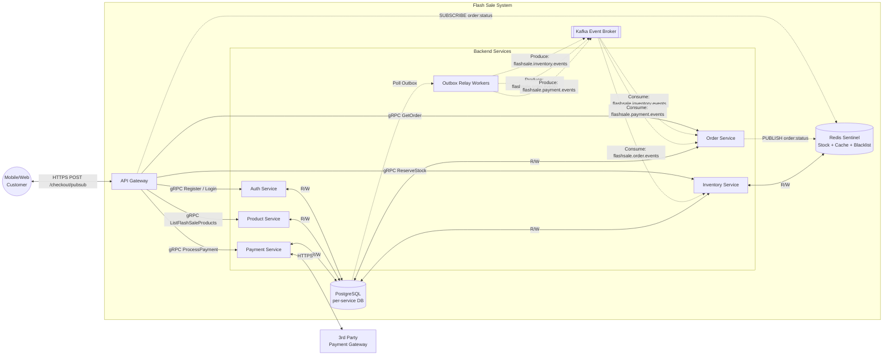
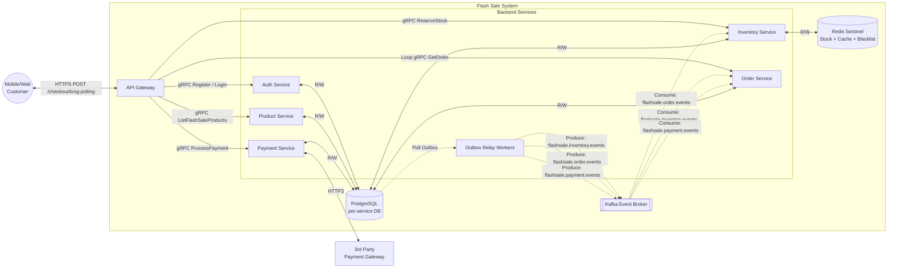
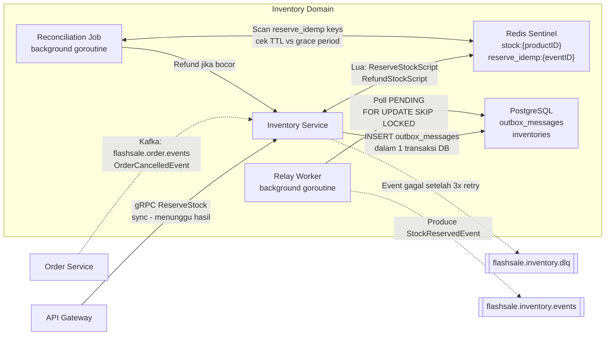
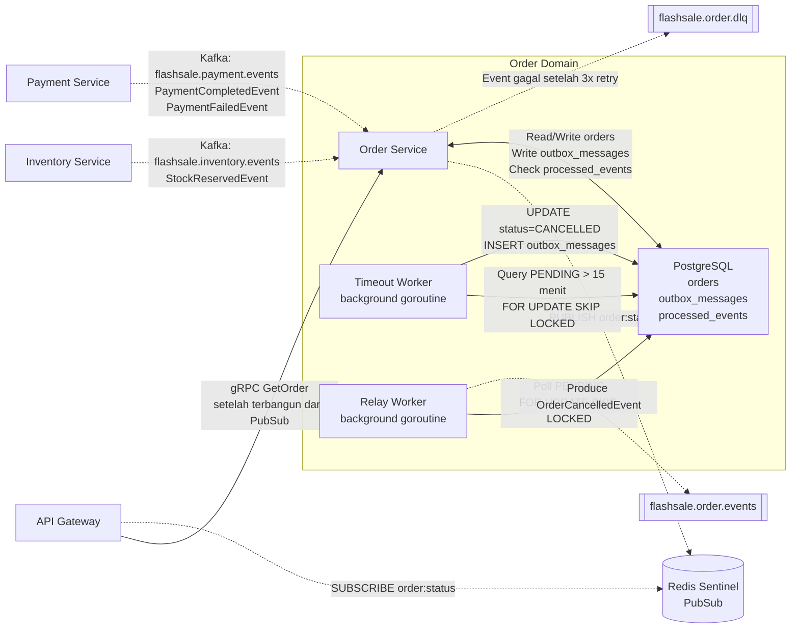
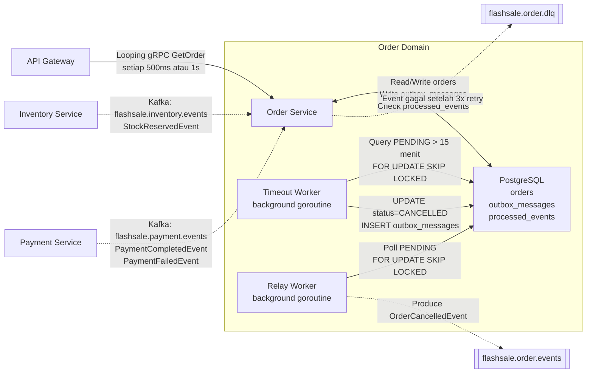
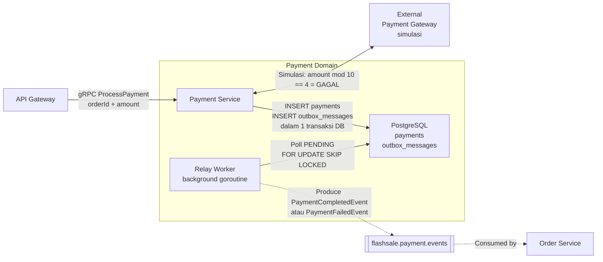
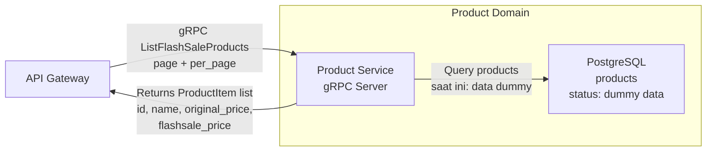
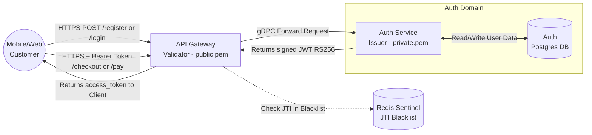

# Domain Context & Architecture Diagram

## 1. Top-Level System Architecture
- **API Gateway:** Entry point, rate limiting (via Nginx), decentralized JWT validation.
- **Auth Service:** Issues JWTs (RS256).
- **Product Service:** Product catalog.
- **Inventory Service:** Core domain. Manages stock atomically via Redis Lua.
- **Order Service:** Event-driven transaction recorder.
- **Payment Service:** Payment processing gateway simulation.
- **Kafka:** Event broker for Saga Choreography.

### 1A. Top-Level Architecture (Variasi PubSub)

**Penjelasan Alur (Sistem PubSub):**
- Klien melakukan POST `/checkout/pubsub` melalui Nginx menuju API Gateway.
- Gateway memvalidasi _token_ (tanpa memanggil DB) dan meneruskan _command_ sinkron ke **Inventory Service**.
- Gateway menahan koneksi dan men-_subscribe_ status ke **Redis**.
- Event mengalir asinkron lewat **Kafka** dari Inventory -> Order.
- Saat **Order Service** selesai mencatat data ke Postgres, ia mem-`PUBLISH` sinyal ke Redis yang kemudian membangunkan Gateway untuk membalas Klien.

[🔍 Buka di Mermaid Live Editor (Gunakan Klik Kanan -> Open in New Tab)](https://mermaid.live/edit#base64:eyJjb2RlIjogImZsb3djaGFydCBMUlxuICAgIEN1c3QoKE1vYmlsZS9XZWI8YnIvPkN1c3RvbWVyKSlcbiAgICBzdWJncmFwaCBGbGFzaFNhbGVTeXN0ZW1bXCJGbGFzaCBTYWxlIFN5c3RlbVwiXVxuICAgICAgICBHV1tBUEkgR2F0ZXdheV1cbiAgICAgICAgc3ViZ3JhcGggQmFja2VuZFNlcnZpY2VzW1wiQmFja2VuZCBTZXJ2aWNlc1wiXVxuICAgICAgICAgICAgQXV0aFtBdXRoIFNlcnZpY2VdXG4gICAgICAgICAgICBQcm9kW1Byb2R1Y3QgU2VydmljZV1cbiAgICAgICAgICAgIEludltJbnZlbnRvcnkgU2VydmljZV1cbiAgICAgICAgICAgIE9yZFtPcmRlciBTZXJ2aWNlXVxuICAgICAgICAgICAgUGF5W1BheW1lbnQgU2VydmljZV1cbiAgICAgICAgICAgIFJlbGF5V1tPdXRib3ggUmVsYXkgV29ya2Vyc11cbiAgICAgICAgZW5kXG4gICAgICAgIEthZmthW1tLYWZrYSBFdmVudCBCcm9rZXJdXVxuICAgICAgICBSZWRpc1soUmVkaXM8YnIvPlN0b2NrICsgQ2FjaGUgKyBCbGFja2xpc3QpXVxuICAgICAgICBQb3N0Z3Jlc1soUG9zdGdyZVNRTDxici8+cGVyLXNlcnZpY2UgREIpXVxuICAgIGVuZFxuICAgIEV4dEJhbmtbM3JkIFBhcnR5PGJyLz5QYXltZW50IEdhdGV3YXldXG4gICAgQ3VzdCA8LS0+fEhUVFBTIFBPU1QgL2NoZWNrb3V0L3B1YnN1YnwgR1dcbiAgICBHVyAtLT58Z1JQQyBSZWdpc3RlciAvIExvZ2lufCBBdXRoXG4gICAgR1cgLS0+fGdSUEMgTGlzdEZsYXNoU2FsZVByb2R1Y3RzfCBQcm9kXG4gICAgR1cgLS0+fGdSUEMgUmVzZXJ2ZVN0b2NrfCBJbnZcbiAgICBHVyAtLi0+fFNVQlNDUklCRSBvcmRlcjpzdGF0dXN8IFJlZGlzXG4gICAgR1cgLS0+fGdSUEMgR2V0T3JkZXJ8IE9yZFxuICAgIEdXIC0tPnxnUlBDIFByb2Nlc3NQYXltZW50fCBQYXlcbiAgICBQb3N0Z3JlcyAtLi0+fFBvbGwgT3V0Ym94fCBSZWxheVdcbiAgICBSZWxheVcgLS4tPnxQcm9kdWNlOiBmbGFzaHNhbGUuaW52ZW50b3J5LmV2ZW50c3wgS2Fma2FcbiAgICBSZWxheVcgLS4tPnxQcm9kdWNlOiBmbGFzaHNhbGUub3JkZXIuZXZlbnRzfCBLYWZrYVxuICAgIFJlbGF5VyAtLi0+fFByb2R1Y2U6IGZsYXNoc2FsZS5wYXltZW50LmV2ZW50c3wgS2Fma2FcbiAgICBPcmQgLS4tPnxQVUJMSVNIIG9yZGVyOnN0YXR1c3wgUmVkaXNcbiAgICBLYWZrYSAtLi0+fENvbnN1bWU6IGZsYXNoc2FsZS5pbnZlbnRvcnkuZXZlbnRzfCBPcmRcbiAgICBLYWZrYSAtLi0+fENvbnN1bWU6IGZsYXNoc2FsZS5wYXltZW50LmV2ZW50c3wgT3JkXG4gICAgS2Fma2EgLS4tPnxDb25zdW1lOiBmbGFzaHNhbGUub3JkZXIuZXZlbnRzfCBJbnZcbiAgICBBdXRoIDwtLT58Ui9XfCBQb3N0Z3Jlc1xuICAgIFByb2QgPC0tPnxSL1d8IFBvc3RncmVzXG4gICAgSW52IDwtLT58Ui9XfCBSZWRpc1xuICAgIEludiA8LS0+fFIvV3wgUG9zdGdyZXNcbiAgICBPcmQgPC0tPnxSL1d8IFBvc3RncmVzXG4gICAgUGF5IDwtLT58Ui9XfCBQb3N0Z3Jlc1xuICAgIFBheSA8LS0+fEhUVFBTfCBFeHRCYW5rIiwgIm1lcm1haWQiOiAie1xuICBcInRoZW1lXCI6IFwiZGVmYXVsdFwiXG59IiwgImF1dG9TeW5jIjogdHJ1ZSwgInVwZGF0ZURpYWdyYW0iOiB0cnVlfQ==)

### 1B. Top-Level Architecture (Variasi Long-Polling)

**Penjelasan Alur (Sistem Long-Polling):**
- Sama dengan sebelumnya, Klien melakukan _checkout_ melalui Gateway dan stok dipotong di Inventory.
- Bedanya, Gateway tidak menunggu aba-aba dari Redis secara senyap.
- Gateway secara aktif melakukan *looping query* (gRPC `GetOrder`) ke **Order Service** sembari event terus mengalir di belakang layar via Kafka.
- Begitu *Order Service* selesai memproses event, *query* Gateway berikutnya akan berhasil, dan hasilnya dikembalikan ke Klien.

[🔍 Buka di Mermaid Live Editor (Gunakan Klik Kanan -> Open in New Tab)](https://mermaid.live/edit#base64:eyJjb2RlIjogImZsb3djaGFydCBMUlxuICAgIEN1c3QoKE1vYmlsZS9XZWI8YnIvPkN1c3RvbWVyKSlcbiAgICBzdWJncmFwaCBGbGFzaFNhbGVTeXN0ZW1bXCJGbGFzaCBTYWxlIFN5c3RlbVwiXVxuICAgICAgICBHV1tBUEkgR2F0ZXdheV1cbiAgICAgICAgc3ViZ3JhcGggQmFja2VuZFNlcnZpY2VzW1wiQmFja2VuZCBTZXJ2aWNlc1wiXVxuICAgICAgICAgICAgQXV0aFtBdXRoIFNlcnZpY2VdXG4gICAgICAgICAgICBQcm9kW1Byb2R1Y3QgU2VydmljZV1cbiAgICAgICAgICAgIEludltJbnZlbnRvcnkgU2VydmljZV1cbiAgICAgICAgICAgIE9yZFtPcmRlciBTZXJ2aWNlXVxuICAgICAgICAgICAgUGF5W1BheW1lbnQgU2VydmljZV1cbiAgICAgICAgICAgIFJlbGF5V1tPdXRib3ggUmVsYXkgV29ya2Vyc11cbiAgICAgICAgZW5kXG4gICAgICAgIEthZmthW1tLYWZrYSBFdmVudCBCcm9rZXJdXVxuICAgICAgICBSZWRpc1soUmVkaXM8YnIvPlN0b2NrICsgQ2FjaGUgKyBCbGFja2xpc3QpXVxuICAgICAgICBQb3N0Z3Jlc1soUG9zdGdyZVNRTDxici8+cGVyLXNlcnZpY2UgREIpXVxuICAgIGVuZFxuICAgIEV4dEJhbmtbM3JkIFBhcnR5PGJyLz5QYXltZW50IEdhdGV3YXldXG4gICAgQ3VzdCA8LS0+fEhUVFBTIFBPU1QgL2NoZWNrb3V0L2xvbmctcG9sbGluZ3wgR1dcbiAgICBHVyAtLT58Z1JQQyBSZWdpc3RlciAvIExvZ2lufCBBdXRoXG4gICAgR1cgLS0+fGdSUEMgTGlzdEZsYXNoU2FsZVByb2R1Y3RzfCBQcm9kXG4gICAgR1cgLS0+fGdSUEMgUmVzZXJ2ZVN0b2NrfCBJbnZcbiAgICBHVyAtLT58TG9vcCBnUlBDIEdldE9yZGVyfCBPcmRcbiAgICBHVyAtLT58Z1JQQyBQcm9jZXNzUGF5bWVudHwgUGF5XG4gICAgUG9zdGdyZXMgLS4tPnxQb2xsIE91dGJveHwgUmVsYXlXXG4gICAgUmVsYXlXIC0uLT58UHJvZHVjZTogZmxhc2hzYWxlLmludmVudG9yeS5ldmVudHN8IEthZmthXG4gICAgUmVsYXlXIC0uLT58UHJvZHVjZTogZmxhc2hzYWxlLm9yZGVyLmV2ZW50c3wgS2Fma2FcbiAgICBSZWxheVcgLS4tPnxQcm9kdWNlOiBmbGFzaHNhbGUucGF5bWVudC5ldmVudHN8IEthZmthXG4gICAgS2Fma2EgLS4tPnxDb25zdW1lOiBmbGFzaHNhbGUuaW52ZW50b3J5LmV2ZW50c3wgT3JkXG4gICAgS2Fma2EgLS4tPnxDb25zdW1lOiBmbGFzaHNhbGUucGF5bWVudC5ldmVudHN8IE9yZFxuICAgIEthZmthIC0uLT58Q29uc3VtZTogZmxhc2hzYWxlLm9yZGVyLmV2ZW50c3wgSW52XG4gICAgQXV0aCA8LS0+fFIvV3wgUG9zdGdyZXNcbiAgICBQcm9kIDwtLT58Ui9XfCBQb3N0Z3Jlc1xuICAgIEludiA8LS0+fFIvV3wgUmVkaXNcbiAgICBJbnYgPC0tPnxSL1d8IFBvc3RncmVzXG4gICAgT3JkIDwtLT58Ui9XfCBQb3N0Z3Jlc1xuICAgIFBheSA8LS0+fFIvV3wgUG9zdGdyZXNcbiAgICBQYXkgPC0tPnxIVFRQU3wgRXh0QmFuayIsICJtZXJtYWlkIjogIntcbiAgXCJ0aGVtZVwiOiBcImRlZmF1bHRcIlxufSIsICJhdXRvU3luYyI6IHRydWUsICJ1cGRhdGVEaWFncmFtIjogdHJ1ZX0=)

### 1C. Top-Level Architecture (Variasi SSE)

**Penjelasan Alur (Sistem SSE):**
- Klien memanggil endpoint `/checkout/sse`. Gateway seketika membalas dengan status HTTP 200 dan menjaga agar koneksi jaringan tetap terbuka (*Keep-Alive*).
- Sembari mem-_polling_ Order Service, Gateway akan mengirim *ping* agar koneksi HTTP/2 tidak diputus oleh *timeout*.
- Begitu pesanan siap di Order Service akibat aliran event Kafka, Gateway mengirimkan paket *Server-Sent Event* berisi JSON pesanan langsung ke *browser/mobile* Klien.

[🔍 Buka di Mermaid Live Editor (Gunakan Klik Kanan -> Open in New Tab)](https://mermaid.live/edit#base64:eyJjb2RlIjogImZsb3djaGFydCBMUlxuICAgIEN1c3QoKE1vYmlsZS9XZWI8YnIvPkN1c3RvbWVyKSlcbiAgICBzdWJncmFwaCBGbGFzaFNhbGVTeXN0ZW1bXCJGbGFzaCBTYWxlIFN5c3RlbVwiXVxuICAgICAgICBHV1tBUEkgR2F0ZXdheV1cbiAgICAgICAgc3ViZ3JhcGggQmFja2VuZFNlcnZpY2VzW1wiQmFja2VuZCBTZXJ2aWNlc1wiXVxuICAgICAgICAgICAgQXV0aFtBdXRoIFNlcnZpY2VdXG4gICAgICAgICAgICBQcm9kW1Byb2R1Y3QgU2VydmljZV1cbiAgICAgICAgICAgIEludltJbnZlbnRvcnkgU2VydmljZV1cbiAgICAgICAgICAgIE9yZFtPcmRlciBTZXJ2aWNlXVxuICAgICAgICAgICAgUGF5W1BheW1lbnQgU2VydmljZV1cbiAgICAgICAgICAgIFJlbGF5V1tPdXRib3ggUmVsYXkgV29ya2Vyc11cbiAgICAgICAgZW5kXG4gICAgICAgIEthZmthW1tLYWZrYSBFdmVudCBCcm9rZXJdXVxuICAgICAgICBSZWRpc1soUmVkaXM8YnIvPlN0b2NrICsgQ2FjaGUgKyBCbGFja2xpc3QpXVxuICAgICAgICBQb3N0Z3Jlc1soUG9zdGdyZVNRTDxici8+cGVyLXNlcnZpY2UgREIpXVxuICAgIGVuZFxuICAgIEV4dEJhbmtbM3JkIFBhcnR5PGJyLz5QYXltZW50IEdhdGV3YXldXG4gICAgQ3VzdCA8LS0+fEhUVFBTIFBPU1QgL2NoZWNrb3V0L3NzZSwgS2VlcC1BbGl2ZXwgR1dcbiAgICBHVyAtLT58Z1JQQyBSZWdpc3RlciAvIExvZ2lufCBBdXRoXG4gICAgR1cgLS0+fGdSUEMgTGlzdEZsYXNoU2FsZVByb2R1Y3RzfCBQcm9kXG4gICAgR1cgLS0+fGdSUEMgUmVzZXJ2ZVN0b2NrfCBJbnZcbiAgICBHVyAtLT58TG9vcCBnUlBDIEdldE9yZGVyfCBPcmRcbiAgICBHVyAtLT58Z1JQQyBQcm9jZXNzUGF5bWVudHwgUGF5XG4gICAgUG9zdGdyZXMgLS4tPnxQb2xsIE91dGJveHwgUmVsYXlXXG4gICAgUmVsYXlXIC0uLT58UHJvZHVjZTogZmxhc2hzYWxlLmludmVudG9yeS5ldmVudHN8IEthZmthXG4gICAgUmVsYXlXIC0uLT58UHJvZHVjZTogZmxhc2hzYWxlLm9yZGVyLmV2ZW50c3wgS2Fma2FcbiAgICBSZWxheVcgLS4tPnxQcm9kdWNlOiBmbGFzaHNhbGUucGF5bWVudC5ldmVudHN8IEthZmthXG4gICAgS2Fma2EgLS4tPnxDb25zdW1lOiBmbGFzaHNhbGUuaW52ZW50b3J5LmV2ZW50c3wgT3JkXG4gICAgS2Fma2EgLS4tPnxDb25zdW1lOiBmbGFzaHNhbGUucGF5bWVudC5ldmVudHN8IE9yZFxuICAgIEthZmthIC0uLT58Q29uc3VtZTogZmxhc2hzYWxlLm9yZGVyLmV2ZW50c3wgSW52XG4gICAgQXV0aCA8LS0+fFIvV3wgUG9zdGdyZXNcbiAgICBQcm9kIDwtLT58Ui9XfCBQb3N0Z3Jlc1xuICAgIEludiA8LS0+fFIvV3wgUmVkaXNcbiAgICBJbnYgPC0tPnxSL1d8IFBvc3RncmVzXG4gICAgT3JkIDwtLT58Ui9XfCBQb3N0Z3Jlc1xuICAgIFBheSA8LS0+fFIvV3wgUG9zdGdyZXNcbiAgICBQYXkgPC0tPnxIVFRQU3wgRXh0QmFuayIsICJtZXJtYWlkIjogIntcbiAgXCJ0aGVtZVwiOiBcImRlZmF1bHRcIlxufSIsICJhdXRvU3luYyI6IHRydWUsICJ1cGRhdGVEaWFncmFtIjogdHJ1ZX0=)

## 2. Core Domains
- **Inventory Domain:** Uses Redis for atomic stock operations. Includes Outbox Relay Worker and Reconciliation Job.

**Penjelasan Alur (Inventory Domain):**
- Ini adalah benteng pertahanan utama stok (menggunakan Redis _Lua Script_ untuk keandalan eksekusi anti-*race-condition*).
- Jika reservasi sukses, pesan log dicatat ke tabel *outbox_messages* di Postgres bersamaan dengan perubahan data lain dalam **1 Transaksi Database**.
- **Relay Worker** bertugas memindahkan pesan dari _outbox_ ke _Kafka Topic_ (`flashsale.inventory.events`).
- **Reconciliation Job** bertugas mendeteksi reservasi stok di Redis yang berstatus *idle* terlalu lama, lalu melakukan *refund* otomatis jika mendapati terjadinya *Stock Leak*.

[🔍 Buka di Mermaid Live Editor (Gunakan Klik Kanan -> Open in New Tab)](https://mermaid.live/edit#base64:eyJjb2RlIjogImZsb3djaGFydCBMUlxuICAgIEdXW0FQSSBHYXRld2F5XVxuICAgIE9yZGVyU3ZjW09yZGVyIFNlcnZpY2VdXG4gICAgc3ViZ3JhcGggSW52ZW50b3J5RG9tYWluW1wiSW52ZW50b3J5IERvbWFpblwiXVxuICAgICAgICBJbnZTdmNbSW52ZW50b3J5IFNlcnZpY2VdXG4gICAgICAgIFJlbGF5V1tSZWxheSBXb3JrZXI8YnIvPmJhY2tncm91bmQgZ29yb3V0aW5lXVxuICAgICAgICBSZWNvbmNpbGVKW1JlY29uY2lsaWF0aW9uIEpvYjxici8+YmFja2dyb3VuZCBnb3JvdXRpbmVdXG4gICAgICAgIFJlZGlzW1wiUmVkaXM8YnIvPnN0b2NrOntwcm9kdWN0SUR9PGJyLz5yZXNlcnZlX2lkZW1wOntldmVudElEfVwiXVxuICAgICAgICBJbnZEQltcIlBvc3RncmVTUUw8YnIvPm91dGJveF9tZXNzYWdlczxici8+aW52ZW50b3JpZXNcIl1cbiAgICBlbmRcbiAgICBETFFbW2ZsYXNoc2FsZS5pbnZlbnRvcnkuZGxxXV1cbiAgICBLYWZrYU91dFtbZmxhc2hzYWxlLmludmVudG9yeS5ldmVudHNdXVxuXG4gICAgR1cgLS0+fGdSUEMgUmVzZXJ2ZVN0b2NrXFxuc3luYyAtIG1lbnVuZ2d1IGhhc2lsfCBJbnZTdmNcbiAgICBPcmRlclN2YyAtLi0+fEthZmthOiBmbGFzaHNhbGUub3JkZXIuZXZlbnRzXFxuT3JkZXJDYW5jZWxsZWRFdmVudHwgSW52U3ZjXG4gICAgSW52U3ZjIDwtLT58THVhOiBSZXNlcnZlU3RvY2tTY3JpcHRcXG5SZWZ1bmRTdG9ja1NjcmlwdHwgUmVkaXNcbiAgICBJbnZTdmMgLS0+fElOU0VSVCBvdXRib3hfbWVzc2FnZXNcXG5kYWxhbSAxIHRyYW5zYWtzaSBEQnwgSW52REJcbiAgICBSZWxheVcgLS0+fFBvbGwgUEVORElOR1xcbkZPUiBVUERBVEUgU0tJUCBMT0NLRUR8IEludkRCXG4gICAgUmVsYXlXIC0uLT58UHJvZHVjZSBTdG9ja1Jlc2VydmVkRXZlbnR8IEthZmthT3V0XG4gICAgUmVjb25jaWxlSiA8LS0+fFNjYW4gcmVzZXJ2ZV9pZGVtcCBrZXlzXFxuY2VrIFRUTCB2cyBncmFjZSBwZXJpb2R8IFJlZGlzXG4gICAgUmVjb25jaWxlSiAtLT58UmVmdW5kIGppa2EgYm9jb3J8IEludlN2Y1xuICAgIEludlN2YyAtLi0+fEV2ZW50IGdhZ2FsIHNldGVsYWggM3ggcmV0cnl8IERMUSIsICJtZXJtYWlkIjogIntcbiAgXCJ0aGVtZVwiOiBcImRlZmF1bHRcIlxufSIsICJhdXRvU3luYyI6IHRydWUsICJ1cGRhdGVEaWFncmFtIjogdHJ1ZX0=)

- **Order Domain:** Listens to `StockReservedEvent` and `PaymentCompleted/FailedEvent`. Contains Timeout Worker for expired orders.
### A. Order Domain (Variasi PubSub)

**Penjelasan Alur (Order Domain - PubSub):**
- Bertindak selaku pusat sinkronisasi dan kompilasi pesanan.
- Mendengarkan event reservasi stok dan pembayaran via **Kafka**.
- Saat order selesai dibuat, **Order Service** memberitahukan *API Gateway* menggunakan perantara **Redis PubSub**.
- Terdapat **Timeout Worker**: Jika order melewati 15 menit tanpa ada _update_ pembayaran, ia akan diubah menjadi `CANCELLED` dan sistem memicu *event* kompensasi untuk mengembalikan stok.

[🔍 Buka di Mermaid Live Editor (Gunakan Klik Kanan -> Open in New Tab)](https://mermaid.live/edit#base64:eyJjb2RlIjogImZsb3djaGFydCBMUlxuICAgIEdXW0FQSSBHYXRld2F5XVxuICAgIEludlN2Y1tJbnZlbnRvcnkgU2VydmljZV1cbiAgICBQYXlTdmNbUGF5bWVudCBTZXJ2aWNlXVxuICAgIHN1YmdyYXBoIE9yZGVyRG9tYWluW1wiT3JkZXIgRG9tYWluXCJdXG4gICAgICAgIE9yZFN2Y1tPcmRlciBTZXJ2aWNlXVxuICAgICAgICBUaW1lb3V0V1tUaW1lb3V0IFdvcmtlcjxici8+YmFja2dyb3VuZCBnb3JvdXRpbmVdXG4gICAgICAgIFJlbGF5V1tSZWxheSBXb3JrZXI8YnIvPmJhY2tncm91bmQgZ29yb3V0aW5lXVxuICAgICAgICBPcmREQltcIlBvc3RncmVTUUw8YnIvPm9yZGVyczxici8+b3V0Ym94X21lc3NhZ2VzPGJyLz5wcm9jZXNzZWRfZXZlbnRzXCJdXG4gICAgZW5kXG4gICAgUmVkaXNPcmRbKFJlZGlzPGJyLz5QdWJTdWIpXVxuICAgIERMUVtbZmxhc2hzYWxlLm9yZGVyLmRscV1dXG4gICAgS2Fma2FPdXRbW2ZsYXNoc2FsZS5vcmRlci5ldmVudHNdXVxuXG4gICAgR1cgLS0+fGdSUEMgR2V0T3JkZXJcXG5zZXRlbGFoIHRlcmJhbmd1biBkYXJpIFB1YlN1YnwgT3JkU3ZjXG4gICAgR1cgLS4tPnxTVUJTQ1JJQkUgb3JkZXI6c3RhdHVzfCBSZWRpc09yZFxuICAgIE9yZFN2YyAtLi0+fFBVQkxJU0ggb3JkZXI6c3RhdHVzfCBSZWRpc09yZFxuICAgIEludlN2YyAtLi0+fEthZmthOiBmbGFzaHNhbGUuaW52ZW50b3J5LmV2ZW50c1xcblN0b2NrUmVzZXJ2ZWRFdmVudHwgT3JkU3ZjXG4gICAgUGF5U3ZjIC0uLT58S2Fma2E6IGZsYXNoc2FsZS5wYXltZW50LmV2ZW50c1xcblBheW1lbnRDb21wbGV0ZWRFdmVudFxcblBheW1lbnRGYWlsZWRFdmVudHwgT3JkU3ZjXG4gICAgT3JkU3ZjIDwtLT58UmVhZC9Xcml0ZSBvcmRlcnNcXG5Xcml0ZSBvdXRib3hfbWVzc2FnZXNcXG5DaGVjayBwcm9jZXNzZWRfZXZlbnRzfCBPcmREQlxuICAgIFRpbWVvdXRXIC0tPnxRdWVyeSBQRU5ESU5HID4gMTUgbWVuaXRcXG5GT1IgVVBEQVRFIFNLSVAgTE9DS0VEfCBPcmREQlxuICAgIFRpbWVvdXRXIC0tPnxVUERBVEUgc3RhdHVzPUNBTkNFTExFRFxcbklOU0VSVCBvdXRib3hfbWVzc2FnZXN8IE9yZERCXG4gICAgUmVsYXlXIC0tPnxQb2xsIFBFTkRJTkdcXG5GT1IgVVBEQVRFIFNLSVAgTE9DS0VEfCBPcmREQlxuICAgIFJlbGF5VyAtLi0+fFByb2R1Y2UgT3JkZXJDYW5jZWxsZWRFdmVudHwgS2Fma2FPdXRcbiAgICBPcmRTdmMgLS4tPnxFdmVudCBnYWdhbCBzZXRlbGFoIDN4IHJldHJ5fCBETFEiLCAibWVybWFpZCI6ICJ7XG4gIFwidGhlbWVcIjogXCJkZWZhdWx0XCJcbn0iLCAiYXV0b1N5bmMiOiB0cnVlLCAidXBkYXRlRGlhZ3JhbSI6IHRydWV9)

### B. Order Domain (Variasi Long-Polling / SSE)
*(Untuk polling dan SSE, Gateway tidak terhubung ke Redis, melainkan langsung mem-polling gRPC ke Order Service secara periodik)*

**Penjelasan Alur (Order Domain - Polling/SSE):**
- Arsitektur sisi *Order Domain* ini menjadi sedikit lebih sederhana karena melepaskan ketergantungan publikasinya terhadap infrastruktur **Redis**.
- Order Service kini murni hanya mengolah pesan Kafka ke database Postgres dan melayani _query_ gRPC membaca data dari API Gateway yang tiada henti mem-_polling_.

[🔍 Buka di Mermaid Live Editor (Gunakan Klik Kanan -> Open in New Tab)](https://mermaid.live/edit#base64:eyJjb2RlIjogImZsb3djaGFydCBMUlxuICAgIEdXW0FQSSBHYXRld2F5XVxuICAgIEludlN2Y1tJbnZlbnRvcnkgU2VydmljZV1cbiAgICBQYXlTdmNbUGF5bWVudCBTZXJ2aWNlXVxuICAgIHN1YmdyYXBoIE9yZGVyRG9tYWluW1wiT3JkZXIgRG9tYWluXCJdXG4gICAgICAgIE9yZFN2Y1tPcmRlciBTZXJ2aWNlXVxuICAgICAgICBUaW1lb3V0V1tUaW1lb3V0IFdvcmtlcjxici8+YmFja2dyb3VuZCBnb3JvdXRpbmVdXG4gICAgICAgIFJlbGF5V1tSZWxheSBXb3JrZXI8YnIvPmJhY2tncm91bmQgZ29yb3V0aW5lXVxuICAgICAgICBPcmREQltcIlBvc3RncmVTUUw8YnIvPm9yZGVyczxici8+b3V0Ym94X21lc3NhZ2VzPGJyLz5wcm9jZXNzZWRfZXZlbnRzXCJdXG4gICAgZW5kXG4gICAgRExRW1tmbGFzaHNhbGUub3JkZXIuZGxxXV1cbiAgICBLYWZrYU91dFtbZmxhc2hzYWxlLm9yZGVyLmV2ZW50c11dXG5cbiAgICBHVyAtLT58TG9vcGluZyBnUlBDIEdldE9yZGVyXFxuc2V0aWFwIDUwMG1zIGF0YXUgMXN8IE9yZFN2Y1xuICAgIEludlN2YyAtLi0+fEthZmthOiBmbGFzaHNhbGUuaW52ZW50b3J5LmV2ZW50c1xcblN0b2NrUmVzZXJ2ZWRFdmVudHwgT3JkU3ZjXG4gICAgUGF5U3ZjIC0uLT58S2Fma2E6IGZsYXNoc2FsZS5wYXltZW50LmV2ZW50c1xcblBheW1lbnRDb21wbGV0ZWRFdmVudFxcblBheW1lbnRGYWlsZWRFdmVudHwgT3JkU3ZjXG4gICAgT3JkU3ZjIDwtLT58UmVhZC9Xcml0ZSBvcmRlcnNcXG5Xcml0ZSBvdXRib3hfbWVzc2FnZXNcXG5DaGVjayBwcm9jZXNzZWRfZXZlbnRzfCBPcmREQlxuICAgIFRpbWVvdXRXIC0tPnxRdWVyeSBQRU5ESU5HID4gMTUgbWVuaXRcXG5GT1IgVVBEQVRFIFNLSVAgTE9DS0VEfCBPcmREQlxuICAgIFRpbWVvdXRXIC0tPnxVUERBVEUgc3RhdHVzPUNBTkNFTExFRFxcbklOU0VSVCBvdXRib3hfbWVzc2FnZXN8IE9yZERCXG4gICAgUmVsYXlXIC0tPnxQb2xsIFBFTkRJTkdcXG5GT1IgVVBEQVRFIFNLSVAgTE9DS0VEfCBPcmREQlxuICAgIFJlbGF5VyAtLi0+fFByb2R1Y2UgT3JkZXJDYW5jZWxsZWRFdmVudHwgS2Fma2FPdXRcbiAgICBPcmRTdmMgLS4tPnxFdmVudCBnYWdhbCBzZXRlbGFoIDN4IHJldHJ5fCBETFEiLCAibWVybWFpZCI6ICJ7XG4gIFwidGhlbWVcIjogXCJkZWZhdWx0XCJcbn0iLCAiYXV0b1N5bmMiOiB0cnVlLCAidXBkYXRlRGlhZ3JhbSI6IHRydWV9)

- **Payment Domain:** Processes sync payments, outputs async events.

**Penjelasan Alur (Payment Domain):**
- Gateway memanggil **Payment Service** secara instan/sinkron.
- Payment Service berinteraksi dengan API Gateway Pembayaran eksternal (Simulasi Bank).
- Hasil akhir (Sukses/Gagal) disimpan ke Postgres beserta *event* lanjutannya ke tabel _Outbox_ dalam transaksi atomik.
- **Relay Worker** kemudian mendistribusikan `PaymentCompletedEvent` atau `PaymentFailedEvent` ini ke Kafka untuk diproses mundur oleh Order Service.

[🔍 Buka di Mermaid Live Editor (Gunakan Klik Kanan -> Open in New Tab)](https://mermaid.live/edit#base64:eyJjb2RlIjogImZsb3djaGFydCBMUlxuICAgIEdXW0FQSSBHYXRld2F5XVxuICAgIHN1YmdyYXBoIFBheW1lbnREb21haW5bXCJQYXltZW50IERvbWFpblwiXVxuICAgICAgICBQYXlTdmNbUGF5bWVudCBTZXJ2aWNlXVxuICAgICAgICBSZWxheVdbUmVsYXkgV29ya2VyPGJyLz5iYWNrZ3JvdW5kIGdvcm91dGluZV1cbiAgICAgICAgUGF5REJbXCJQb3N0Z3JlU1FMPGJyLz5wYXltZW50czxici8+b3V0Ym94X21lc3NhZ2VzXCJdXG4gICAgZW5kXG4gICAgRXh0QmFua1tFeHRlcm5hbDxici8+UGF5bWVudCBHYXRld2F5PGJyLz5zaW11bGFzaV1cbiAgICBPcmRlclN2Y1tPcmRlciBTZXJ2aWNlXVxuICAgIEthZmthT3V0W1tmbGFzaHNhbGUucGF5bWVudC5ldmVudHNdXVxuXG4gICAgR1cgLS0+fGdSUEMgUHJvY2Vzc1BheW1lbnRcXG5vcmRlcklkICsgYW1vdW50fCBQYXlTdmNcbiAgICBQYXlTdmMgPC0tPnxTaW11bGFzaTogYW1vdW50IG1vZCAxMCA9PSA0ID0gR0FHQUx8IEV4dEJhbmtcbiAgICBQYXlTdmMgLS0+fElOU0VSVCBwYXltZW50c1xcbklOU0VSVCBvdXRib3hfbWVzc2FnZXNcXG5kYWxhbSAxIHRyYW5zYWtzaSBEQnwgUGF5REJcbiAgICBSZWxheVcgLS0+fFBvbGwgUEVORElOR1xcbkZPUiBVUERBVEUgU0tJUCBMT0NLRUR8IFBheURCXG4gICAgUmVsYXlXIC0uLT58UHJvZHVjZSBQYXltZW50Q29tcGxldGVkRXZlbnRcXG5hdGF1IFBheW1lbnRGYWlsZWRFdmVudHwgS2Fma2FPdXRcbiAgICBLYWZrYU91dCAtLi0+fENvbnN1bWVkIGJ5fCBPcmRlclN2YyIsICJtZXJtYWlkIjogIntcbiAgXCJ0aGVtZVwiOiBcImRlZmF1bHRcIlxufSIsICJhdXRvU3luYyI6IHRydWUsICJ1cGRhdGVEaWFncmFtIjogdHJ1ZX0=)

- **Product Domain:** Product catalog.

**Penjelasan Alur (Product Domain):**
- Sangat lugas dan efisien. Bertugas murni membaca *katalog* produk flash sale dari PostgreSQL untuk dirender saat pengguna memuat halaman utama.
- *(Saat ini direkayasa untuk merespons dengan data produk dummy statis).*

[🔍 Buka di Mermaid Live Editor (Gunakan Klik Kanan -> Open in New Tab)](https://mermaid.live/edit#base64:eyJjb2RlIjogImZsb3djaGFydCBMUlxuICAgIEdXW0FQSSBHYXRld2F5XVxuICAgIHN1YmdyYXBoIFByb2R1Y3REb21haW5bXCJQcm9kdWN0IERvbWFpblwiXVxuICAgICAgICBQcm9kU3ZjW1wiUHJvZHVjdCBTZXJ2aWNlXFxuZ1JQQyBTZXJ2ZXJcIl1cbiAgICAgICAgUHJvZERCW1wiUG9zdGdyZVNRTFxcbnByb2R1Y3RzXFxuc3RhdHVzOiBkdW1teSBkYXRhXCJdXG4gICAgZW5kXG5cbiAgICBHVyAtLT58Z1JQQyBMaXN0Rmxhc2hTYWxlUHJvZHVjdHNcXG5wYWdlICsgcGVyX3BhZ2V8IFByb2RTdmNcbiAgICBQcm9kU3ZjIC0tPnxRdWVyeSBwcm9kdWN0c1xcbnNhYXQgaW5pOiBkYXRhIGR1bW15fCBQcm9kREJcbiAgICBQcm9kU3ZjIC0tPnxSZXR1cm5zIFByb2R1Y3RJdGVtIGxpc3RcXG5pZCwgbmFtZSwgb3JpZ2luYWxfcHJpY2UsXFxuZmxhc2hzYWxlX3ByaWNlfCBHVyIsICJtZXJtYWlkIjogIntcbiAgXCJ0aGVtZVwiOiBcImRlZmF1bHRcIlxufSIsICJhdXRvU3luYyI6IHRydWUsICJ1cGRhdGVEaWFncmFtIjogdHJ1ZX0=)

- **Auth Domain:** Validates and issues tokens via asymmetric cryptography.

**Penjelasan Alur (Auth Domain):**
- Klien melakukan otentikasi. **Auth Service** mencetak *JWT Token* (berisi _payload_ ID pengguna) yang ditandatangani dengan *Private Key* `RS256` asimetris.
- **API Gateway** bisa beroperasi tanpa beban: ia **tidak perlu** bertanya ke Auth Service setiap kali pengguna melakukan _Checkout_. Gateway hanya memverifikasi _signature_ JWT lokal menggunakan *Public Key*.
- API Gateway juga membaca Token _Blacklist_ (`JTI`) di Redis (jika pengguna melakukan *Logout* paksa) untuk mencegah *stolen token bypass*.

[🔍 Buka di Mermaid Live Editor (Gunakan Klik Kanan -> Open in New Tab)](https://mermaid.live/edit#base64:eyJjb2RlIjogImZsb3djaGFydCBMUlxuICAgIENsaWVudCgoTW9iaWxlL1dlYjxici8+Q3VzdG9tZXIpKVxuICAgIHN1YmdyYXBoIEF1dGhEb21haW5bXCJBdXRoIERvbWFpblwiXVxuICAgICAgICBBdXRoU3ZjW1wiQXV0aCBTZXJ2aWNlPGJyLz5Jc3N1ZXIgLSBwcml2YXRlLnBlbVwiXVxuICAgICAgICBBdXRoREJbKEF1dGg8YnIvPlBvc3RncmVzIERCKV1cbiAgICBlbmRcbiAgICBHV1tcIkFQSSBHYXRld2F5PGJyLz5WYWxpZGF0b3IgLSBwdWJsaWMucGVtXCJdXG4gICAgUmVkaXNbKFJlZGlzIENhY2hlPGJyLz5KVEkgQmxhY2tsaXN0KV1cblxuICAgIENsaWVudCAtLT58SFRUUFMgUE9TVCAvcmVnaXN0ZXIgb3IgL2xvZ2lufCBHV1xuICAgIEdXIC0tPnxnUlBDIEZvcndhcmQgUmVxdWVzdHwgQXV0aFN2Y1xuICAgIEF1dGhTdmMgPC0tPnxSZWFkL1dyaXRlIFVzZXIgRGF0YXwgQXV0aERCXG4gICAgQXV0aFN2YyAtLT58UmV0dXJucyBzaWduZWQgSldUIFJTMjU2fCBHV1xuICAgIEdXIC0tPnxSZXR1cm5zIGFjY2Vzc190b2tlbiB0byBDbGllbnR8IENsaWVudFxuICAgIENsaWVudCAtLT58SFRUUFMgKyBCZWFyZXIgVG9rZW4gL2NoZWNrb3V0IG9yIC9wYXl8IEdXXG4gICAgR1cgLS4tPnxDaGVjayBKVEkgaW4gQmxhY2tsaXN0fCBSZWRpcyIsICJtZXJtYWlkIjogIntcbiAgXCJ0aGVtZVwiOiBcImRlZmF1bHRcIlxufSIsICJhdXRvU3luYyI6IHRydWUsICJ1cGRhdGVEaWFncmFtIjogdHJ1ZX0=)

