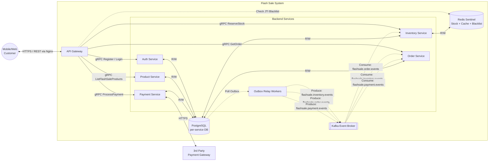
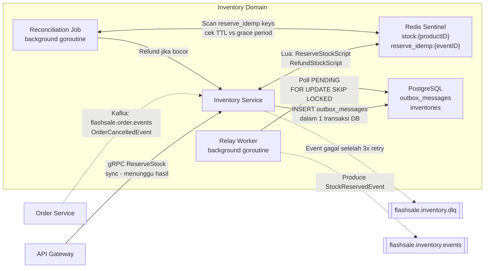
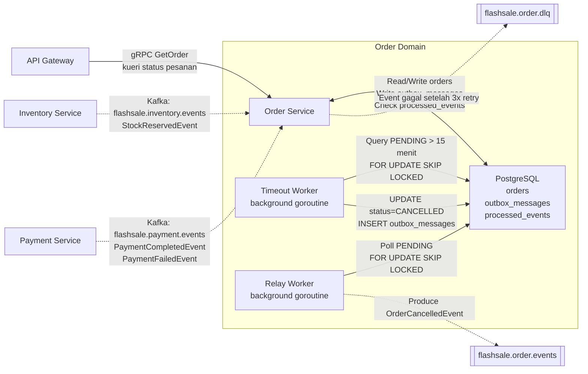
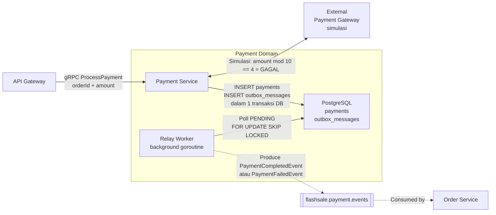
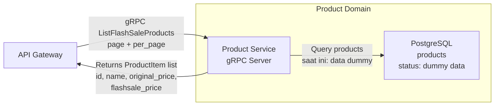
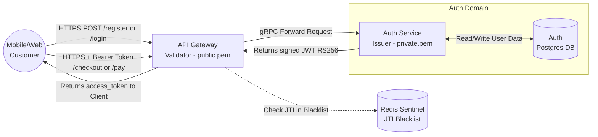

# Domain Context & Architecture Diagram

## 1. Top-Level System Architecture
- **API Gateway:** Entry point, rate limiting (via Nginx), decentralized JWT validation.
- **Auth Service:** Issues JWTs (RS256).
- **Product Service:** Product catalog.
- **Inventory Service:** Core domain. Manages stock atomically via Redis Lua.
- **Order Service:** Event-driven transaction recorder.
- **Payment Service:** Payment processing gateway simulation.
- **Kafka:** Event broker for Saga Choreography.

**Penjelasan Alur:**
- Klien mengakses sistem melalui API Gateway. Gateway memvalidasi _token_ JWT secara desentralisasi tanpa memanggil Auth Service.
- Gateway meneruskan *request* `ReserveStock` ke Inventory Service secara gRPC.
- Masing-masing layanan (Inventory, Order, Payment) tidak langsung menembak Kafka, melainkan menyisipkan *event* ke tabel *Outbox* di PostgreSQL dalam satu transaksi lokal.
- **Relay Worker** secara konstan mem-_polling_ tabel Outbox dan mempublikasikan *event* tersebut ke Kafka untuk dikonsumsi secara lintas-layanan (_Saga Choreography_).

[🔍 Buka di Mermaid Live Editor (Gunakan Klik Kanan -> Open in New Tab)](https://mermaid.live/edit#base64:eyJjb2RlIjoiZmxvd2NoYXJ0IExSXG4gICAgQ3VzdCgoTW9iaWxlL1dlYlx1MDAzY2JyL1x1MDAzZUN1c3RvbWVyKSlcbiAgICBzdWJncmFwaCBGbGFzaFNhbGVTeXN0ZW1bXCJGbGFzaCBTYWxlIFN5c3RlbVwiXVxuICAgICAgICBHV1tBUEkgR2F0ZXdheV1cbiAgICAgICAgc3ViZ3JhcGggQmFja2VuZFNlcnZpY2VzW1wiQmFja2VuZCBTZXJ2aWNlc1wiXVxuICAgICAgICAgICAgQXV0aFtBdXRoIFNlcnZpY2VdXG4gICAgICAgICAgICBQcm9kW1Byb2R1Y3QgU2VydmljZV1cbiAgICAgICAgICAgIEludltJbnZlbnRvcnkgU2VydmljZV1cbiAgICAgICAgICAgIE9yZFtPcmRlciBTZXJ2aWNlXVxuICAgICAgICAgICAgUGF5W1BheW1lbnQgU2VydmljZV1cbiAgICAgICAgICAgIFJlbGF5V1tPdXRib3ggUmVsYXkgV29ya2Vyc11cbiAgICAgICAgZW5kXG4gICAgICAgIEthZmthW1tLYWZrYSBFdmVudCBCcm9rZXJdXVxuICAgICAgICBSZWRpc1soUmVkaXMgU2VudGluZWxcdTAwM2Nici9cdTAwM2VTdG9jayArIENhY2hlICsgQmxhY2tsaXN0KV1cbiAgICAgICAgUG9zdGdyZXNbKFBvc3RncmVTUUxcdTAwM2Nici9cdTAwM2VwZXItc2VydmljZSBEQildXG4gICAgZW5kXG4gICAgRXh0QmFua1szcmQgUGFydHlcdTAwM2Nici9cdTAwM2VQYXltZW50IEdhdGV3YXldXG4gICAgQ3VzdCBcdTAwM2MtLVx1MDAzZXxIVFRQUyAvIFJFU1QgdmlhIE5naW54fCBHV1xuICAgIEdXIC0tXHUwMDNlfGdSUEMgUmVnaXN0ZXIgLyBMb2dpbnwgQXV0aFxuICAgIEdXIC0tXHUwMDNlfGdSUEMgTGlzdEZsYXNoU2FsZVByb2R1Y3RzfCBQcm9kXG4gICAgR1cgLS1cdTAwM2V8Z1JQQyBSZXNlcnZlU3RvY2t8IEludlxuICAgIEdXIC0tXHUwMDNlfGdSUEMgR2V0T3JkZXJ8IE9yZFxuICAgIEdXIC0tXHUwMDNlfGdSUEMgUHJvY2Vzc1BheW1lbnR8IFBheVxuICAgIEdXIC0uLVx1MDAzZXxDaGVjayBKVEkgQmxhY2tsaXN0fCBSZWRpc1xuICAgIFBvc3RncmVzIC0uLVx1MDAzZXxQb2xsIE91dGJveHwgUmVsYXlXXG4gICAgUmVsYXlXIC0uLVx1MDAzZXxQcm9kdWNlOiBmbGFzaHNhbGUuaW52ZW50b3J5LmV2ZW50c3wgS2Fma2FcbiAgICBSZWxheVcgLS4tXHUwMDNlfFByb2R1Y2U6IGZsYXNoc2FsZS5vcmRlci5ldmVudHN8IEthZmthXG4gICAgUmVsYXlXIC0uLVx1MDAzZXxQcm9kdWNlOiBmbGFzaHNhbGUucGF5bWVudC5ldmVudHN8IEthZmthXG4gICAgS2Fma2EgLS4tXHUwMDNlfENvbnN1bWU6IGZsYXNoc2FsZS5pbnZlbnRvcnkuZXZlbnRzfCBPcmRcbiAgICBLYWZrYSAtLi1cdTAwM2V8Q29uc3VtZTogZmxhc2hzYWxlLnBheW1lbnQuZXZlbnRzfCBPcmRcbiAgICBLYWZrYSAtLi1cdTAwM2V8Q29uc3VtZTogZmxhc2hzYWxlLm9yZGVyLmV2ZW50c3wgSW52XG4gICAgQXV0aCBcdTAwM2MtLVx1MDAzZXxSL1d8IFBvc3RncmVzXG4gICAgUHJvZCBcdTAwM2MtLVx1MDAzZXxSL1d8IFBvc3RncmVzXG4gICAgSW52IFx1MDAzYy0tXHUwMDNlfFIvV3wgUmVkaXNcbiAgICBJbnYgXHUwMDNjLS1cdTAwM2V8Ui9XfCBQb3N0Z3Jlc1xuICAgIE9yZCBcdTAwM2MtLVx1MDAzZXxSL1d8IFBvc3RncmVzXG4gICAgUGF5IFx1MDAzYy0tXHUwMDNlfFIvV3wgUG9zdGdyZXNcbiAgICBQYXkgXHUwMDNjLS1cdTAwM2V8SFRUUFN8IEV4dEJhbmsiLCJtZXJtYWlkIjoie1xuICBcInRoZW1lXCI6IFwiZGVmYXVsdFwiXG59IiwiYXV0b1N5bmMiOnRydWUsInVwZGF0ZURpYWdyYW0iOnRydWV9)

## 2. Core Domains
- **Inventory Domain:** Uses Redis for atomic stock operations. Includes Outbox Relay Worker and Reconciliation Job.
**Penjelasan Alur (Inventory Domain):**
- Ini adalah benteng pertahanan utama stok (menggunakan Redis Sentinel _Lua Script_ untuk keandalan eksekusi anti-*race-condition*).
- Jika reservasi sukses, pesan log dicatat ke tabel *outbox_messages* di Postgres bersamaan dengan perubahan data lain dalam **1 Transaksi Database**.
- **Relay Worker** bertugas memindahkan pesan dari _outbox_ ke _Kafka Topic_ (`flashsale.inventory.events`).
- **Reconciliation Job** bertugas mendeteksi reservasi stok di Redis yang berstatus *idle* terlalu lama, lalu melakukan *refund* otomatis jika mendapati terjadinya *Stock Leak*.

[🔍 Buka di Mermaid Live Editor (Gunakan Klik Kanan -> Open in New Tab)](https://mermaid.live/edit#base64:eyJjb2RlIjoiZmxvd2NoYXJ0IExSXG4gICAgR1dbQVBJIEdhdGV3YXldXG4gICAgT3JkZXJTdmNbT3JkZXIgU2VydmljZV1cbiAgICBzdWJncmFwaCBJbnZlbnRvcnlEb21haW5bXCJJbnZlbnRvcnkgRG9tYWluXCJdXG4gICAgICAgIEludlN2Y1tJbnZlbnRvcnkgU2VydmljZV1cbiAgICAgICAgUmVsYXlXW1JlbGF5IFdvcmtlclx1MDAzY2JyL1x1MDAzZWJhY2tncm91bmQgZ29yb3V0aW5lXVxuICAgICAgICBSZWNvbmNpbGVKW1JlY29uY2lsaWF0aW9uIEpvYlx1MDAzY2JyL1x1MDAzZWJhY2tncm91bmQgZ29yb3V0aW5lXVxuICAgICAgICBSZWRpc1tcIlJlZGlzIFNlbnRpbmVsXHUwMDNjYnIvXHUwMDNlc3RvY2s6e3Byb2R1Y3RJRH1cdTAwM2Nici9cdTAwM2VyZXNlcnZlX2lkZW1wOntldmVudElEfVwiXVxuICAgICAgICBJbnZEQltcIlBvc3RncmVTUUxcdTAwM2Nici9cdTAwM2VvdXRib3hfbWVzc2FnZXNcdTAwM2Nici9cdTAwM2VpbnZlbnRvcmllc1wiXVxuICAgIGVuZFxuICAgIERMUVtbZmxhc2hzYWxlLmludmVudG9yeS5kbHFdXVxuICAgIEthZmthT3V0W1tmbGFzaHNhbGUuaW52ZW50b3J5LmV2ZW50c11dXG5cbiAgICBHVyAtLVx1MDAzZXxnUlBDIFJlc2VydmVTdG9ja1xcbnN5bmMgLSBtZW51bmdndSBoYXNpbHwgSW52U3ZjXG4gICAgT3JkZXJTdmMgLS4tXHUwMDNlfEthZmthOiBmbGFzaHNhbGUub3JkZXIuZXZlbnRzXFxuT3JkZXJDYW5jZWxsZWRFdmVudHwgSW52U3ZjXG4gICAgSW52U3ZjIFx1MDAzYy0tXHUwMDNlfEx1YTogUmVzZXJ2ZVN0b2NrU2NyaXB0XFxuUmVmdW5kU3RvY2tTY3JpcHR8IFJlZGlzXG4gICAgSW52U3ZjIC0tXHUwMDNlfElOU0VSVCBvdXRib3hfbWVzc2FnZXNcXG5kYWxhbSAxIHRyYW5zYWtzaSBEQnwgSW52REJcbiAgICBSZWxheVcgLS1cdTAwM2V8UG9sbCBQRU5ESU5HXFxuRk9SIFVQREFURSBTS0lQIExPQ0tFRHwgSW52REJcbiAgICBSZWxheVcgLS4tXHUwMDNlfFByb2R1Y2UgU3RvY2tSZXNlcnZlZEV2ZW50fCBLYWZrYU91dFxuICAgIFJlY29uY2lsZUogXHUwMDNjLS1cdTAwM2V8U2NhbiByZXNlcnZlX2lkZW1wIGtleXNcXG5jZWsgVFRMIHZzIGdyYWNlIHBlcmlvZHwgUmVkaXNcbiAgICBSZWNvbmNpbGVKIC0tXHUwMDNlfFJlZnVuZCBqaWthIGJvY29yfCBJbnZTdmNcbiAgICBJbnZTdmMgLS4tXHUwMDNlfEV2ZW50IGdhZ2FsIHNldGVsYWggM3ggcmV0cnl8IERMUSIsIm1lcm1haWQiOiJ7XG4gIFwidGhlbWVcIjogXCJkZWZhdWx0XCJcbn0iLCJhdXRvU3luYyI6dHJ1ZSwidXBkYXRlRGlhZ3JhbSI6dHJ1ZX0=)

- **Order Domain:** Listens to `StockReservedEvent` and `PaymentCompleted/FailedEvent`. Contains Timeout Worker for expired orders.
**Penjelasan Alur (Order Domain):**
- Bertindak selaku pusat sinkronisasi dan kompilasi pesanan.
- Mendengarkan event reservasi stok dan pembayaran via **Kafka**.
- Terdapat **Timeout Worker**: Jika order melewati 15 menit tanpa ada _update_ pembayaran, ia akan diubah menjadi `CANCELLED` dan sistem memicu *event* kompensasi untuk mengembalikan stok melalui Relay Worker.

[🔍 Buka di Mermaid Live Editor (Gunakan Klik Kanan -> Open in New Tab)](https://mermaid.live/edit#base64:eyJjb2RlIjoiZmxvd2NoYXJ0IExSXG4gICAgR1dbQVBJIEdhdGV3YXldXG4gICAgSW52U3ZjW0ludmVudG9yeSBTZXJ2aWNlXVxuICAgIFBheVN2Y1tQYXltZW50IFNlcnZpY2VdXG4gICAgc3ViZ3JhcGggT3JkZXJEb21haW5bXCJPcmRlciBEb21haW5cIl1cbiAgICAgICAgT3JkU3ZjW09yZGVyIFNlcnZpY2VdXG4gICAgICAgIFRpbWVvdXRXW1RpbWVvdXQgV29ya2VyXHUwMDNjYnIvXHUwMDNlYmFja2dyb3VuZCBnb3JvdXRpbmVdXG4gICAgICAgIFJlbGF5V1tSZWxheSBXb3JrZXJcdTAwM2Nici9cdTAwM2ViYWNrZ3JvdW5kIGdvcm91dGluZV1cbiAgICAgICAgT3JkREJbXCJQb3N0Z3JlU1FMXHUwMDNjYnIvXHUwMDNlb3JkZXJzXHUwMDNjYnIvXHUwMDNlb3V0Ym94X21lc3NhZ2VzXHUwMDNjYnIvXHUwMDNlcHJvY2Vzc2VkX2V2ZW50c1wiXVxuICAgIGVuZFxuICAgIERMUVtbZmxhc2hzYWxlLm9yZGVyLmRscV1dXG4gICAgS2Fma2FPdXRbW2ZsYXNoc2FsZS5vcmRlci5ldmVudHNdXVxuXG4gICAgR1cgLS1cdTAwM2V8Z1JQQyBHZXRPcmRlclxcbmt1ZXJpIHN0YXR1cyBwZXNhbmFufCBPcmRTdmNcbiAgICBJbnZTdmMgLS4tXHUwMDNlfEthZmthOiBmbGFzaHNhbGUuaW52ZW50b3J5LmV2ZW50c1xcblN0b2NrUmVzZXJ2ZWRFdmVudHwgT3JkU3ZjXG4gICAgUGF5U3ZjIC0uLVx1MDAzZXxLYWZrYTogZmxhc2hzYWxlLnBheW1lbnQuZXZlbnRzXFxuUGF5bWVudENvbXBsZXRlZEV2ZW50XFxuUGF5bWVudEZhaWxlZEV2ZW50fCBPcmRTdmNcbiAgICBPcmRTdmMgXHUwMDNjLS1cdTAwM2V8UmVhZC9Xcml0ZSBvcmRlcnNcXG5Xcml0ZSBvdXRib3hfbWVzc2FnZXNcXG5DaGVjayBwcm9jZXNzZWRfZXZlbnRzfCBPcmREQlxuICAgIFRpbWVvdXRXIC0tXHUwMDNlfFF1ZXJ5IFBFTkRJTkcgXHUwMDNlIDE1IG1lbml0XFxuRk9SIFVQREFURSBTS0lQIExPQ0tFRHwgT3JkREJcbiAgICBUaW1lb3V0VyAtLVx1MDAzZXxVUERBVEUgc3RhdHVzPUNBTkNFTExFRFxcbklOU0VSVCBvdXRib3hfbWVzc2FnZXN8IE9yZERCXG4gICAgUmVsYXlXIC0tXHUwMDNlfFBvbGwgUEVORElOR1xcbkZPUiBVUERBVEUgU0tJUCBMT0NLRUR8IE9yZERCXG4gICAgUmVsYXlXIC0uLVx1MDAzZXxQcm9kdWNlIE9yZGVyQ2FuY2VsbGVkRXZlbnR8IEthZmthT3V0XG4gICAgT3JkU3ZjIC0uLVx1MDAzZXxFdmVudCBnYWdhbCBzZXRlbGFoIDN4IHJldHJ5fCBETFEiLCJtZXJtYWlkIjoie1xuICBcInRoZW1lXCI6IFwiZGVmYXVsdFwiXG59IiwiYXV0b1N5bmMiOnRydWUsInVwZGF0ZURpYWdyYW0iOnRydWV9)

- **Payment Domain:** Processes sync payments, outputs async events.
**Penjelasan Alur (Payment Domain):**
- Gateway memanggil **Payment Service** secara instan/sinkron.
- Payment Service berinteraksi dengan API Gateway Pembayaran eksternal (Simulasi Bank).
- Hasil akhir (Sukses/Gagal) disimpan ke Postgres beserta *event* lanjutannya ke tabel _Outbox_ dalam transaksi atomik.
- **Relay Worker** kemudian mendistribusikan `PaymentCompletedEvent` atau `PaymentFailedEvent` ini ke Kafka untuk diproses mundur oleh Order Service.

[🔍 Buka di Mermaid Live Editor (Gunakan Klik Kanan -> Open in New Tab)](https://mermaid.live/edit#base64:eyJjb2RlIjoiZmxvd2NoYXJ0IExSXG4gICAgR1dbQVBJIEdhdGV3YXldXG4gICAgc3ViZ3JhcGggUGF5bWVudERvbWFpbltcIlBheW1lbnQgRG9tYWluXCJdXG4gICAgICAgIFBheVN2Y1tQYXltZW50IFNlcnZpY2VdXG4gICAgICAgIFJlbGF5V1tSZWxheSBXb3JrZXJcdTAwM2Nici9cdTAwM2ViYWNrZ3JvdW5kIGdvcm91dGluZV1cbiAgICAgICAgUGF5REJbXCJQb3N0Z3JlU1FMXHUwMDNjYnIvXHUwMDNlcGF5bWVudHNcdTAwM2Nici9cdTAwM2VvdXRib3hfbWVzc2FnZXNcIl1cbiAgICBlbmRcbiAgICBFeHRCYW5rW0V4dGVybmFsXHUwMDNjYnIvXHUwMDNlUGF5bWVudCBHYXRld2F5XHUwMDNjYnIvXHUwMDNlc2ltdWxhc2ldXG4gICAgT3JkZXJTdmNbT3JkZXIgU2VydmljZV1cbiAgICBLYWZrYU91dFtbZmxhc2hzYWxlLnBheW1lbnQuZXZlbnRzXV1cblxuICAgIEdXIC0tXHUwMDNlfGdSUEMgUHJvY2Vzc1BheW1lbnRcXG5vcmRlcklkICsgYW1vdW50fCBQYXlTdmNcbiAgICBQYXlTdmMgXHUwMDNjLS1cdTAwM2V8U2ltdWxhc2k6IGFtb3VudCBtb2QgMTAgPT0gNCA9IEdBR0FMfCBFeHRCYW5rXG4gICAgUGF5U3ZjIC0tXHUwMDNlfElOU0VSVCBwYXltZW50c1xcbklOU0VSVCBvdXRib3hfbWVzc2FnZXNcXG5kYWxhbSAxIHRyYW5zYWtzaSBEQnwgUGF5REJcbiAgICBSZWxheVcgLS1cdTAwM2V8UG9sbCBQRU5ESU5HXFxuRk9SIFVQREFURSBTS0lQIExPQ0tFRHwgUGF5REJcbiAgICBSZWxheVcgLS4tXHUwMDNlfFByb2R1Y2UgUGF5bWVudENvbXBsZXRlZEV2ZW50XFxuYXRhdSBQYXltZW50RmFpbGVkRXZlbnR8IEthZmthT3V0XG4gICAgS2Fma2FPdXQgLS4tXHUwMDNlfENvbnN1bWVkIGJ5fCBPcmRlclN2YyIsIm1lcm1haWQiOiJ7XG4gIFwidGhlbWVcIjogXCJkZWZhdWx0XCJcbn0iLCJhdXRvU3luYyI6dHJ1ZSwidXBkYXRlRGlhZ3JhbSI6dHJ1ZX0=)

- **Product Domain:** Product catalog.
**Penjelasan Alur (Product Domain):**
- Sangat lugas dan efisien. Bertugas murni membaca *katalog* produk flash sale dari PostgreSQL untuk dirender saat pengguna memuat halaman utama.
- *(Saat ini direkayasa untuk merespons dengan data produk dummy statis).*

[🔍 Buka di Mermaid Live Editor (Gunakan Klik Kanan -> Open in New Tab)](https://mermaid.live/edit#base64:eyJjb2RlIjoiZmxvd2NoYXJ0IExSXG4gICAgR1dbQVBJIEdhdGV3YXldXG4gICAgc3ViZ3JhcGggUHJvZHVjdERvbWFpbltcIlByb2R1Y3QgRG9tYWluXCJdXG4gICAgICAgIFByb2RTdmNbXCJQcm9kdWN0IFNlcnZpY2VcXG5nUlBDIFNlcnZlclwiXVxuICAgICAgICBQcm9kREJbXCJQb3N0Z3JlU1FMXFxucHJvZHVjdHNcXG5zdGF0dXM6IGR1bW15IGRhdGFcIl1cbiAgICBlbmRcblxuICAgIEdXIC0tXHUwMDNlfGdSUEMgTGlzdEZsYXNoU2FsZVByb2R1Y3RzXFxucGFnZSArIHBlcl9wYWdlfCBQcm9kU3ZjXG4gICAgUHJvZFN2YyAtLVx1MDAzZXxRdWVyeSBwcm9kdWN0c1xcbnNhYXQgaW5pOiBkYXRhIGR1bW15fCBQcm9kREJcbiAgICBQcm9kU3ZjIC0tXHUwMDNlfFJldHVybnMgUHJvZHVjdEl0ZW0gbGlzdFxcbmlkLCBuYW1lLCBvcmlnaW5hbF9wcmljZSxcXG5mbGFzaHNhbGVfcHJpY2V8IEdXIiwibWVybWFpZCI6IntcbiAgXCJ0aGVtZVwiOiBcImRlZmF1bHRcIlxufSIsImF1dG9TeW5jIjp0cnVlLCJ1cGRhdGVEaWFncmFtIjp0cnVlfQ==)

- **Auth Domain:** Validates and issues tokens via asymmetric cryptography.
**Penjelasan Alur (Auth Domain):**
- Klien melakukan otentikasi. **Auth Service** mencetak *JWT Token* (berisi _payload_ ID pengguna) yang ditandatangani dengan *Private Key* `RS256` asimetris.
- **API Gateway** bisa beroperasi tanpa beban: ia **tidak perlu** bertanya ke Auth Service setiap kali pengguna melakukan _Checkout_. Gateway hanya memverifikasi _signature_ JWT lokal menggunakan *Public Key*.
- API Gateway juga membaca Token _Blacklist_ (`JTI`) di Redis Sentinel (jika pengguna melakukan *Logout* paksa) untuk mencegah *stolen token bypass*.

[🔍 Buka di Mermaid Live Editor (Gunakan Klik Kanan -> Open in New Tab)](https://mermaid.live/edit#base64:eyJjb2RlIjoiZmxvd2NoYXJ0IExSXG4gICAgQ2xpZW50KChNb2JpbGUvV2ViXHUwMDNjYnIvXHUwMDNlQ3VzdG9tZXIpKVxuICAgIHN1YmdyYXBoIEF1dGhEb21haW5bXCJBdXRoIERvbWFpblwiXVxuICAgICAgICBBdXRoU3ZjW1wiQXV0aCBTZXJ2aWNlXHUwMDNjYnIvXHUwMDNlSXNzdWVyIC0gcHJpdmF0ZS5wZW1cIl1cbiAgICAgICAgQXV0aERCWyhBdXRoXHUwMDNjYnIvXHUwMDNlUG9zdGdyZXMgREIpXVxuICAgIGVuZFxuICAgIEdXW1wiQVBJIEdhdGV3YXlcdTAwM2Nici9cdTAwM2VWYWxpZGF0b3IgLSBwdWJsaWMucGVtXCJdXG4gICAgUmVkaXNbKFJlZGlzIFNlbnRpbmVsXHUwMDNjYnIvXHUwMDNlSlRJIEJsYWNrbGlzdCldXG5cbiAgICBDbGllbnQgLS1cdTAwM2V8SFRUUFMgUE9TVCAvcmVnaXN0ZXIgb3IgL2xvZ2lufCBHV1xuICAgIEdXIC0tXHUwMDNlfGdSUEMgRm9yd2FyZCBSZXF1ZXN0fCBBdXRoU3ZjXG4gICAgQXV0aFN2YyBcdTAwM2MtLVx1MDAzZXxSZWFkL1dyaXRlIFVzZXIgRGF0YXwgQXV0aERCXG4gICAgQXV0aFN2YyAtLVx1MDAzZXxSZXR1cm5zIHNpZ25lZCBKV1QgUlMyNTZ8IEdXXG4gICAgR1cgLS1cdTAwM2V8UmV0dXJucyBhY2Nlc3NfdG9rZW4gdG8gQ2xpZW50fCBDbGllbnRcbiAgICBDbGllbnQgLS1cdTAwM2V8SFRUUFMgKyBCZWFyZXIgVG9rZW4gL2NoZWNrb3V0IG9yIC9wYXl8IEdXXG4gICAgR1cgLS4tXHUwMDNlfENoZWNrIEpUSSBpbiBCbGFja2xpc3R8IFJlZGlzIiwibWVybWFpZCI6IntcbiAgXCJ0aGVtZVwiOiBcImRlZmF1bHRcIlxufSIsImF1dG9TeW5jIjp0cnVlLCJ1cGRhdGVEaWFncmFtIjp0cnVlfQ==)

