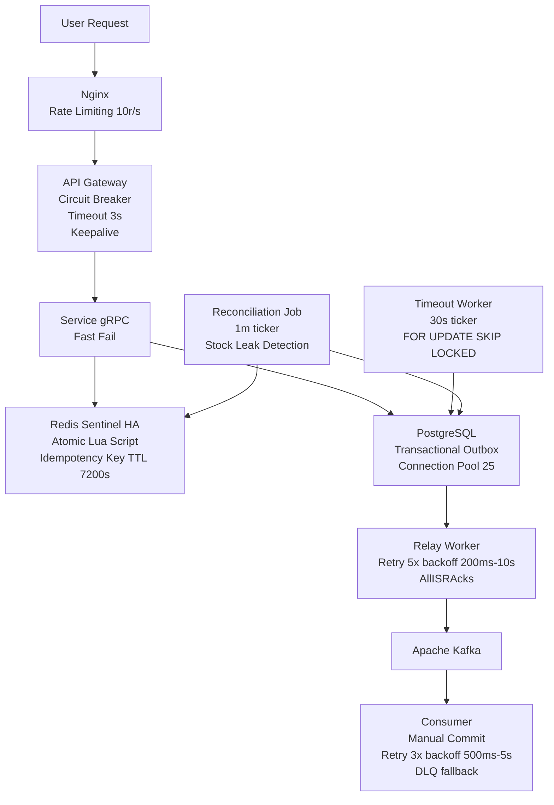

# Strategi Resilience — Flash Sale System

Dokumen ini menjelaskan semua pola ketahanan sistem (*resilience patterns*) yang diimplementasikan dalam kode dan alasan desain di balik setiap keputusan teknis.

> [!IMPORTANT]
> Dokumen ini **sangat penting** sebagai referensi engineering. Flash Sale adalah workload yang penuh lonjakan (*bursty*) dan sangat tidak toleran terhadap kegagalan. Setiap pola di sini bukan sekadar "best practice" — semuanya adalah respons terhadap skenario kegagalan konkret yang bisa terjadi di produksi.

---

## 1. Peta Risiko Kegagalan

Berikut adalah gambaran seluruh aliran request dan komponen yang berpotensi gagal:

```
User → [Nginx] → [API Gateway] ──gRPC──→ [Inventory Service] → Redis Sentinel (Lua Script)
                                       ↘                      ↘ PostgreSQL (Outbox)
                                        → [Auth Service]        → Relay Worker → Kafka
                                        → [Product Service]
                                        → [Payment Service] → PostgreSQL (Outbox)
                                                              → Relay Worker → Kafka
                                                   ↓
                                        [Order Service Consumer] → PostgreSQL
                                        [Inventory Service Consumer] ← Kafka
                                        [Timeout Worker] (background)
                                        [Reconciliation Job] (background)
```

| Titik Kegagalan | Dampak Tanpa Resilience | Pola yang Diterapkan |
|---|---|---|
| Service downstream (Inv/Pay/Auth) down | Goroutine menumpuk di API Gateway → OOM | **Circuit Breaker** |
| gRPC call terlambat/hang | Goroutine leak, request client menunggu lama | **Timeout 3 detik per-call** |
| Koneksi gRPC mati diam-diam | Request ke koneksi zombie → timeout lambat terdeteksi | **gRPC Keepalive** |
| Kafka sementara down | Event dari Outbox tidak terkirim, hilang permanen | **Retry 5x + status FAILED** |
| Kafka deliver event 2x (at-least-once) | Order dibuat ganda | **Idempotency Guard (processed_events)** |
| Consumer crash, event gagal permanen | Event drop tanpa jejak | **Dead Letter Queue (DLQ)** |
| Banyak koneksi DB bersamaan | `too many connections` PostgreSQL → cascade fail | **Connection Pool Limit** |
| Lonjakan ribuan req/detik Flash Sale | API Gateway kewalahan | **Rate Limiting Nginx** |
| Redis berhasil potong stok, Postgres crash | Stok bocor → tidak pernah terbentuk order | **Reconciliation Job** |

---

## 2. Circuit Breaker (API Gateway)

**Library:** `github.com/sony/gobreaker`  
**Implementasi:** [`shared/pkg/resilience/circuit_breaker.go`](../../shared/pkg/resilience/circuit_breaker.go)  
**Penggunaan:** [`api-gateway/internal/adapter/outbound/grpc/clients.go`](../../api-gateway/internal/adapter/outbound/grpc/clients.go)

### State Machine

```
                 ≥50% failure (min 10 req)        timeout 5 detik berlalu
   CLOSED  ───────────────────────────────→  OPEN  ──────────────────────→  HALF-OPEN
     ↑                                                                            │
     │  semua probe request sukses (max 5 probe)                                  │
     └────────────────────────────────────────────────────────────────────────────┘
```

**Penjelasan State:**
- **CLOSED** (Normal): Semua request diteruskan. Counter failure terus dihitung dalam window 10 detik.
- **OPEN** (Terbuka): CB "memutus arus". Semua request **langsung ditolak** dengan error `gobreaker.ErrOpenState` — tanpa menunggu, tanpa timeout. Ini melindungi API Gateway dari goroutine menumpuk.
- **HALF-OPEN** (Pemulihan): Setelah 5 detik, CB mengizinkan maksimal 5 request "probe" masuk. Jika semua sukses → kembali ke CLOSED. Jika ada yang gagal → kembali ke OPEN.

### Konfigurasi (Terverifikasi dari Kode)

```go
// circuit_breaker.go - DefaultCircuitBreakerConfig()
CircuitBreakerConfig{
    MaxRequests:  5,               // max request saat half-open (probe)
    Interval:     10 * time.Second, // periode evaluasi rolling window
    Timeout:      5 * time.Second,  // lama OPEN sebelum coba half-open
    FailureRatio: 0.5,             // 50% dari MinRequests = trip
    MinRequests:  10,              // minimum sampel sebelum dievaluasi
}
```

### Isolasi Per-Service (Bulkhead Pattern)

Setiap service downstream memiliki Circuit Breaker **sendiri-sendiri**:

```go
// clients.go
productCB:   resilience.NewCircuitBreaker(resilience.DefaultCircuitBreakerConfig("product-service"))
inventoryCB: resilience.NewCircuitBreaker(resilience.DefaultCircuitBreakerConfig("inventory-service"))
paymentCB:   resilience.NewCircuitBreaker(resilience.DefaultCircuitBreakerConfig("payment-service"))
authCB:      resilience.NewCircuitBreaker(resilience.DefaultCircuitBreakerConfig("auth-service"))
```

> **Mengapa penting?** Jika `inventory-service` sedang down dan CB-nya OPEN, CB `payment-service`, `product-service`, dan `auth-service` **sama sekali tidak terdampak**. Ini adalah penerapan *Bulkhead Pattern* — mencegah satu kegagalan merambat ke seluruh sistem.

### Perilaku saat CB OPEN

Ketika CB terbuka dan request checkout masuk, API Gateway mengembalikan:
```
HTTP 409 Conflict: "inventory-service tidak tersedia sementara (circuit open)"
```
Client menerima respons cepat (< 1ms) dan dapat menampilkan pesan "Coba lagi sebentar" alih-alih menunggu 3 detik timeout.

---

## 3. Timeout Per-Call gRPC

**Nilai:** 3 detik (konstanta `callTimeout`)  
**Implementasi:** `context.WithTimeout(ctx, 3*time.Second)` di setiap method gRPC client

```go
// clients.go — diterapkan di SEMUA method gRPC (ReserveStock, ProcessPayment, Login, dll.)
const callTimeout = 3 * time.Second

func (c *grpcClients) ReserveStock(ctx context.Context, ...) (bool, error) {
    callCtx, cancel := context.WithTimeout(ctx, callTimeout)
    defer cancel()
    // ...
}
```

### Mengapa 3 Detik?

| Pertimbangan | Penjelasan |
|---|---|
| **Lebih kecil dari Nginx timeout** | Nginx memiliki timeout proxy ~60 detik. Dengan CB timeout 3 detik, kita memberikan respons jauh lebih cepat kepada user |
| **Cukup untuk operasi DB** | Query PostgreSQL yang berat sekalipun biasanya selesai < 1 detik. 3 detik memberikan buffer aman |
| **Mencegah goroutine leak** | Tanpa timeout, goroutine bisa menunggu hingga koneksi TCP-nya drop (bisa menit-an) |
| **User experience** | User Flash Sale tidak akan sabar menunggu > 3 detik — lebih baik fail-fast dan coba lagi |

### gRPC Keepalive

```go
// clients.go — keepaliveParams
keepalive.ClientParameters{
    Time:                360 * time.Second, // kirim ping setiap 6 menit jika ada stream aktif
    Timeout:             20 * time.Second,  // timeout jika tidak ada respons setelah 20 detik
    PermitWithoutStream: false,             // JANGAN kirim ping jika idle (menghindari GoAway "too_many_pings")
}
```

**Masalah yang diselesaikan:** Koneksi TCP bisa mati diam-diam (NAT timeout, firewall idle timeout) tanpa Go runtime menyadarinya. Tanpa keepalive, request berikutnya baru akan mendeteksi koneksi mati setelah menunggu 3 detik timeout. Dengan keepalive, koneksi mati terdeteksi dalam **380 detik** (360s + 20s timeout), dan gRPC secara otomatis melakukan reconnect sebelum request berikutnya tiba.

---

## 4. Retry + Exponential Backoff + Jitter

**Implementasi:** [`shared/pkg/resilience/retry.go`](../../shared/pkg/resilience/retry.go)

### Rumus Backoff

```
jeda = min(InitialInterval × Multiplier^(attempt-1), MaxInterval) ± 30% jitter
```

### Konfigurasi Per Konteks (Terverifikasi dari Kode)

| Konteks | MaxAttempts | InitialInterval | MaxInterval | Multiplier |
|---|---|---|---|---|
| **Default** (`DefaultRetryConfig`) | 3x | 100ms | 2s | 2.0 |
| **Relay Worker** (Outbox → Kafka) | 5x | 200ms | 10s | 2.0 |
| **Kafka Consumer** (Order + Inventory) | 3x | 500ms | 5s | 2.0 |

> **Mengapa berbeda?** Relay Worker publish ke Kafka lebih kritis (kehilangan event = inkonsistensi data) sehingga diberi lebih banyak retry. Consumer diberi lebih sedikit retry karena Kafka sudah menjamin re-delivery jika offset belum di-commit.

### Contoh Backoff dengan Relay Worker Config

```
Attempt 1 → GAGAL → jeda: ~200ms (±30%)
Attempt 2 → GAGAL → jeda: ~400ms (±30%)
Attempt 3 → GAGAL → jeda: ~800ms (±30%)
Attempt 4 → GAGAL → jeda: ~1600ms (±30%)
Attempt 5 → GAGAL → UPDATE status='FAILED' (berhenti)
```

### Mengapa Jitter Penting?

Bayangkan 100 Relay Worker berjalan bersamaan (scale-out), semuanya gagal publish ke Kafka di saat yang sama karena Kafka broker sedang overload. **Tanpa jitter**, semua 100 goroutine akan retry pada waktu yang **sama persis** → membanjiri Kafka lagi saat recovery → *thundering herd*. **Dengan ±30% jitter**, 100 goroutine tersebar retry secara alami dalam rentang waktu yang berbeda → Kafka dapat pulih bertahap.

### Operasi yang TIDAK Di-Retry

| Operasi | Alasan Teknis |
|---|---|
| **`ReserveStock` gRPC call** | Tidak idempoten dari sisi client. Jika retry dengan `eventID` yang sama, Redis Lua Script akan menolak (idempotency key sudah ada). Namun jika retry dengan `eventID` baru, stok bisa terpotong dua kali. Keduanya bukan perilaku yang diinginkan. |
| **Kafka payload parsing error** | Permanent error — payload corrupt tidak akan sembuh hanya dengan retry. Langsung kirim ke DLQ. |
| **bcrypt.CompareHashAndPassword gagal** | Permanent error — password salah tidak akan menjadi benar setelah retry. |

---

## 5. Transactional Outbox + Relay Worker

**Implementasi:** [`shared/pkg/outbox/relay.go`](../../shared/pkg/outbox/relay.go)

### Masalah yang Diselesaikan: Dual-Write Problem

Tanpa Outbox Pattern:
```
1. UPDATE stock ke DB  ✅
2. Publish event ke Kafka ❌ (Kafka down saat ini)
   → Stock berubah tapi tidak ada event → inkonsistensi
```

Dengan Outbox Pattern:
```
1. BEGIN TRANSACTION
   UPDATE domain data
   INSERT outbox_messages (status=PENDING)
   COMMIT  ← keduanya atomik
2. Relay Worker (background) → Publish ke Kafka → UPDATE status=SENT
   → Jika Kafka down, event tetap aman di Postgres dengan status PENDING
```

### Konfigurasi Relay Worker (Terverifikasi dari Kode)

```go
// relay.go - NewRelayWorker
kgo.RequiredAcks(kgo.AllISRAcks())              // konfirmasi dari semua ISR replica
kgo.ProducerBatchCompression(kgo.SnappyCompression()) // kompresi Snappy untuk efisiensi
```

```
Polling interval: 1 detik (ticker 1s)
Batch size: LIMIT 50 per polling cycle
Lock: FOR UPDATE SKIP LOCKED (aman untuk scale-out)
Retry: 5x dengan backoff 200ms → 10s
Jika gagal semua retry: UPDATE status = 'FAILED' (tidak hilang, bisa dipantau)
```

**Monitoring kebocoran event:**
```sql
-- Cek event yang gagal dikirim ke Kafka
SELECT * FROM outbox_messages WHERE status = 'FAILED' ORDER BY created_at DESC;

-- Cek event yang masih mengantre (terlalu lama PENDING = Relay Worker mungkin mati)
SELECT * FROM outbox_messages WHERE status = 'PENDING' AND created_at < NOW() - INTERVAL '5 minutes';
```

---

## 6. Kafka Consumer — Manual Commit + Dead Letter Queue

**Implementasi Order Consumer:** [`order-service/internal/adapter/inbound/kafka/consumer.go`](../../order-service/internal/adapter/inbound/kafka/consumer.go)  
**Implementasi Inventory Consumer:** [`inventory-service/internal/adapter/inbound/kafka/consumer.go`](../../inventory-service/internal/adapter/inbound/kafka/consumer.go)

### Alur Pemrosesan Event

```
Poll record dari Kafka
  → Extract traceparent dari header (OpenTelemetry propagation)
  → DoWithRetry (3x, backoff 500ms→5s)
      ✅ Sukses → CommitUncommittedOffsets
      ❌ Gagal 3x → sendToDLQ() → CommitUncommittedOffsets
```

### Mengapa Manual Commit (`DisableAutoCommit`)?

Dengan auto-commit, Kafka otomatis menggeser offset setiap beberapa detik — terlepas dari apakah pemrosesan berhasil atau tidak. Jika service crash **setelah** auto-commit tapi **sebelum** INSERT ke database selesai, event tersebut **hilang selamanya**.

Dengan manual commit (`CommitUncommittedOffsets`), offset hanya digeser setelah:
1. Pemrosesan berhasil, **ATAU**
2. Event gagal dan sudah dikirim ke DLQ

Ini menjamin **at-least-once processing** — event mungkin diproses lebih dari sekali, tapi tidak pernah hilang. Duplikasi ditangani oleh `processed_events` table.

### Dead Letter Queue

| DLQ Topic | Consumer Asalnya | Jenis Error |
|---|---|---|
| `flashsale.order.dlq` | Order Service Consumer | Payload invalid, DB error permanen |
| `flashsale.inventory.dlq` | Inventory Service Consumer | Payload invalid, Redis error permanen |

**Header yang disertakan di setiap DLQ record:**
```
dlq.original.topic  → "flashsale.inventory.events"
dlq.error           → "payload OrderCancelledEvent tidak valid (permanent): ..."  
dlq.timestamp       → "2026-06-03T19:30:00Z"
```

**Cara replay DLQ** (jika penyebab sudah diperbaiki):
```bash
# Re-produce DLQ records ke topic asal menggunakan kafka-console-producer
# atau tooling seperti Kafka UI / Redpanda Console
```

---

## 7. Idempotency Guard — Mencegah Duplikasi

Karena Kafka menggunakan *at-least-once delivery*, consumer **wajib** idempoten.

### Tabel `processed_events` (Order Service)

```sql
-- Sebelum proses event, cek dulu
SELECT COUNT(*) FROM processed_events WHERE event_id = $1;

-- Jika belum ada, proses dan catat dalam SATU transaksi
BEGIN;
  INSERT INTO orders (...) VALUES (...);
  INSERT INTO processed_events (event_id, processed_at) VALUES ($1, NOW());
COMMIT;
```

Jika Kafka mengirim `StockReservedEvent` yang sama dua kali (misal karena offset belum sempat di-commit sebelum crash), percobaan kedua akan menemukan `event_id` sudah ada di `processed_events` dan **langsung return success** tanpa membuat order duplikat.

### Redis Idempotency Key (`reserve_idemp:{eventID}`)

Untuk operasi checkout, idempotency dijaga di Redis melalui Lua Script:
```lua
-- Jika idempotency key sudah ada, tolak (duplikat)
if redis.call("EXISTS", idemp_key) == 1 then
    return 0  -- tolak tanpa memotong stok
end
```

TTL key: **7200 detik (2 jam)** — memberikan waktu yang cukup untuk Reconciliation Job mendeteksi kebocoran, sambil memastikan key bersih setelah Flash Sale selesai.

---

## 8. Database Connection Pool

**Implementasi:** [`shared/pkg/database/postgres.go`](../../shared/pkg/database/postgres.go)

### Konfigurasi (Terverifikasi dari Kode)

```go
// database/postgres.go - DefaultConfig()
Config{
    MaxOpenConns:    25,              // batas koneksi aktif
    MaxIdleConns:    10,              // koneksi idle yang dipertahankan di pool
    ConnMaxLifetime: 5 * time.Minute, // rotasi koneksi untuk hindari basi
    ConnMaxIdleTime: 2 * time.Minute, // lepas koneksi idle terlalu lama
}
```

### Kalkulasi Kapasitas

Dengan 5 service (Auth, Product, Inventory, Order, Payment) masing-masing `MaxOpenConns=25`:

```
5 service × 25 koneksi = 125 koneksi maksimum
```

PostgreSQL default `max_connections = 100`. Pada deployment production, nilai ini perlu disesuaikan:
```
ALTER SYSTEM SET max_connections = 200;
SELECT pg_reload_conf();
```

> [!TIP]
> Untuk Flash Sale skala besar, pertimbangkan menggunakan **PgBouncer** sebagai connection pooler di depan PostgreSQL. PgBouncer dapat menampung ribuan koneksi dari aplikasi dengan hanya membuka puluhan koneksi ke PostgreSQL.

### Mengapa `ConnMaxLifetime = 5 menit`?

Load balancer cloud (AWS ALB, GCP Load Balancer, Azure LB) umumnya menutup koneksi TCP yang idle setelah 4 menit. Dengan `ConnMaxLifetime = 5 menit`, pool secara proaktif merotasi koneksi sebelum LB menutupnya secara paksa — mencegah error "connection reset by peer" yang tak terduga.

---

## 9. Rate Limiting (Nginx)

**Implementasi:** [`nginx.conf`](../../nginx.conf)

```nginx
# Definisi zone: 10m memory, per IP, limit 10 req/detik
limit_req_zone $binary_remote_addr zone=api_limit:10m rate=10r/s;

location /api/ {
    limit_req zone=api_limit burst=20 nodelay;
    limit_req_status 429;  # tolak dengan 429 Too Many Requests
    # ...
}
```

### Penjelasan Parameter

| Parameter | Nilai | Efek |
|---|---|---|
| `rate=10r/s` | 10 request/detik per IP | Baseline normal untuk satu user |
| `burst=20` | Burst bucket 20 request | Toleransi lonjakan singkat (klik cepat) |
| `nodelay` | Tidak ada antrean | Request di atas burst **langsung** ditolak 429, tidak mengantri |
| `limit_req_status 429` | HTTP 429 | Client mengetahui mereka di-throttle dan bisa back-off |

### Mengapa `nodelay`?

Tanpa `nodelay`, Nginx akan mengantri request yang melebihi burst dan memprosesnya secara lambat. Pada Flash Sale dengan ribuan user, antrean ini bisa menumpuk dan menyebabkan user menunggu lama. Dengan `nodelay`, mereka langsung mendapat `429` dan dapat segera mencoba lagi — lebih baik daripada menggantung tanpa kepastian.

### Kalkulasi Kapasitas

Dengan `rate=10r/s` dan `burst=20`, satu IP user bisa mengirim:
- 10 request/detik secara sustain
- Hingga 20 request dalam satu lonjakan

Untuk Flash Sale dengan 10.000 user bersamaan, rate limiting per-IP yang rendah ini mencegah "auto-clicker bot" menghabiskan semua slot, sekaligus membiarkan user normal masuk.

---

## 10. Self-Healing: Reconciliation Job

**Implementasi:** [`inventory-service/internal/application/job/reconciliation_job.go`](../../inventory-service/internal/application/job/reconciliation_job.go)

### Skenario Kegagalan yang Ditangani: Stock Leak

```
Timeline:
  t=0ms: Redis Lua Script: DECRBY stock:prod_1 → stok = 98 ✅
  t=1ms: Inventory Service crash / PostgreSQL timeout
  t=∞:   INSERT outbox_messages TIDAK PERNAH terjadi ❌
  
Akibat: stok terpotong di Redis tapi order tidak pernah terbentuk.
        User kehilangan slot beli, stok "hilang" selamanya.
```

### Mekanisme Deteksi

```go
// reconciliation_job.go - Interval: 1 menit, Grace Period: 5 menit (300 detik)
func (j *ReconciliationJob) run(ctx context.Context) {
    // 1. Scan semua reserve_idemp:* keys di Redis
    leaked, _ := j.redisPort.GetLeakedReservations(ctx, j.gracePeriod)
    
    for eventID, meta := range leaked {
        // 2. Cek apakah ada di Postgres Outbox
        exists, _ := j.outboxPort.IsOutboxExist(ctx, eventID)
        
        if !exists {
            // 3. LEAK TERDETEKSI! Parse meta "productID:quantity"
            productID, quantity, _ := parseMeta(meta)
            // 4. Refund stok di Redis
            j.redisPort.RefundStock(ctx, productID, eventID, quantity)
        }
    }
}
```

### Cara Deteksi TTL di Redis

```go
// lua_script.go - TTL idempotency key = 7200 detik (2 jam)
// GetLeakedReservations melihat sisa TTL:
//   - Jika remaining TTL < (7200 - gracePeriod) = (7200 - 300) = 6900s
//   - Berarti key sudah ada > 300 detik (grace period terlewati)
//   - Ini kandidat "leak" yang perlu diverifikasi ke Postgres
```

**Mengapa Grace Period 5 menit?** Normal Outbox Relay Worker berjalan setiap 1 detik. Bahkan di kondisi beban tinggi, event seharusnya sudah masuk ke Postgres dalam hitungan detik. Grace period 5 menit memberikan buffer yang sangat generous untuk menghindari false positive (mengira event normal sebagai leak).

---

## 11. OpenTelemetry Distributed Tracing

**Implementasi:** [`shared/pkg/telemetry/`](../../shared/pkg/telemetry/)

Meskipun bukan *resilience pattern* dalam arti tradisional, tracing adalah komponen kritis untuk **observability** — kemampuan untuk mendiagnosis kegagalan saat terjadi.

```
Request masuk ke API Gateway → TraceID dibuat
  → TraceID diteruskan ke gRPC headers
  → TraceID diteruskan ke Kafka record headers (traceparent)
  → Consumer mengekstrak traceparent dan melanjutkan span
```

Ini memungkinkan satu `trace_id` untuk melacak seluruh perjalanan sebuah request dari API Gateway → Inventory → Kafka → Order Service — semua dalam satu trace di Jaeger.

---

## 12. High Availability (Redis Sentinel)

**Implementasi:** [`docker-compose.prod.yml`](../../docker-compose.prod.yml)

Di lingkungan produksi (seperti yang disimulasikan dalam `docker-compose.prod.yml`), single point of failure pada Redis dihilangkan menggunakan arsitektur **Redis Sentinel**.

### Topologi HA

```
                 [API Gateway / Inventory Service]
                                │
      ┌─────────────────────────┼─────────────────────────┐
      ▼                         ▼                         ▼
[Sentinel 1]               [Sentinel 2]              [Sentinel 3]
      │                         │                         │
      └─────────────────────────┼─────────────────────────┘
                                ▼
                       [Redis Master (R/W)]
                                │
             ┌──────────────────┴──────────────────┐
             ▼                                     ▼
     [Redis Replica 1 (R)]                 [Redis Replica 2 (R)]
```

### Mekanisme Failover

1. **Monitoring:** 3 node Sentinel terus memantau *health* dari Master dan Replicas.
2. **Failure Detection:** Jika Master mati (misal di-*kill* saat *Chaos Testing*), Sentinel akan mendeteksi *timeout*.
3. **Quorum Election:** Minimal 2 dari 3 Sentinel (Quorum) harus setuju bahwa Master mati.
4. **Promotion:** Salah satu Replica akan dipromosikan menjadi Master baru.
5. **Client Notification:** Service Go (melalui driver `go-redis` yang dikonfigurasi menggunakan mode `FailoverClient`) akan otomatis mendapatkan alamat Master baru dari Sentinel dan melakukan rekoneksi.

**Dampak pada Resilience:** Jika Master Redis crash di tengah-tengah transaksi *Flash Sale*, sistem akan terhenti sementara (sekitar 3-5 detik) selama masa *failover*, namun akan otomatis pulih dan melanjutkan pemotongan stok tanpa intervensi manual, menghindari *downtime* total.

---

## Ringkasan: Pola per Layer



| Layer | Pola | Library/Mekanisme |
|---|---|---|
| **Nginx** | Rate Limiting | `limit_req_zone` |
| **API Gateway** | Circuit Breaker, Timeout, Keepalive | `sony/gobreaker`, `context.WithTimeout`, `grpc/keepalive` |
| **Redis** | High Availability (Failover), Atomic Lua | Redis Sentinel, `go-redis` FailoverClient, Lua Script |
| **PostgreSQL** | Connection Pool, Outbox Pattern | `sqlx`, `database.DefaultConfig` |
| **Kafka Producer** | Retry + Backoff, Durability | `DoWithRetry`, `AllISRAcks`, `SnappyCompression` |
| **Kafka Consumer** | Manual Commit, DLQ, Idempotency | `DisableAutoCommit`, `processed_events` table |
| **Background** | Self-healing, Timeout handling | `ReconciliationJob`, `TimeoutWorker` |
| **Observability** | Distributed Tracing | OpenTelemetry + Jaeger |
