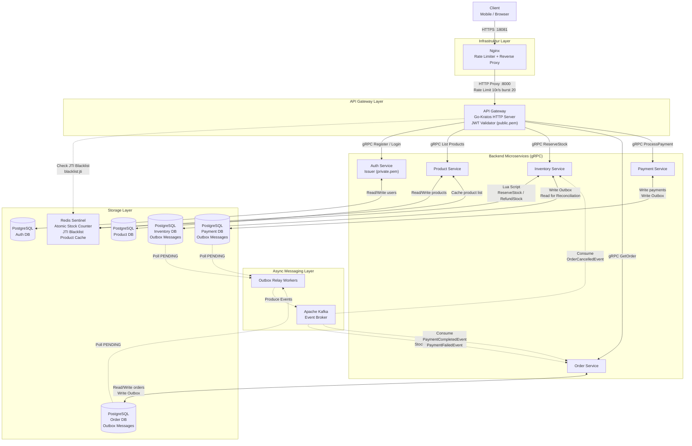

# System Architecture: Flash Sale Microservices

Dokumen ini menjelaskan arsitektur teknis keseluruhan sistem Flash Sale, mulai dari komponen infrastruktur, alur data utama, hingga keputusan arsitektur yang mendasari desain ini.

---

## 1. High-Level Component Diagram

Diagram berikut menggambarkan semua komponen sistem dan keterhubungannya. Setiap *service* memiliki *datastore* sendiri — tidak ada yang berbagi database secara langsung.



[🔍 Buka di Mermaid Live Editor (Gunakan Klik Kanan -> Open in New Tab)](https://mermaid.live/edit#base64:eyJjb2RlIjoiZmxvd2NoYXJ0IFREXG4gICAgQ2xpZW50W0NsaWVudFxcbk1vYmlsZSAvIEJyb3dzZXJdXG5cbiAgICBzdWJncmFwaCBJbmZyYVtcIkluZnJhc3RydWt0dXIgTGF5ZXJcIl1cbiAgICAgICAgTmdpbnhbTmdpbnhcXG5SYXRlIExpbWl0ZXIgKyBSZXZlcnNlIFByb3h5XVxuICAgIGVuZFxuXG4gICAgc3ViZ3JhcGggR2F0ZXdheVtcIkFQSSBHYXRld2F5IExheWVyXCJdXG4gICAgICAgIEdXW1wiQVBJIEdhdGV3YXlcXG5Hby1LcmF0b3MgSFRUUCBTZXJ2ZXJcXG5KV1QgVmFsaWRhdG9yIChwdWJsaWMucGVtKVwiXVxuICAgIGVuZFxuXG4gICAgc3ViZ3JhcGggU2VydmljZXNbXCJCYWNrZW5kIE1pY3Jvc2VydmljZXMgKGdSUEMpXCJdXG4gICAgICAgIEF1dGhTdmNbXCJBdXRoIFNlcnZpY2VcXG5Jc3N1ZXIgKHByaXZhdGUucGVtKVwiXVxuICAgICAgICBQcm9kdWN0U3ZjW1Byb2R1Y3QgU2VydmljZV1cbiAgICAgICAgSW52ZW50b3J5U3ZjW0ludmVudG9yeSBTZXJ2aWNlXVxuICAgICAgICBPcmRlclN2Y1tPcmRlciBTZXJ2aWNlXVxuICAgICAgICBQYXltZW50U3ZjW1BheW1lbnQgU2VydmljZV1cbiAgICBlbmRcblxuICAgIHN1YmdyYXBoIE1lc3NhZ2luZ1tcIkFzeW5jIE1lc3NhZ2luZyBMYXllclwiXVxuICAgICAgICBLYWZrYVtBcGFjaGUgS2Fma2FcXG5FdmVudCBCcm9rZXJdXG4gICAgICAgIFJlbGF5V29ya2VyW091dGJveCBSZWxheSBXb3JrZXJzXVxuICAgIGVuZFxuXG4gICAgc3ViZ3JhcGggU3RvcmFnZVtcIlN0b3JhZ2UgTGF5ZXJcIl1cbiAgICAgICAgUmVkaXNbXCJSZWRpcyBTZW50aW5lbFxcbkF0b21pYyBTdG9jayBDb3VudGVyXFxuSlRJIEJsYWNrbGlzdFxcblByb2R1Y3QgQ2FjaGVcIl1cbiAgICAgICAgREJfQXV0aFsoUG9zdGdyZVNRTFxcbkF1dGggREIpXVxuICAgICAgICBEQl9Qcm9kWyhQb3N0Z3JlU1FMXFxuUHJvZHVjdCBEQildXG4gICAgICAgIERCX0ludlsoUG9zdGdyZVNRTFxcbkludmVudG9yeSBEQlxcbk91dGJveCBNZXNzYWdlcyldXG4gICAgICAgIERCX09yZFsoUG9zdGdyZVNRTFxcbk9yZGVyIERCXFxuT3V0Ym94IE1lc3NhZ2VzKV1cbiAgICAgICAgREJfUGF5WyhQb3N0Z3JlU1FMXFxuUGF5bWVudCBEQlxcbk91dGJveCBNZXNzYWdlcyldXG4gICAgZW5kXG5cbiAgICBDbGllbnQgLS1cdTAwM2V8SFRUUFMgOjE4MDgxfCBOZ2lueFxuICAgIE5naW54IC0tXHUwMDNlfEhUVFAgUHJveHkgOjgwMDBcXG5SYXRlIExpbWl0IDEwci9zIGJ1cnN0IDIwfCBHV1xuICAgIEdXIC0uLVx1MDAzZXxDaGVjayBKVEkgQmxhY2tsaXN0XFxuYmxhY2tsaXN0Omp0aXwgUmVkaXNcbiAgICBHVyAtLVx1MDAzZXxnUlBDIFJlZ2lzdGVyIC8gTG9naW58IEF1dGhTdmNcbiAgICBHVyAtLVx1MDAzZXxnUlBDIExpc3QgUHJvZHVjdHN8IFByb2R1Y3RTdmNcbiAgICBHVyAtLVx1MDAzZXxnUlBDIFJlc2VydmVTdG9ja3wgSW52ZW50b3J5U3ZjXG4gICAgR1cgLS1cdTAwM2V8Z1JQQyBHZXRPcmRlcnwgT3JkZXJTdmNcbiAgICBHVyAtLVx1MDAzZXxnUlBDIFByb2Nlc3NQYXltZW50fCBQYXltZW50U3ZjXG5cbiAgICBBdXRoU3ZjIFx1MDAzYy0tXHUwMDNlfFJlYWQvV3JpdGUgdXNlcnN8IERCX0F1dGhcbiAgICBQcm9kdWN0U3ZjIFx1MDAzYy0tXHUwMDNlfFJlYWQvV3JpdGUgcHJvZHVjdHN8IERCX1Byb2RcbiAgICBQcm9kdWN0U3ZjIFx1MDAzYy0tXHUwMDNlfENhY2hlIHByb2R1Y3QgbGlzdHwgUmVkaXNcbiAgICBJbnZlbnRvcnlTdmMgXHUwMDNjLS1cdTAwM2V8THVhIFNjcmlwdFxcblJlc2VydmVTdG9jayAvIFJlZnVuZFN0b2NrfCBSZWRpc1xuICAgIEludmVudG9yeVN2YyBcdTAwM2MtLVx1MDAzZXxXcml0ZSBPdXRib3hcXG5SZWFkIGZvciBSZWNvbmNpbGlhdGlvbnwgREJfSW52XG4gICAgT3JkZXJTdmMgXHUwMDNjLS1cdTAwM2V8UmVhZC9Xcml0ZSBvcmRlcnNcXG5Xcml0ZSBPdXRib3h8IERCX09yZFxuICAgIFBheW1lbnRTdmMgXHUwMDNjLS1cdTAwM2V8V3JpdGUgcGF5bWVudHNcXG5Xcml0ZSBPdXRib3h8IERCX1BheVxuXG4gICAgREJfSW52IC0uLVx1MDAzZXxQb2xsIFBFTkRJTkd8IFJlbGF5V29ya2VyXG4gICAgREJfT3JkIC0uLVx1MDAzZXxQb2xsIFBFTkRJTkd8IFJlbGF5V29ya2VyXG4gICAgREJfUGF5IC0uLVx1MDAzZXxQb2xsIFBFTkRJTkd8IFJlbGF5V29ya2VyXG5cbiAgICBSZWxheVdvcmtlciAtLi1cdTAwM2V8UHJvZHVjZSBFdmVudHN8IEthZmthXG5cbiAgICBLYWZrYSAtLi1cdTAwM2V8Q29uc3VtZVxcblN0b2NrUmVzZXJ2ZWRFdmVudHwgT3JkZXJTdmNcbiAgICBLYWZrYSAtLi1cdTAwM2V8Q29uc3VtZVxcbk9yZGVyQ2FuY2VsbGVkRXZlbnR8IEludmVudG9yeVN2Y1xuICAgIEthZmthIC0uLVx1MDAzZXxDb25zdW1lXFxuUGF5bWVudENvbXBsZXRlZEV2ZW50XFxuUGF5bWVudEZhaWxlZEV2ZW50fCBPcmRlclN2YyIsIm1lcm1haWQiOiJ7XG4gIFwidGhlbWVcIjogXCJkZWZhdWx0XCJcbn0iLCJhdXRvU3luYyI6dHJ1ZSwidXBkYXRlRGlhZ3JhbSI6dHJ1ZX0=)

### Penjelasan Alur Panah

| Panah | Protokol | Keterangan |
|---|---|---|
| **Client → Nginx** | HTTPS :18081 | Semua *request* dari luar wajib masuk melalui Nginx. Tidak ada *endpoint* backend yang dibuka ke publik secara langsung. |
| **Nginx → API Gateway** | HTTP Proxy | Nginx memforward *request* setelah melewati *Rate Limiter* (10 req/detik per IP, burst 20). Jika melampaui batas, Nginx mengembalikan `429 Too Many Requests` tanpa meneruskan ke backend sama sekali. |
| **API Gateway -.-> Redis (JTI)** | Redis GET | Sebelum memproses `/checkout` atau `/pay`, Gateway mengecek apakah nilai `jti` dari JWT ada di key `blacklist:{jti}` di Redis Sentinel. Jika ada → token sudah di-revoke → tolak dengan `401`. Ini adalah pengecekan *stateless* yang sangat cepat (O(1)). |
| **API Gateway → Auth Service** | gRPC | Untuk `/register` dan `/login`. Gateway bertindak sebagai *proxy* — tidak ada logika autentikasi di Gateway sendiri untuk pembuatan token. |
| **API Gateway → Inventory Service** | gRPC `ReserveStock` | Untuk `/checkout`. Ini adalah panggilan **sinkron** paling kritis — Gateway menunggu hasilnya. Jika Redis Sentinel mengembalikan `0` (stok habis/idempotency hit), Gateway langsung membalas `409 Conflict`. |
| **API Gateway → Order Service** | gRPC `GetOrder` | Untuk kueri status pesanan (`GET /orders/{id}`). Operasi baca murni. |
| **API Gateway → Payment Service** | gRPC `ProcessPayment` | Untuk `/pay`. Gateway meneruskan pembayaran secara sinkron ke Payment Service. |
| **Service → Kafka (Produce)** | Kafka Protocol | Setiap *service* tidak langsung memproduksi event ke Kafka. Mereka menulis ke tabel `outbox_messages` di PostgreSQL terlebih dahulu, lalu **Relay Worker** (background goroutine) yang mempublish ke Kafka dengan garansi *at-least-once delivery*. Panah putus-putus menandakan alur **asinkron**. |
| **Kafka → Service (Consume)** | Kafka Protocol | *Service* berlangganan (*subscribe*) ke topik Kafka. Ketika ada event baru, *consumer goroutine* di dalam *service* tersebut akan memprosesnya. |

---

## 2. Penjelasan Setiap Microservice

### 🔐 Nginx (Layer Paling Depan)
Nginx bukan microservice, tetapi komponen infrastruktur yang berperan sebagai **"Penjaga Gerbang"** pertama.
- Menerima semua *request* dari dunia luar di port `18081`.
- Melakukan **Rate Limiting** (`limit_req_zone`): maksimal **10 req/detik per IP** dengan toleransi *burst* hingga 20 req. *Request* yang melebihi batas dikembalikan langsung sebagai `429 Too Many Requests` tanpa menyentuh API Gateway.
- Melakukan *health check* ke API Gateway dan mendukung fallback ke host lokal (mode debug developer).
- Menjaga koneksi TCP tetap efisien ke API Gateway menggunakan HTTP 1.1 connection reuse.

---

### 🌐 API Gateway
Otak orkestrasi semua *request* yang masuk.
- Mengekspos endpoint HTTP: `/api/v1/register`, `/api/v1/login`, `/api/v1/products`, `/api/v1/checkout` (beserta variant asinkronus spt `/long-polling`, `/sse`, `/pubsub`), `/api/v1/pay`, dan `/api/v1/orders/{id}`.
- **Validasi JWT RS256** dilakukan di sini secara *stateless* menggunakan `public.pem` tanpa perlu memanggil Auth Service. Ini desain yang **desentralisasi** — Auth Service tidak menjadi bottleneck.
- Untuk endpoint `/checkout` dan `/pay`, Gateway mengekstrak `userID` dari klaim `sub` di JWT, lalu meneruskannya ke *service* terkait.
- Mendukung **Idempotency Key** via header `X-Idempotency-Key` untuk mencegah duplikasi checkout.
- Dilengkapi dengan **OpenTelemetry tracing** — setiap *request* menghasilkan `trace_id` yang disertakan di semua respons API.

---

### 🔑 Auth Service
Satu-satunya penerbit (*issuer*) token di seluruh sistem.
- Menyimpan data pengguna (`username` + `password_hash` bcrypt) di PostgreSQL `db_auth`.
- Saat *register*: menerima username & password → hash dengan bcrypt → simpan ke DB.
- Saat *login*: verifikasi password dengan bcrypt → generate JWT menggunakan `private.pem` (RSA 2048-bit, algoritma RS256). JWT berisi klaim `sub` (UserID), `jti` (UUID unik token), dan `exp` (TTL 24 jam).
- **Tidak pernah** membaca *request* validasi token — validasi adalah tanggung jawab API Gateway menggunakan `public.pem`.

---

### 📦 Inventory Service *(Service Paling Kritis)*
Satu-satunya penjaga kebenaran stok selama Flash Sale.
- **Redis Sentinel sebagai Source of Truth stok**: Stok disimpan di key `stock:{productID}`. Setiap operasi potong/kembalikan stok menggunakan **Atomic Lua Script** sehingga tidak ada *race condition* walau ribuan request datang bersamaan.
- **ReserveStock Lua Script**: Dalam satu operasi atomik, script ini (1) mengecek idempotency key, (2) membaca stok saat ini, (3) memotong stok, dan (4) menyimpan idempotency key dengan TTL 2 jam. Mengembalikan `1` jika berhasil, `0` jika stok habis atau request duplikat.
- **RefundStock Lua Script**: Mengembalikan stok (`INCRBY`) dan menghapus idempotency key dalam satu operasi atomik, dipanggil saat menerima `OrderCancelledEvent` dari Kafka.
- **Reconciliation Job**: Background goroutine yang berjalan setiap menit. Ia mendeteksi "kebocoran stok" — kondisi di mana stok sudah terpotong di Redis tetapi event gagal masuk ke Postgres Outbox — lalu secara otomatis melakukan refund.
- PostgreSQL digunakan untuk dua hal: (1) tabel `outbox_messages` untuk *Transactional Outbox Pattern*, dan (2) tabel `inventories` sebagai *audit log* permanen.

---

### 📋 Order Service
Pencatat semua transaksi pesanan, sepenuhnya digerakkan oleh *event*.
- **Tidak pernah membuat pesanan sendiri** — ia hanya mendengarkan Kafka.
- Saat menerima `StockReservedEvent` dari Inventory: membuat baris pesanan baru di PostgreSQL dengan status `PENDING`.
- Saat menerima `PaymentCompletedEvent` dari Payment: mengubah status pesanan menjadi `PAID`.
- Saat menerima `PaymentFailedEvent` dari Payment: mengubah status pesanan menjadi `CANCELLED` dan menerbitkan `OrderCancelledEvent` ke Outbox (yang kemudian dikirim ke Kafka).
- **Order Timeout Worker**: Background goroutine yang menggunakan `FOR UPDATE SKIP LOCKED` di PostgreSQL untuk mendeteksi pesanan yang sudah `PENDING` lebih dari 15 menit tanpa pembayaran. Pesanan tersebut diubah ke `CANCELLED` dan `OrderCancelledEvent` diterbitkan untuk memicu refund stok.
- Menggunakan tabel `processed_events` sebagai *idempotency guard* agar event Kafka yang sama tidak diproses dua kali.

---

### 💳 Payment Service
Jembatan antara sistem internal dan dunia pembayaran eksternal.
- Menerima perintah `ProcessPayment` dari API Gateway via gRPC.
- Mensimulasikan komunikasi dengan *Payment Gateway* eksternal (bank/e-wallet). Jika digit terakhir `amount` adalah `4`, transaksi dianggap **GAGAL** (simulasi penolakan bank).
- Menerbitkan `PaymentCompletedEvent` (berhasil) atau `PaymentFailedEvent` (gagal) ke Postgres Outbox, yang kemudian disebarkan ke Kafka oleh Relay Worker.
- Semua transaksi dicatat di tabel `payments` untuk keperluan *audit trail*.

---

## 3. Aliran Data Lengkap: Skenario Happy Path (Checkout → Bayar)

Berikut adalah alur langkah demi langkah yang terjadi di balik layar saat seorang user berhasil membeli produk Flash Sale:

```
1. [CLIENT]     → POST /api/v1/register + POST /api/v1/login → Dapat JWT access_token (RS256)

2. [CLIENT]     → POST /api/v1/checkout  (Authorization: Bearer <JWT>)
3. [NGINX]      → Rate limit check → OK (≤10 r/s) → Forward ke API Gateway
4. [API GW]     → Validasi JWT dengan public.pem → cek JTI di Redis → Extract userID dari 'sub'
5. [API GW]     → gRPC ReserveStock(productID, userID, eventID) ke Inventory Service
6. [INVENTORY]  → Jalankan Lua Script di Redis:
                   • Cek idempotency key (reserve_idemp:{eventID}) → tidak ada → lanjut
                   • Baca stock:{productID} → 99 ≥ 1 → OK
                   • DECRBY stock:{productID} 1 → stok jadi 98
                   • SET reserve_idemp:{eventID} "prod_1:1" EX 7200
                   → Return 1 (SUKSES)
7. [INVENTORY]  → INSERT INTO outbox_messages (StockReservedEvent) di Postgres (dalam 1 transaksi DB)
8. [API GW]     → Return HTTP 202 Accepted ke Client (sangat cepat, tidak menunggu Kafka)

--- Proses background berjalan asinkron ---

9. [RELAY WORKER Inventory] → Poll outbox_messages WHERE status='PENDING' FOR UPDATE SKIP LOCKED
                             → Publish StockReservedEvent ke Kafka topic 'flashsale.inventory.events'
                             → UPDATE outbox_messages SET status='SENT'

10. [ORDER SVC Consumer]   → Consume StockReservedEvent dari Kafka
                            → Cek processed_events (idempotency guard) → belum ada
                            → INSERT INTO orders (status='PENDING') di Postgres
                            → INSERT INTO processed_events

11. [CLIENT]   → POST /api/v1/pay (order_id, amount=150000)
12. [API GW]   → Validasi JWT → gRPC ProcessPayment ke Payment Service
13. [PAYMENT]  → Simulasi: 150000 % 10 ≠ 4 → SUKSES
                 → INSERT INTO payments (status='SUCCESS')
                 → INSERT INTO outbox_messages (PaymentCompletedEvent)

14. [RELAY WORKER Payment]  → Publish PaymentCompletedEvent ke Kafka
15. [ORDER SVC Consumer]    → Consume PaymentCompletedEvent
                             → UPDATE orders SET status='PAID'

✅ Transaksi selesai. Order status = PAID, Stok Redis = 98.
```

---

## 4. Aliran Kompensasi: Skenario Sad Path (Order Timeout → Refund Stok)

Jika user melakukan checkout tetapi tidak membayar dalam 15 menit:

```
1. [ORDER TIMEOUT WORKER] → Setiap 1 menit, query:
                            SELECT * FROM orders WHERE status='PENDING'
                            AND created_at < NOW() - INTERVAL '15 minutes'
                            FOR UPDATE SKIP LOCKED
                          → Temukan 1 order kedaluwarsa

2. [ORDER TIMEOUT WORKER] → UPDATE orders SET status='CANCELLED'
                          → INSERT INTO outbox_messages (OrderCancelledEvent, orderID, productID, qty)

3. [RELAY WORKER Order]   → Publish OrderCancelledEvent ke Kafka topic 'flashsale.order.events'

4. [INVENTORY Consumer]   → Consume OrderCancelledEvent
                          → Jalankan RefundStock Lua Script:
                             • INCRBY stock:{productID} 1 → stok kembali dari 98 ke 99
                             • DEL reserve_idemp:{eventID} → user bisa checkout lagi

✅ Stok kembali pulih. Saga Kompensasi berhasil.
```

---

## 5. Keputusan Arsitektur Kunci

| Keputusan | Alasan | Implementasi |
|---|---|---|
| **Database per Service** | Isolasi domain. Tidak boleh ada *cross-DB join*. Setiap *service* bisa dikembangkan dan di-*scale* secara independen. | 5 database terpisah di PostgreSQL: `db_auth`, `db_product`, `db_inventory`, `db_order`, `db_payment`. |
| **Redis Sentinel sebagai Atomic Stock Store** | PostgreSQL akan menjadi *bottleneck* dengan ribuan `UPDATE` bersamaan (*lock contention*). Redis single-threaded + Lua Script menjamin atomisitas tanpa *locking overhead*. | `lua_script.go`: `ReserveStockScript` dan `RefundStockScript`. |
| **Transactional Outbox Pattern** | Mencegah *dual-write problem*: kondisi di mana data tersimpan ke DB tapi event gagal dikirim ke Kafka (atau sebaliknya). | Setiap *service* menulis event ke tabel `outbox_messages` dalam **satu transaksi DB** yang sama dengan data domain, lalu `RelayWorker` mempublishnya ke Kafka. |
| **Desentralisasi Validasi JWT (RS256)** | Jika validasi selalu dilakukan ke Auth Service, maka Auth Service menjadi *Single Point of Failure* dan *bottleneck* di setiap request. | API Gateway memegang `public.pem` untuk verifikasi mandiri. Auth Service hanya dipanggil saat `/register` dan `/login`. |
| **Saga Choreography (bukan Orchestration)** | Tidak ada *central orchestrator* yang bisa menjadi *single point of failure*. Setiap *service* cukup bereaksi terhadap event yang diterimanya. | Kafka event: `StockReservedEvent` → `OrderCreated` → `PaymentProcessed` → `OrderCompleted` atau `OrderCancelled` → `StockRefunded`. |
| **FOR UPDATE SKIP LOCKED** | Mencegah *thundering herd* pada background workers. Jika ada banyak instance Order Timeout Worker berjalan, mereka tidak akan saling *deadlock* — setiap worker mengambil *row* yang berbeda. | `timeout_worker.go` dan `relay.go`. |
