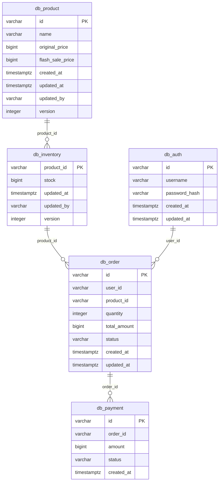

# Logical Data Model — Flash Sale System

Dokumen ini mendefinisikan skema tabel PostgreSQL yang **aktual** digunakan dalam sistem Flash Sale, diverifikasi langsung dari [`init-dbs.sh`](../../init-dbs.sh).

> [!IMPORTANT]
> Sistem ini mengimplementasikan **Database per Service** — setiap microservice memiliki database PostgreSQL yang **sepenuhnya terpisah**. Tidak ada tabel yang di-JOIN secara langsung antar database. Komunikasi data antar service **hanya** melalui gRPC (sinkron) atau Kafka event (asinkron).

---

## 1. Peta Database per Service

```
PostgreSQL Instance (shared container, logical databases terpisah)
│
├── db_product      → products
│
├── db_inventory    → inventories
│                   → outbox_messages  (Inventory Outbox)
│
├── db_order        → orders
│                   → outbox_messages  (Order Outbox)
│                   → processed_events (Order Idempotency Guard)
│
├── db_payment      → payments
│                   → outbox_messages  (Payment Outbox)
│                   → processed_events (Payment Idempotency Guard — reserved)
│
└── db_auth         → users
```

> [!NOTE]
> `outbox_messages` dan `processed_events` bukan tabel tunggal — mereka **duplikat strukturnya** di setiap database yang membutuhkan. Ini adalah keputusan desain yang disengaja: setiap service memiliki outbox-nya sendiri agar tidak ada coupling antar database.

---

## 2. Entity Relationship Diagram (Konseptual)

Meskipun tidak ada foreign key fisik antar database, berikut adalah hubungan **logis** antar entitas berdasarkan ID yang dibawa dalam Kafka events:



[🔍 Buka di Mermaid Live Editor (Gunakan Klik Kanan -> Open in New Tab)](https://mermaid.live/view#pako:eJy9lEFugzAQRa9ied1cgHV33fQAkawBT4JVbNPxmIiS3L0iCQgCrVIJlQ3S_D8wz5-hk4XXKDOJ9GrgSGD3TgghdK5q8joWLM7n3c53fcW4Bh17akUm9vKuK6P3cmxKlSxmSSP93HKTk72G1qLja8NVm9shcrn68BhG64Khu1X6qwEqSiBhtHh_W5YdWEzV3ByNY-Gpv0OlajLFUj5UEEoVoMJHAxuLgcHW_CUKQmDUCnhdj7Ve6MNUg5a3STOO8YgkGqRg_J35MoFPWazgpyhmx3AnCuyLj38a85bg8wkNOf-CtHz7ZwTHhtsFKXuGSoH10a0ABQaOYZs8p8zDN_489bgJjwBbjD4d7bpff0tjvjNjHBDCyZNWJYRyoyOUL9IiWTBaZp3kEm3_79J4gFixvFy-ATfWjUg)

---

## 3. Database `db_product`

**Service:** Product Service  
**Tabel:** 1 tabel

### Tabel `products`

Menyimpan data katalog produk yang dijual pada Flash Sale. Diakses oleh Product Service melalui gRPC `ListFlashSaleProducts`.

```sql
CREATE TABLE IF NOT EXISTS products (
    id               VARCHAR(50)  PRIMARY KEY,
    name             VARCHAR(255) NOT NULL,
    original_price   BIGINT       NOT NULL,
    flash_sale_price BIGINT       NOT NULL,
    created_at       TIMESTAMP WITH TIME ZONE DEFAULT CURRENT_TIMESTAMP,
    updated_at       TIMESTAMP WITH TIME ZONE DEFAULT CURRENT_TIMESTAMP,
    updated_by       VARCHAR(100),
    version          INTEGER DEFAULT 1
);
```

| Kolom | Tipe | Constraint | Keterangan |
|---|---|---|---|
| `id` | VARCHAR(50) | PK | Format: `prod_<id>` (contoh: `prod_1`) |
| `name` | VARCHAR(255) | NOT NULL | Nama produk |
| `original_price` | BIGINT | NOT NULL | Harga normal dalam satuan sen/IDR |
| `flash_sale_price` | BIGINT | NOT NULL | Harga Flash Sale (diskon) |
| `created_at` | TIMESTAMPTZ | DEFAULT NOW() | Waktu produk dibuat |
| `updated_at` | TIMESTAMPTZ | DEFAULT NOW() | Waktu produk terakhir diperbarui |
| `updated_by` | VARCHAR(100) | nullable | ID admin/sistem yang mengubah |
| `version` | INTEGER | DEFAULT 1 | Optimistic Concurrency Control |

**Data Seed:**
```sql
INSERT INTO products (id, name, original_price, flash_sale_price, updated_by)
VALUES 
    ('prod_1', 'Sepatu Lari X', 500000, 150000, 'system'),
    ('prod_2', 'Tas Ransel Y',  300000,  99000, 'system')
ON CONFLICT (id) DO NOTHING;
```

---

## 4. Database `db_inventory`

**Service:** Inventory Service  
**Tabel:** 2 tabel

### Tabel `inventories`

Menyimpan stok produk sebagai rekaman persisten (kebenaran logis/katalog) di database. Berfungsi sebagai backup dan sumber data utama untuk inventori produk.

```sql
CREATE TABLE IF NOT EXISTS inventories (
    product_id VARCHAR(50) PRIMARY KEY,
    stock      BIGINT NOT NULL,
    updated_at TIMESTAMP WITH TIME ZONE DEFAULT CURRENT_TIMESTAMP,
    updated_by VARCHAR(100),
    version    INTEGER DEFAULT 1
);
```

| Kolom | Tipe | Constraint | Keterangan |
|---|---|---|---|
| `product_id` | VARCHAR(50) | PK | Referensi logis ke `products.id` di `db_product` |
| `stock` | BIGINT | NOT NULL | Jumlah stok awal/persisten |
| `updated_at` | TIMESTAMPTZ | DEFAULT NOW() | Waktu stok terakhir diperbarui |
| `updated_by` | VARCHAR(100) | nullable | Contoh: `system`, `admin-001` |
| `version` | INTEGER | DEFAULT 1 | Optimistic Concurrency Control |

**Data Seed:**
```sql
INSERT INTO inventories (product_id, stock, updated_by)
VALUES 
    ('prod_1', 100, 'system'),
    ('prod_2',  50, 'system')
ON CONFLICT (product_id) DO NOTHING;
```

---

### Tabel `outbox_messages` (db_inventory)

Digunakan oleh **Transactional Outbox Pattern** di Inventory Service. Event `StockReservedEvent` ditulis ke sini dalam satu transaksi DB yang sama dengan operasi domain, kemudian **Relay Worker** mempublish ke Kafka topic `flashsale.inventory.events`.

```sql
CREATE TABLE IF NOT EXISTS outbox_messages (
    id             SERIAL        PRIMARY KEY,
    aggregate_id   VARCHAR(255)  NOT NULL,
    aggregate_type VARCHAR(255)  NOT NULL,
    event_type     VARCHAR(255)  NOT NULL,
    payload        JSONB         NOT NULL,
    trace_payload  VARCHAR(512),
    status         VARCHAR(50)   NOT NULL DEFAULT 'PENDING',
    created_at     TIMESTAMP WITH TIME ZONE DEFAULT CURRENT_TIMESTAMP
);
```

| Kolom | Tipe | Constraint | Keterangan |
|---|---|---|---|
| `id` | SERIAL | PK, auto-increment | ID internal outbox |
| `aggregate_id` | VARCHAR(255) | NOT NULL | ID entitas (contoh: `eventID` dari StockReservedEvent) |
| `aggregate_type` | VARCHAR(255) | NOT NULL | Tipe entitas (contoh: `inventory`) |
| `event_type` | VARCHAR(255) | NOT NULL | Nama event (contoh: `StockReservedEvent`) |
| `payload` | JSONB | NOT NULL | Isi event dalam format JSON |
| `trace_payload` | VARCHAR(512) | nullable | OpenTelemetry `traceparent` header untuk distributed tracing |
| `status` | VARCHAR(50) | NOT NULL, DEFAULT `'PENDING'` | `PENDING` → `SENT` (sukses) atau `FAILED` (gagal setelah 5x retry) |
| `created_at` | TIMESTAMPTZ | DEFAULT NOW() | Waktu event disisipkan |

**Siklus Hidup Status:**
```
INSERT (status=PENDING)
    → Relay Worker poll → Publish ke Kafka → UPDATE status=SENT
    → Jika gagal 5x → UPDATE status=FAILED
```

---

## 5. Database `db_order`

**Service:** Order Service  
**Tabel:** 3 tabel

### Tabel `orders`

Menyimpan semua transaksi pesanan. Dibuat oleh Order Service **secara reaktif** saat menerima `StockReservedEvent` dari Kafka. Status berubah sesuai event Kafka berikutnya.

```sql
CREATE TABLE IF NOT EXISTS orders (
    id           VARCHAR(50) PRIMARY KEY,
    user_id      VARCHAR(50) NOT NULL,
    product_id   VARCHAR(50) NOT NULL,
    quantity     INTEGER     NOT NULL,
    total_amount BIGINT      NOT NULL,
    status       VARCHAR(50) NOT NULL DEFAULT 'PENDING',
    created_at   TIMESTAMP WITH TIME ZONE DEFAULT CURRENT_TIMESTAMP,
    updated_at   TIMESTAMP WITH TIME ZONE DEFAULT CURRENT_TIMESTAMP
);
```

| Kolom | Tipe | Constraint | Keterangan |
|---|---|---|---|
| `id` | VARCHAR(50) | PK | Format: UUID v4 |
| `user_id` | VARCHAR(50) | NOT NULL | ID pembeli (dari JWT claim `sub`) |
| `product_id` | VARCHAR(50) | NOT NULL | ID produk yang dipesan |
| `quantity` | INTEGER | NOT NULL | Jumlah item yang dipesan |
| `total_amount` | BIGINT | NOT NULL | Total harga (`quantity × flash_sale_price`) |
| `status` | VARCHAR(50) | NOT NULL, DEFAULT `'PENDING'` | Lihat state machine di bawah |
| `created_at` | TIMESTAMPTZ | DEFAULT NOW() | Waktu order dibuat |
| `updated_at` | TIMESTAMPTZ | DEFAULT NOW() | Waktu order terakhir diperbarui |

**State Machine Status Order:**
```
PENDING ──(PaymentCompletedEvent)──→ PAID
        ──(PaymentFailedEvent)─────→ CANCELLED
        ──(Timeout > 15 menit)─────→ CANCELLED
```

---

### Tabel `outbox_messages` (db_order)

Digunakan untuk mempublish `OrderCancelledEvent` ke Kafka topic `flashsale.order.events`. Event ini diperlukan untuk memicu Saga Compensation (refund stok di Inventory Service).

```sql
CREATE TABLE IF NOT EXISTS outbox_messages (
    id             SERIAL        PRIMARY KEY,
    aggregate_id   VARCHAR(255)  NOT NULL,
    aggregate_type VARCHAR(255)  NOT NULL,
    event_type     VARCHAR(255)  NOT NULL,
    payload        JSONB         NOT NULL,
    trace_payload  VARCHAR(512),
    status         VARCHAR(50)   NOT NULL DEFAULT 'PENDING',
    created_at     TIMESTAMP WITH TIME ZONE DEFAULT CURRENT_TIMESTAMP
);
```

| Kolom | Tipe | Constraint | Keterangan |
|---|---|---|---|
| `id` | SERIAL | PK, auto-increment | ID internal outbox |
| `aggregate_id` | VARCHAR(255) | NOT NULL | ID pesanan yang dibatalkan |
| `aggregate_type` | VARCHAR(255) | NOT NULL | `order` |
| `event_type` | VARCHAR(255) | NOT NULL | `OrderCancelledEvent` |
| `payload` | JSONB | NOT NULL | Isi event dalam format JSON |
| `trace_payload` | VARCHAR(512) | nullable | OpenTelemetry `traceparent` header |
| `status` | VARCHAR(50) | NOT NULL, DEFAULT `'PENDING'` | `PENDING` → `SENT` atau `FAILED` |
| `created_at` | TIMESTAMPTZ | DEFAULT NOW() | Waktu event disisipkan |

**Event yang diproduksi:** `OrderCancelledEvent`  
**Kafka Topic:** `flashsale.order.events`

---

### Tabel `processed_events` (db_order)

**Idempotency Guard** untuk Order Service consumer. Setiap event Kafka yang berhasil diproses dicatat di sini agar tidak diproses ulang jika Kafka mengirim event yang sama dua kali (*at-least-once delivery*).

```sql
CREATE TABLE IF NOT EXISTS processed_events (
    event_id     VARCHAR(255) PRIMARY KEY,
    processed_at TIMESTAMP WITH TIME ZONE DEFAULT CURRENT_TIMESTAMP
);
```

| Kolom | Tipe | Constraint | Keterangan |
|---|---|---|---|
| `event_id` | VARCHAR(255) | PK | UUID unik event dari Kafka (field `event_id` di payload) |
| `processed_at` | TIMESTAMPTZ | DEFAULT NOW() | Waktu event berhasil diproses |

**Cara Penggunaan (dalam satu transaksi DB):**
```sql
-- Step 1: Cek apakah event sudah diproses
SELECT COUNT(*) FROM processed_events WHERE event_id = $1;

-- Step 2: Jika belum ada, proses dan catat dalam satu transaksi
BEGIN;
  -- Lakukan operasi bisnis (INSERT orders / UPDATE orders)
  INSERT INTO processed_events (event_id) VALUES ($1);
COMMIT;
```

---

## 6. Database `db_payment`

**Service:** Payment Service  
**Tabel:** 3 tabel

### Tabel `payments`

Menyimpan **audit log** semua transaksi pembayaran, baik yang berhasil maupun yang gagal.

```sql
CREATE TABLE IF NOT EXISTS payments (
    id       VARCHAR(50) PRIMARY KEY,
    order_id VARCHAR(50) NOT NULL,
    amount   BIGINT      NOT NULL,
    status   VARCHAR(50) NOT NULL DEFAULT 'SUCCESS',
    created_at TIMESTAMP WITH TIME ZONE DEFAULT CURRENT_TIMESTAMP
);
```

| Kolom | Tipe | Constraint | Keterangan |
|---|---|---|---|
| `id` | VARCHAR(50) | PK | Format: UUID v4 |
| `order_id` | VARCHAR(50) | NOT NULL | ID order terkait (referensi logis ke `orders.id`) |
| `amount` | BIGINT | NOT NULL | Jumlah yang dibayarkan |
| `status` | VARCHAR(50) | NOT NULL, DEFAULT `'SUCCESS'` | `SUCCESS` atau `FAILED` |
| `created_at` | TIMESTAMPTZ | DEFAULT NOW() | Waktu transaksi diproses |

**Aturan Simulasi Payment:**
```
amount mod 10 == 4  →  status = 'FAILED'   (contoh: 150004)
amount mod 10 != 4  →  status = 'SUCCESS'  (contoh: 150000)
```

---

### Tabel `outbox_messages` (db_payment)

Digunakan untuk mempublish hasil transaksi (`PaymentCompletedEvent` atau `PaymentFailedEvent`) ke Kafka topic `flashsale.payment.events`.

```sql
CREATE TABLE IF NOT EXISTS outbox_messages (
    id             SERIAL        PRIMARY KEY,
    aggregate_id   VARCHAR(255)  NOT NULL,
    aggregate_type VARCHAR(255)  NOT NULL,
    event_type     VARCHAR(255)  NOT NULL,
    payload        JSONB         NOT NULL,
    trace_payload  VARCHAR(512),
    status         VARCHAR(50)   NOT NULL DEFAULT 'PENDING',
    created_at     TIMESTAMP WITH TIME ZONE DEFAULT CURRENT_TIMESTAMP
);
```

| Kolom | Tipe | Constraint | Keterangan |
|---|---|---|---|
| `id` | SERIAL | PK, auto-increment | ID internal outbox |
| `aggregate_id` | VARCHAR(255) | NOT NULL | ID pesanan (order_id) terkait |
| `aggregate_type` | VARCHAR(255) | NOT NULL | `payment` |
| `event_type` | VARCHAR(255) | NOT NULL | `PaymentCompletedEvent` / `PaymentFailedEvent` |
| `payload` | JSONB | NOT NULL | Isi event dalam format JSON |
| `trace_payload` | VARCHAR(512) | nullable | OpenTelemetry `traceparent` header |
| `status` | VARCHAR(50) | NOT NULL, DEFAULT `'PENDING'` | `PENDING` → `SENT` atau `FAILED` |
| `created_at` | TIMESTAMPTZ | DEFAULT NOW() | Waktu event disisipkan |

**Event yang diproduksi:** `PaymentCompletedEvent`, `PaymentFailedEvent`  
**Kafka Topic:** `flashsale.payment.events`

---

### Tabel `processed_events` (db_payment)

Berfungsi sebagai **Idempotency Guard** untuk layanan Payment. Memastikan bahwa sebuah instruksi pembayaran (*ProcessPaymentCommand*) tidak diproses dua kali apabila terjadi kegagalan jaringan atau pengiriman ulang.

```sql
CREATE TABLE IF NOT EXISTS processed_events (
    event_id     VARCHAR(255) PRIMARY KEY,
    processed_at TIMESTAMP WITH TIME ZONE DEFAULT CURRENT_TIMESTAMP
);
```

| Kolom | Tipe | Constraint | Keterangan |
|---|---|---|---|
| `event_id` | VARCHAR(255) | PK | UUID unik event command |
| `processed_at` | TIMESTAMPTZ | DEFAULT NOW() | Waktu instruksi berhasil diproses |

---

## 7. Database `db_auth`

**Service:** Auth Service  
**Tabel:** 1 tabel

### Tabel `users`

Menyimpan akun pengguna. Password tidak pernah disimpan dalam bentuk plaintext — selalu di-*hash* dengan **bcrypt** sebelum disimpan.

```sql
CREATE TABLE IF NOT EXISTS users (
    id            VARCHAR(50)  PRIMARY KEY,
    username      VARCHAR(100) UNIQUE NOT NULL,
    password_hash VARCHAR(255) NOT NULL,
    created_at    TIMESTAMP WITH TIME ZONE DEFAULT CURRENT_TIMESTAMP,
    updated_at    TIMESTAMP WITH TIME ZONE DEFAULT CURRENT_TIMESTAMP
);
```

| Kolom | Tipe | Constraint | Keterangan |
|---|---|---|---|
| `id` | VARCHAR(50) | PK | Format: UUID v4 |
| `username` | VARCHAR(100) | UNIQUE, NOT NULL | Nama pengguna unik |
| `password_hash` | VARCHAR(255) | NOT NULL | bcrypt hash (cost factor default) |
| `created_at` | TIMESTAMPTZ | DEFAULT NOW() | Waktu akun dibuat |
| `updated_at` | TIMESTAMPTZ | DEFAULT NOW() | Waktu akun terakhir diperbarui |

---

## 8. Struktur `outbox_messages` — Tabel Bersama

Tabel `outbox_messages` hadir di **tiga database** dengan **struktur yang identik**. Berikut ringkasannya:

| Database | Producer Service | Event yang Disimpan | Kafka Topic Tujuan |
|---|---|---|---|
| `db_inventory` | Inventory Service | `StockReservedEvent` | `flashsale.inventory.events` |
| `db_order` | Order Service | `OrderCancelledEvent` | `flashsale.order.events` |
| `db_payment` | Payment Service | `PaymentCompletedEvent`, `PaymentFailedEvent` | `flashsale.payment.events` |

**Siklus Hidup Status Outbox (`PENDING` → `SENT` / `FAILED`):**

Sistem *Outbox* ini digerakkan oleh sebuah **Relay Worker** (berjalan di masing-masing service) yang terus-menerus mengecek tabel ini di latar belakang. Alur perubahannya adalah sebagai berikut:

1. **`PENDING` (Titik Awal)**
   Saat terjadi transaksi bisnis (contoh: stok berhasil dicadangkan), sistem tidak langsung mengirim pesan ke Kafka. Sistem menyisipkan pesan ke tabel ini dengan status `PENDING` di dalam **transaksi database yang sama** (`BEGIN ... COMMIT`). Ini menjamin bahwa pesan pasti tercatat jika transaksi sukses.

2. **`SENT` (Berhasil Terkirim)**
   - Relay Worker mencari baris berstatus `PENDING`.
   - Ia mengambil baris tersebut menggunakan perintah SQL `FOR UPDATE SKIP LOCKED`. Teknik ini sangat krusial agar jika ada dua *worker* yang berjalan bersamaan, mereka tidak berebut pesan yang sama.
   - Pekerja mencoba mengirim *payload* ke Kafka Broker.
   - Jika Kafka merespons dengan sukses, Relay Worker memperbarui status baris tersebut menjadi **`SENT`**. Tugas selesai.

3. **`FAILED` (Gagal Terkirim)**
   - Jika Kafka sedang mati atau jaringan terputus, pengiriman akan gagal.
   - Relay Worker tidak akan langsung menyerah; ia memiliki mekanisme *Retry* (misalnya maksimal 5 kali percobaan).
   - Namun, jika setelah seluruh percobaan habis dan Kafka masih tidak merespons, status baris akan diubah menjadi **`FAILED`**.
   - **Tujuan status FAILED:** Agar *worker* tidak terjebak *infinite loop* (mencoba mengirim pesan yang sama terus-menerus) yang berakibat menyumbat jalur pesan untuk pesanan konsumen lainnya. Status `FAILED` memungkinkan sistem melompati pesan rusak tersebut, sekaligus memberikan sinyal bagi tim *DevOps* untuk melakukan intervensi manual (monitoring).

**Query monitoring:**
```sql
-- Cek event yang gagal
SELECT * FROM outbox_messages WHERE status = 'FAILED' ORDER BY created_at DESC;

-- Cek event yang terlalu lama PENDING (Relay Worker mungkin mati)
SELECT * FROM outbox_messages 
WHERE status = 'PENDING' AND created_at < NOW() - INTERVAL '5 minutes';

-- Statistik per status
SELECT status, COUNT(*), MAX(created_at) as latest 
FROM outbox_messages 
GROUP BY status;
```

---

## 9. Standar Kolom Audit (Referensi Production)

Implementasi saat ini menggunakan pola yang disederhanakan. Untuk lingkungan produksi skala besar, pertimbangkan menambahkan:

| Kolom | Tipe | Keterangan |
|---|---|---|
| `created_by` | VARCHAR(100) | User ID atau nama service yang membuat record |
| `updated_by` | VARCHAR(100) | User ID atau nama service yang terakhir mengubah |
| `version` | INTEGER | Optimistic Concurrency Control — increment setiap UPDATE |
| `deleted_at` | TIMESTAMPTZ | Soft delete — set saat record "dihapus" tapi data dipertahankan |

Kolom `version` sudah ada di `products` dan `inventories`. Untuk tabel `orders` dan `payments`, penambahan kolom ini disarankan jika diperlukan optimistic locking.

---

## 10. Data Seed Awal

Script `init-dbs.sh` menyisipkan data *dummy* untuk keperluan demo dan testing:

### `db_product`.`products`

| `id` | `name` | `original_price` | `flash_sale_price` | `updated_by` |
|---|---|---:|---:|---|
| `prod_1` | Sepatu Lari X | 500.000 | 150.000 | `system` |
| `prod_2` | Tas Ransel Y | 300.000 | 99.000 | `system` |

### `db_inventory`.`inventories`

| `product_id` | `stock` | `updated_by` |
|---|---:|---|
| `prod_1` | 100 | `system` |
| `prod_2` | 50 | `system` |

Semua INSERT menggunakan `ON CONFLICT (...) DO NOTHING` agar aman dijalankan berulang kali (idempoten).

---

## 11. Referensi Perintah DML per Endpoint / Worker

Sebagai panduan operasional dan referensi kode, berikut adalah daftar operasi Data Manipulation Language (DML) murni PostgreSQL yang dieksekusi oleh masing-masing _endpoint_ dan _background worker_ di dalam *source code*.

### 1. `auth-service`

**`POST /api/v1/register`**
Mendaftarkan pengguna baru dengan melakukan insersi data.
```sql
INSERT INTO users (id, username, password_hash) VALUES ($1, $2, $3);
```

**`POST /api/v1/login`**
Mencocokkan kredensial pengguna dengan mengambil *hash* dari database.
```sql
SELECT id, username, password_hash FROM users WHERE username = $1;
```

### 2. `product-service`

**`GET /api/v1/products`**
Menarik daftar produk (mendukung limit dan offset untuk paginasi tingkat produksi).
```sql
SELECT id, name, original_price, flash_sale_price FROM products LIMIT $1 OFFSET $2;
```

### 3. `inventory-service`

**Reaksi dari gRPC `ReserveStock` (dipicu oleh `POST /api/v1/checkout`)**
Sistem menggunakan Outbox Pattern secara lokal untuk mendaftarkan *event*.
```sql
-- Memastikan event belum pernah direkam (Idempotensi di tingkat Outbox)
SELECT COUNT(1) FROM outbox_messages WHERE aggregate_id = $1;

-- Menulis event StockReservedEvent ke Outbox
INSERT INTO outbox_messages (aggregate_id, aggregate_type, event_type, payload, trace_payload, status)
VALUES ($1, $2, $3, $4, $5, 'PENDING');
```

### 4. `order-service`

**Kafka Consumer: Menerima `StockReservedEvent`**
Membuat baris pesanan baru secara *asynchronous* ketika pesanan sudah disetujui.
```sql
BEGIN;
-- Cek Idempotensi Kafka (mencegah duplikasi data jika consumer me-restart)
SELECT EXISTS(SELECT 1 FROM processed_events WHERE event_id = $1);
INSERT INTO processed_events (event_id) VALUES ($1);

-- Masukkan pesanan dengan status PENDING
INSERT INTO orders (id, user_id, product_id, quantity, total_amount, status) 
VALUES ($1, $2, $3, $4, $5, 'PENDING');
COMMIT;
```

**`GET /api/v1/orders/{order_id}`**
Mengembalikan data pesanan terbaru untuk memfasilitasi _Short-Polling_ dan penantian klien.
```sql
SELECT id, user_id, product_id, quantity, total_amount, status, created_at, updated_at 
FROM orders WHERE id = $1;
```

**Kafka Consumer: Menerima `PaymentFailedEvent` / `PaymentCompletedEvent`**
Mengubah status order berdasarkan hasil pembayaran (Sukses/Gagal).
```sql
BEGIN;
SELECT EXISTS(SELECT 1 FROM processed_events WHERE event_id = $1);
INSERT INTO processed_events (event_id) VALUES ($1);

-- Contoh Transisi Gagal (CANCELLED) & Publish Event Kompensasi
UPDATE orders SET status = 'CANCELLED', updated_at = NOW() WHERE id = $1 AND status = 'PENDING';
INSERT INTO outbox_messages (aggregate_id, aggregate_type, event_type, payload, trace_payload, status) VALUES (...);
COMMIT;
```

**`Timeout Worker` (Background Job)**
Menyapu pesanan yang masih `PENDING` melebihi batas waktu (misal: 15 menit).
```sql
-- 1. Mengambil order kadaluarsa
SELECT id, user_id, product_id, quantity, total_amount, status, created_at, updated_at 
FROM orders WHERE status = 'PENDING' AND created_at < $1;

-- 2. Membatalkan order dan melepas stok
BEGIN;
UPDATE orders SET status = 'CANCELLED', updated_at = CURRENT_TIMESTAMP WHERE id = $1;
INSERT INTO outbox_messages (aggregate_id, aggregate_type, event_type, payload, status) VALUES (...);
COMMIT;
```

### 5. `payment-service`

**`POST /api/v1/pay`**
Mensimulasikan proses bayar dan membangkitkan log transaksi.
```sql
BEGIN;
-- 1. Mencatat transaksi ke tabel payments
INSERT INTO payments (id, order_id, amount, status) VALUES ($1, $2, $3, $4);

-- 2. Mempublikasikan hasilnya ke Outbox
INSERT INTO outbox_messages (aggregate_id, aggregate_type, event_type, payload, trace_payload, status) 
VALUES ($1, $2, $3, $4, $5, 'PENDING');
COMMIT;
```

### 6. Kafka Relay Worker (Komponen Universal)

**Dieksekusi oleh: `inventory-service`, `order-service`, dan `payment-service`**
Berjalan dalam putaran iteratif untuk mengirim *outbox* ke *message broker*.
```sql
-- Lock baris yang akan diambil agar aman dari race condition antar instance (SKIP LOCKED)
SELECT id, aggregate_type, event_type, payload, COALESCE(trace_payload, '') as trace_payload 
FROM outbox_messages 
WHERE status = 'PENDING' 
ORDER BY created_at ASC 
LIMIT $1 FOR UPDATE SKIP LOCKED;

-- Update jika berhasil dikirim ke Kafka
UPDATE outbox_messages SET status = 'SENT' WHERE id = $1;
```
