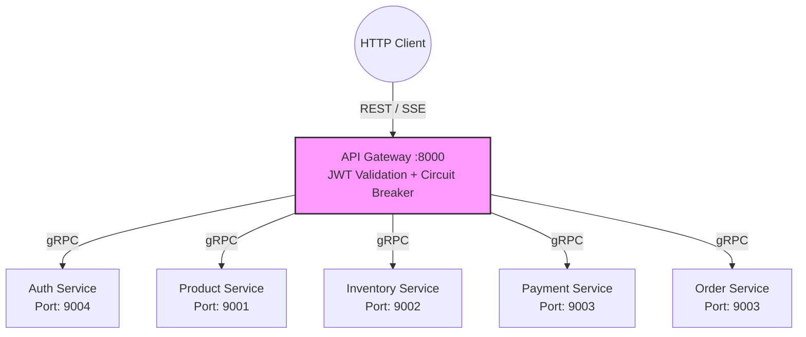

# Spesifikasi Kontrak gRPC

> [!IMPORTANT]
> Arsitektur ini menetapkan **Single Source of Truth** untuk kontrak gRPC.
> Seluruh definisi `.proto` yang asli dan digunakan oleh aplikasi berada di direktori **[`/proto/`](../../proto/)** di *root repository*. Kode Golang hasil *compile* berada di `/proto/gen/`.

---

## Daftar Service & Endpoint Aktif

Tabel berikut memetakan seluruh layanan gRPC kita dengan *source code* aslinya. Semua panggilan eksternal dari web/mobile selalu masuk ke API Gateway, yang kemudian bertindak sebagai *gRPC Client* ke *microservices* di bawahnya.

| Service | Port Internal | Endpoint | File Proto Asli |
|---|---|---|---|
| **Auth Service** | `9004` | `Register`, `Login` | [`proto/auth/v1/auth.proto`](../../proto/auth/v1/auth.proto) |
| **Product Service** | `9001` | `ListFlashSaleProducts` | [`proto/product/v1/product.proto`](../../proto/product/v1/product.proto) |
| **Inventory Service** | `9002` | `ReserveStock`, `ReleaseStock` (Internal) | [`proto/inventory/v1/inventory.proto`](../../proto/inventory/v1/inventory.proto) |
| **Order Service** | `9003` | `GetOrder` | [`proto/order/v1/order.proto`](../../proto/order/v1/order.proto) |
| **Payment Service** | `9003` | `ProcessPayment` | [`proto/payment/v1/payment.proto`](../../proto/payment/v1/payment.proto) |

> [!NOTE]
> *Order Service* **memiliki** gRPC endpoint (`GetOrder`). Endpoint ini digunakan oleh API Gateway untuk melayani request *Long-Polling* / SSE dari *client* (seperti halaman web) yang ingin mengecek status pesanan mereka apakah sudah berubah dari PENDING menjadi PAID atau CANCELLED.

---

## Pola Komunikasi gRPC (API Gateway -> Microservices)

### Konfigurasi Klien gRPC (Di API Gateway)
Seluruh panggilan gRPC antar-service menerapkan standar *resilience* berikut:
1. **Distributed Tracing**: Menggunakan `tracing.Client()` *middleware* untuk propagasi *trace context* (OpenTelemetry).
2. **Circuit Breaker**: Menggunakan `sony/gobreaker` yang diatur per-*service*. (Misal: jika Inventory mati, layanan Product tetap bisa dipanggil).
3. **Timeout Per-Call**: Diberlakukan timeout ketat **3 detik** menggunakan `context.WithTimeout`. Jika melebih batas ini, panggilan dibatalkan untuk menghindari *goroutine leak*.
4. **Keepalive Ping**: Melakukan ping *TCP* setiap 10 detik dengan timeout 5 detik untuk membuang koneksi "zombie" yang mati tanpa sinyal dari *network provider*.
