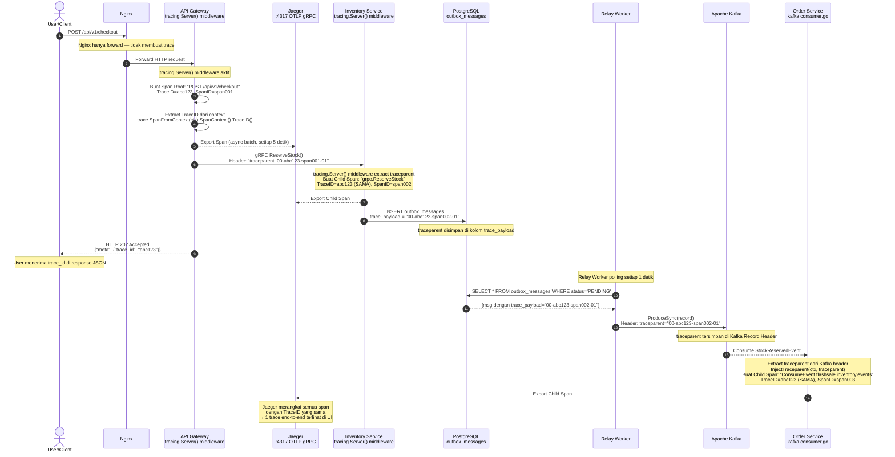
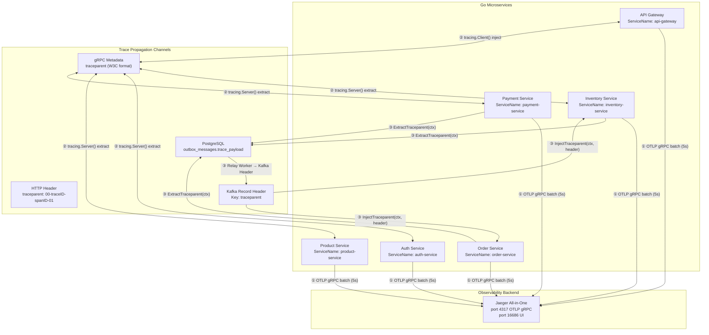

# Strategi Observability: Distributed Tracing ke Jaeger

Dokumen ini menjelaskan **bagaimana** telemetri dan distributed trace dihasilkan, dipropagasikan, dan dicatat ke Jaeger — mulai dari HTTP request masuk di Nginx, hingga event dikonsumsi Kafka Consumer di service terakhir.

> [!NOTE]
> Semua library, port, env variable, dan mekanisme dalam dokumen ini diverifikasi langsung dari source code dan `docker-compose.yml`.

---

## 1. Stack Observability yang Diimplementasikan

```
[ Go Services ] ──OTLP gRPC──→ [ Jaeger All-in-One ] ──→ [ Jaeger UI ]
                                port 4317 (internal)        port 16686
                                port 14317 (host)           port 16686 (host)
```

**Narasi Diagram:**

Diagram di atas menggambarkan aliran telemetri satu arah. Semua 6 Go services (API Gateway, Auth, Product, Inventory, Order, Payment) bertindak sebagai **producer span** — mereka menghasilkan data trace lalu mengirimkannya ke Jaeger menggunakan protokol **OTLP gRPC**. Jaeger All-in-One berperan sebagai **backend tunggal** yang menerima, menyimpan, dan menampilkan trace di web UI. Tidak ada komponen perantara (tanpa OTel Collector) — service langsung melempar data ke Jaeger.

Port `4317` adalah port standar OTLP di dalam jaringan Docker. Karena Jaeger diekspos ke host dengan mapping `14317 → 4317`, developer dapat mengakses Jaeger dari browser di `localhost:16686` sementara service dalam Docker tetap mengirim trace ke `jaeger:4317`.

> [!IMPORTANT]
> **Metrics (Prometheus/Grafana) belum diimplementasikan** di proyek ini. Saat ini hanya **Distributed Tracing via OpenTelemetry → Jaeger** yang aktif. Semua 6 service mengirim trace ke Jaeger.

### Library yang Digunakan

| Komponen | Library | Versi |
|---|---|---|
| OTel SDK | `go.opentelemetry.io/otel` | v1.x |
| OTLP Exporter | `go.opentelemetry.io/otel/exporters/otlp/otlptrace/otlptracegrpc` | v1.x |
| Propagator | `go.opentelemetry.io/otel/propagation` | W3C TraceContext + Baggage |
| Kratos Middleware | `github.com/go-kratos/kratos/v2/middleware/tracing` | v2.x |
| Jaeger Backend | `jaegertracing/all-in-one` (Docker) | latest |

### Konfigurasi Jaeger (docker-compose.yml)

```yaml
jaeger:
  image: jaegertracing/all-in-one:latest
  environment:
    - COLLECTOR_OTLP_ENABLED=true      # Aktifkan penerima OTLP
  ports:
    - "127.0.0.1:16686:16686"          # Jaeger UI
    - "127.0.0.1:14317:4317"           # OTLP gRPC (host port 14317 → container 4317)
    - "127.0.0.1:14318:4318"           # OTLP HTTP (opsional)
```

**Akses lokal:** `http://localhost:16686`

---

## 2. Inisialisasi Tracer per Service

Setiap service memanggil `telemetry.InitTracer()` saat startup (`main.go`), sebelum server gRPC/HTTP dimulai.

```go
// shared/pkg/telemetry/tracer.go
func InitTracer(ctx context.Context, serviceName string, endpoint string) (*sdktrace.TracerProvider, error) {
    // Export span via OTLP gRPC ke Jaeger
    exp, _ := otlptracegrpc.New(ctx,
        otlptracegrpc.WithInsecure(),
        otlptracegrpc.WithEndpoint(endpoint),   // "jaeger:4317" (internal Docker)
    )

    tp := sdktrace.NewTracerProvider(
        // Batch export setiap 5 detik (tidak blocking per span)
        sdktrace.WithBatcher(exp, sdktrace.WithBatchTimeout(5*time.Second)),
        // Tag service name di setiap span
        sdktrace.WithResource(resource.NewWithAttributes(
            semconv.SchemaURL,
            semconv.ServiceName(serviceName),   // "api-gateway", "inventory-service", dll.
        )),
    )

    otel.SetTracerProvider(tp)
    // Propagator W3C TraceContext: menggunakan header "traceparent" standard
    otel.SetTextMapPropagator(propagation.NewCompositeTextMapPropagator(
        propagation.TraceContext{},  // W3C standard
        propagation.Baggage{},
    ))
    return tp, nil
}
```

**Endpoint per environment:**

| Environment | Endpoint | Env Variable |
|---|---|---|
| Docker (dalam container) | `jaeger:4317` | `JAEGER_HOST=jaeger`, `JAEGER_OTLP_GRPC_PORT=4317` |
| Lokal (luar Docker) | `localhost:14317` | default fallback |
| Override penuh | env `OTEL_EXPORTER_OTLP_ENDPOINT` | prioritas tertinggi |

---

## 3. Alur Propagasi Trace: HTTP → gRPC → Kafka → Kafka Consumer

Berikut adalah alur lengkap bagaimana satu `TraceID` menyebar dari ujung ke ujung:



[🔍 Buka di Mermaid Live Editor (Gunakan Klik Kanan -> Open in New Tab)](https://mermaid.live/edit#base64:eyJjb2RlIjogInNlcXVlbmNlRGlhZ3JhbVxuICAgIGF1dG9udW1iZXJcbiAgICBhY3RvciBVIGFzIFVzZXIvQ2xpZW50XG4gICAgcGFydGljaXBhbnQgTkcgYXMgTmdpbnhcbiAgICBwYXJ0aWNpcGFudCBHVyBhcyBBUEkgR2F0ZXdheTxici8+dHJhY2luZy5TZXJ2ZXIoKSBtaWRkbGV3YXJlXG4gICAgcGFydGljaXBhbnQgSiBhcyBKYWVnZXI8YnIvPjo0MzE3IE9UTFAgZ1JQQ1xuICAgIHBhcnRpY2lwYW50IElOViBhcyBJbnZlbnRvcnkgU2VydmljZTxici8+dHJhY2luZy5TZXJ2ZXIoKSBtaWRkbGV3YXJlXG4gICAgcGFydGljaXBhbnQgSURCIGFzIFBvc3RncmVTUUw8YnIvPm91dGJveF9tZXNzYWdlc1xuICAgIHBhcnRpY2lwYW50IFJXIGFzIFJlbGF5IFdvcmtlclxuICAgIHBhcnRpY2lwYW50IEtGIGFzIEFwYWNoZSBLYWZrYVxuICAgIHBhcnRpY2lwYW50IE9SRCBhcyBPcmRlciBTZXJ2aWNlPGJyLz5rYWZrYSBjb25zdW1lci5nb1xuXG4gICAgVS0+Pk5HOiBQT1NUIC9hcGkvdjEvY2hlY2tvdXRcbiAgICBOb3RlIG92ZXIgTkc6IE5naW54IGhhbnlhIGZvcndhcmQgXHUyMDE0IHRpZGFrIG1lbWJ1YXQgdHJhY2VcbiAgICBORy0+PkdXOiBGb3J3YXJkIEhUVFAgcmVxdWVzdFxuXG4gICAgTm90ZSBvdmVyIEdXOiB0cmFjaW5nLlNlcnZlcigpIG1pZGRsZXdhcmUgYWt0aWZcbiAgICBHVy0+PkdXOiBCdWF0IFNwYW4gUm9vdDogXCJQT1NUIC9hcGkvdjEvY2hlY2tvdXRcIjxici8+VHJhY2VJRD1hYmMxMjMsIFNwYW5JRD1zcGFuMDAxXG4gICAgR1ctPj5HVzogRXh0cmFjdCBUcmFjZUlEIGRhcmkgY29udGV4dDxici8+dHJhY2UuU3BhbkZyb21Db250ZXh0KGN0eCkuU3BhbkNvbnRleHQoKS5UcmFjZUlEKClcbiAgICBHVy0tPj5KOiBFeHBvcnQgU3BhbiAoYXN5bmMgYmF0Y2gsIHNldGlhcCA1IGRldGlrKVxuXG4gICAgR1ctPj5JTlY6IGdSUEMgUmVzZXJ2ZVN0b2NrKCk8YnIvPkhlYWRlcjogXCJ0cmFjZXBhcmVudDogMDAtYWJjMTIzLXNwYW4wMDEtMDFcIlxuICAgIE5vdGUgb3ZlciBJTlY6IHRyYWNpbmcuU2VydmVyKCkgbWlkZGxld2FyZSBleHRyYWN0IHRyYWNlcGFyZW50PGJyLz5CdWF0IENoaWxkIFNwYW46IFwiZ3JwYy5SZXNlcnZlU3RvY2tcIjxici8+VHJhY2VJRD1hYmMxMjMgKFNBTUEpLCBTcGFuSUQ9c3BhbjAwMlxuICAgIElOVi0tPj5KOiBFeHBvcnQgQ2hpbGQgU3BhblxuXG4gICAgSU5WLT4+SURCOiBJTlNFUlQgb3V0Ym94X21lc3NhZ2VzPGJyLz50cmFjZV9wYXlsb2FkID0gXCIwMC1hYmMxMjMtc3BhbjAwMi0wMVwiXG4gICAgTm90ZSBvdmVyIElEQjogdHJhY2VwYXJlbnQgZGlzaW1wYW4gZGkga29sb20gdHJhY2VfcGF5bG9hZFxuXG4gICAgR1ctLT4+VTogSFRUUCAyMDIgQWNjZXB0ZWQ8YnIvPntcIm1ldGFcIjoge1widHJhY2VfaWRcIjogXCJhYmMxMjNcIn19XG4gICAgTm90ZSBvdmVyIFU6IFVzZXIgbWVuZXJpbWEgdHJhY2VfaWQgZGkgcmVzcG9uc2UgSlNPTlxuXG4gICAgTm90ZSBvdmVyIFJXOiBSZWxheSBXb3JrZXIgcG9sbGluZyBzZXRpYXAgMSBkZXRpa1xuICAgIFJXLT4+SURCOiBTRUxFQ1QgKiBGUk9NIG91dGJveF9tZXNzYWdlcyBXSEVSRSBzdGF0dXM9J1BFTkRJTkcnXG4gICAgSURCLS0+PlJXOiBbbXNnIGRlbmdhbiB0cmFjZV9wYXlsb2FkPVwiMDAtYWJjMTIzLXNwYW4wMDItMDFcIl1cblxuICAgIFJXLT4+S0Y6IFByb2R1Y2VTeW5jKHJlY29yZCk8YnIvPkhlYWRlcjogdHJhY2VwYXJlbnQ9XCIwMC1hYmMxMjMtc3BhbjAwMi0wMVwiXG4gICAgTm90ZSBvdmVyIEtGOiB0cmFjZXBhcmVudCB0ZXJzaW1wYW4gZGkgS2Fma2EgUmVjb3JkIEhlYWRlclxuXG4gICAgS0YtLT4+T1JEOiBDb25zdW1lIFN0b2NrUmVzZXJ2ZWRFdmVudFxuICAgIE5vdGUgb3ZlciBPUkQ6IEV4dHJhY3QgdHJhY2VwYXJlbnQgZGFyaSBLYWZrYSBoZWFkZXI8YnIvPkluamVjdFRyYWNlcGFyZW50KGN0eCwgdHJhY2VwYXJlbnQpPGJyLz5CdWF0IENoaWxkIFNwYW46IFwiQ29uc3VtZUV2ZW50IGZsYXNoc2FsZS5pbnZlbnRvcnkuZXZlbnRzXCI8YnIvPlRyYWNlSUQ9YWJjMTIzIChTQU1BKSwgU3BhbklEPXNwYW4wMDNcbiAgICBPUkQtLT4+SjogRXhwb3J0IENoaWxkIFNwYW5cbiAgICBOb3RlIG92ZXIgSjogSmFlZ2VyIG1lcmFuZ2thaSBzZW11YSBzcGFuPGJyLz5kZW5nYW4gVHJhY2VJRCB5YW5nIHNhbWE8YnIvPlx1MjE5MiAxIHRyYWNlIGVuZC10by1lbmQgdGVybGloYXQgZGkgVUkiLCAibWVybWFpZCI6ICJ7XG4gIFwidGhlbWVcIjogXCJkZWZhdWx0XCJcbn0iLCAiYXV0b1N5bmMiOiB0cnVlLCAidXBkYXRlRGlhZ3JhbSI6IHRydWV9)


**Narasi Diagram (Baca per langkah):**

1. **User → Nginx (langkah 1–2):** User mengirim `POST /api/v1/checkout`. Nginx menerima dan meneruskan request ke API Gateway tanpa membuat trace apapun — Nginx hanya bertindak sebagai reverse proxy dan rate limiter.

2. **API Gateway membuat Span Root (langkah 3–5):** Middleware `tracing.Server()` yang dipasang di API Gateway secara otomatis mencegat request yang masuk. Di sini untuk pertama kalinya **TraceID** (`abc123`) dan **SpanID** (`span001`) dibuat. TraceID ini akan menjadi "benang merah" yang menghubungkan semua komponen berikutnya. Secara asinkron (setiap 5 detik batch), span ini dikirim ke Jaeger.

3. **API Gateway → Inventory Service via gRPC (langkah 6):** Saat API Gateway memanggil `ReserveStock()` ke Inventory Service, middleware `tracing.Client()` secara otomatis menyisipkan header `traceparent` ke dalam gRPC metadata. Format `traceparent` adalah standar W3C: `00-{traceID}-{spanID}-{flags}`. Inventory Service pun menerima header ini dan "meneruskan" trace yang sudah berjalan.

4. **Inventory Service membuat Child Span (langkah 7):** Middleware `tracing.Server()` di Inventory Service membaca `traceparent` dari gRPC metadata. Ia membuat **child span baru** (`span002`) yang secara otomatis terhubung ke TraceID yang sama (`abc123`). Ini berarti kedua span (dari API Gateway dan dari Inventory Service) akan tampil bersama di Jaeger UI sebagai satu trace yang berkesinambungan.

5. **Menyimpan traceparent ke Outbox (langkah 8–9):** Di sinilah "jembatan" kritis terjadi — perpindahan dari dunia **synchronous** (gRPC) ke dunia **asynchronous** (Kafka). Inventory Service memanggil `telemetry.ExtractTraceparent(ctx)` untuk mengambil nilai traceparent dari context Go, lalu menyimpannya ke kolom `trace_payload` di tabel `outbox_messages`. Dengan demikian, informasi trace "tersimpan" di database dan tidak hilang meski proses selanjutnya terjadi beberapa detik kemudian.

6. **API Gateway membalas User (langkah 10–11):** API Gateway segera mengembalikan HTTP 202 Accepted ke user. Nilai `trace_id` disertakan di response JSON dalam field `meta.trace_id`. User kini bisa menggunakan nilai ini untuk mencari trace di Jaeger UI kapanpun.

7. **Relay Worker membaca dan meneruskan trace (langkah 12–15):** Outbox Relay Worker yang berjalan sebagai goroutine terpisah, polling setiap 1 detik. Ia membaca baris PENDING dari `outbox_messages` — termasuk `trace_payload` yang tersimpan. Saat mempublish ke Kafka, Worker menempelkan nilai ini sebagai **Kafka Record Header** dengan key `traceparent`. Dengan cara ini, trace "berpindah" dari PostgreSQL ke Kafka.

8. **Order Service melanjutkan trace (langkah 16–18):** Order Service consumer membaca record Kafka dan mencari header `traceparent`. Fungsi `telemetry.InjectTraceparent(ctx, traceparent)` memasukkan nilai ini ke dalam Go context, lalu `otel.Tracer().Start()` membuat child span baru (`span003`) — masih dengan TraceID yang sama (`abc123`). Semua operasi database yang dilakukan Order Service (INSERT ke tabel `orders`) otomatis "berada di bawah" span ini.

9. **Jaeger merangkai semua span (langkah 19):** Jaeger UI menampilkan satu trace dengan TraceID `abc123` yang memiliki tiga span dari tiga service berbeda: API Gateway, Inventory Service, dan Order Service — seolah-olah ketiganya adalah satu alur eksekusi yang berkesinambungan, meski secara teknis diselingi oleh jeda waktu Kafka.

---

## 4. Detail Implementasi: Propagasi di Setiap Layer

### Layer 1 — HTTP Server (API Gateway)

**Mekanisme:** `kratoshttp.Middleware(tracing.Server())`

go-kratos otomatis membaca header `traceparent` dari HTTP request (jika ada dari upstream) atau membuat TraceID baru. Span root dibuat untuk setiap HTTP request.

```go
// api-gateway/cmd/api-gateway/main.go
srv := kratoshttp.NewServer(
    kratoshttp.Middleware(
        tracing.Server(),   // ← Otomatis inject span ke context
    ),
)
```

Di handler, `trace_id` diambil dan disertakan di **setiap JSON response**:
```go
// handler.go — berlaku untuk semua endpoint
traceID := trace.SpanFromContext(ctx).SpanContext().TraceID().String()

return ctx.JSON(http.StatusAccepted, Response{
    Meta: Meta{
        TraceID: traceID,   // ← User menerima trace_id di response
        Message: "pesanan sedang diproses",
    },
})
```

### Layer 2 — gRPC Client (API Gateway → Service)

**Mekanisme:** `kratosgrpc.WithMiddleware(tracing.Client())`

Setiap gRPC call dari API Gateway ke service backend secara otomatis menyisipkan `traceparent` ke gRPC metadata.

```go
// clients.go
connInv, _ := kratosgrpc.DialInsecure(ctx,
    kratosgrpc.WithEndpoint(inventoryEndpoint),
    kratosgrpc.WithMiddleware(tracing.Client()),  // ← Propagate trace ke gRPC metadata
)
```

### Layer 3 — gRPC Server (Inventory/Payment/Product/Auth Service)

**Mekanisme:** `kratosgrpc.Middleware(tracing.Server())`

Service backend menerima `traceparent` dari gRPC metadata dan membuat **child span** dengan TraceID yang sama.

```go
// inventory-service/cmd/inventory-service/main.go
grpcSrv := kratosgrpc.NewServer(
    kratosgrpc.Middleware(tracing.Server()),  // ← Extract trace dari gRPC metadata
)
```

### Layer 4 — Outbox → Kafka (Relay Worker)

**Mekanisme:** `trace_payload` di `outbox_messages` + Kafka Record Header

Ini adalah "jembatan" trace dari dunia synchronous (gRPC) ke dunia asynchronous (Kafka):

```go
// relay.go
// 1. Baca trace_payload dari outbox_messages
record := &kgo.Record{
    Topic: topic,
    Value: []byte(msg.Payload),
}

// 2. Tambahkan sebagai Kafka Header
if msg.TracePayload != "" {
    record.Headers = append(record.Headers, kgo.RecordHeader{
        Key:   "traceparent",
        Value: []byte(msg.TracePayload),
    })
}
```

Cara trace disimpan ke `outbox_messages.trace_payload`:
```go
// Di usecase/repository yang menulis ke outbox
traceparent := telemetry.ExtractTraceparent(ctx)
// INSERT INTO outbox_messages (..., trace_payload) VALUES (..., traceparent)
```

### Layer 5 — Kafka Consumer (Order Service & Inventory Service)

**Mekanisme:** `telemetry.InjectTraceparent()` + `otel.Tracer().Start()`

```go
// order-service/internal/adapter/inbound/kafka/consumer.go
func (c *Consumer) processRecord(ctx context.Context, record *kgo.Record) {
    // 1. Extract traceparent dari Kafka Header
    var traceparent string
    for _, h := range record.Headers {
        if h.Key == "traceparent" {
            traceparent = string(h.Value)
            break
        }
    }

    // 2. Inject traceparent ke dalam context Go
    ctxWithTrace := telemetry.InjectTraceparent(ctx, traceparent)

    // 3. Buat child span yang terhubung ke trace yang sama
    ctxWithTrace, span := otel.Tracer("order-service-consumer").Start(
        ctxWithTrace,
        "ConsumeEvent " + record.Topic,
    )
    defer span.End()

    // Semua operasi di bawah ini masuk ke span yang sama TraceID-nya
    c.dispatch(ctxWithTrace, record)
}
```

---

## 5. Diagram Arsitektur: Data Flow Telemetri ke Jaeger



[🔍 Buka di Mermaid Live Editor (Gunakan Klik Kanan -> Open in New Tab)](https://mermaid.live/edit#base64:eyJjb2RlIjogImZsb3djaGFydCBURFxuICAgIHN1YmdyYXBoIFNlcnZpY2VzW1wiR28gTWljcm9zZXJ2aWNlc1wiXVxuICAgICAgICBHV1tcIkFQSSBHYXRld2F5PGJyLz5TZXJ2aWNlTmFtZTogYXBpLWdhdGV3YXlcIl1cbiAgICAgICAgQVVbXCJBdXRoIFNlcnZpY2U8YnIvPlNlcnZpY2VOYW1lOiBhdXRoLXNlcnZpY2VcIl1cbiAgICAgICAgUFJbXCJQcm9kdWN0IFNlcnZpY2U8YnIvPlNlcnZpY2VOYW1lOiBwcm9kdWN0LXNlcnZpY2VcIl1cbiAgICAgICAgSU5bXCJJbnZlbnRvcnkgU2VydmljZTxici8+U2VydmljZU5hbWU6IGludmVudG9yeS1zZXJ2aWNlXCJdXG4gICAgICAgIE9SW1wiT3JkZXIgU2VydmljZTxici8+U2VydmljZU5hbWU6IG9yZGVyLXNlcnZpY2VcIl1cbiAgICAgICAgUEFbXCJQYXltZW50IFNlcnZpY2U8YnIvPlNlcnZpY2VOYW1lOiBwYXltZW50LXNlcnZpY2VcIl1cbiAgICBlbmRcblxuICAgIHN1YmdyYXBoIFByb3BhZ2F0aW9uW1wiVHJhY2UgUHJvcGFnYXRpb24gQ2hhbm5lbHNcIl1cbiAgICAgICAgSFRUUFtcIkhUVFAgSGVhZGVyPGJyLz50cmFjZXBhcmVudDogMDAtdHJhY2VJRC1zcGFuSUQtMDFcIl1cbiAgICAgICAgR1JQQ1tcImdSUEMgTWV0YWRhdGE8YnIvPnRyYWNlcGFyZW50IChXM0MgZm9ybWF0KVwiXVxuICAgICAgICBQR1NRTFtcIlBvc3RncmVTUUw8YnIvPm91dGJveF9tZXNzYWdlcy50cmFjZV9wYXlsb2FkXCJdXG4gICAgICAgIEtBRktBW1wiS2Fma2EgUmVjb3JkIEhlYWRlcjxici8+S2V5OiB0cmFjZXBhcmVudFwiXVxuICAgIGVuZFxuXG4gICAgc3ViZ3JhcGggQmFja2VuZFtcIk9ic2VydmFiaWxpdHkgQmFja2VuZFwiXVxuICAgICAgICBKW1wiSmFlZ2VyIEFsbC1pbi1PbmU8YnIvPnBvcnQgNDMxNyBPVExQIGdSUEM8YnIvPnBvcnQgMTY2ODYgVUlcIl1cbiAgICBlbmRcblxuICAgICUlIFx1MjQ2MCBBbGlyYW4gU3BhbiBrZSBKYWVnZXIgXHUyMDE0IHNlbXVhIHNlcnZpY2Uga2lyaW0gc3BhbiB2aWEgT1RMUCBnUlBDXG4gICAgR1cgLS0+fFwiXHUyNDYwIE9UTFAgZ1JQQyBiYXRjaCAoNXMpXCJ8IEpcbiAgICBBVSAtLT58XCJcdTI0NjAgT1RMUCBnUlBDIGJhdGNoICg1cylcInwgSlxuICAgIFBSIC0tPnxcIlx1MjQ2MCBPVExQIGdSUEMgYmF0Y2ggKDVzKVwifCBKXG4gICAgSU4gLS0+fFwiXHUyNDYwIE9UTFAgZ1JQQyBiYXRjaCAoNXMpXCJ8IEpcbiAgICBPUiAtLT58XCJcdTI0NjAgT1RMUCBnUlBDIGJhdGNoICg1cylcInwgSlxuICAgIFBBIC0tPnxcIlx1MjQ2MCBPVExQIGdSUEMgYmF0Y2ggKDVzKVwifCBKXG5cbiAgICAlJSBcdTI0NjEgUHJvcGFnYXNpIHRyYWNlIHN5bmNocm9ub3VzIFx1MjAxNCBIVFRQICYgZ1JQQyBhbnRhciBzZXJ2aWNlXG4gICAgR1cgPC0tPnxcIlx1MjQ2MSB0cmFjaW5nLkNsaWVudCgpIGluamVjdFwifCBHUlBDXG4gICAgR1JQQyA8LS0+fFwiXHUyNDYxIHRyYWNpbmcuU2VydmVyKCkgZXh0cmFjdFwifCBJTlxuICAgIEdSUEMgPC0tPnxcIlx1MjQ2MSB0cmFjaW5nLlNlcnZlcigpIGV4dHJhY3RcInwgQVVcbiAgICBHUlBDIDwtLT58XCJcdTI0NjEgdHJhY2luZy5TZXJ2ZXIoKSBleHRyYWN0XCJ8IFBSXG4gICAgR1JQQyA8LS0+fFwiXHUyNDYxIHRyYWNpbmcuU2VydmVyKCkgZXh0cmFjdFwifCBQQVxuXG4gICAgJSUgXHUyNDYyIEplbWJhdGFuIGFzeW5jOiBnUlBDIFx1MjE5MiBQb3N0Z3JlU1FMIFx1MjE5MiBLYWZrYSBcdTIxOTIgQ29uc3VtZXJcbiAgICBJTiAtLT58XCJcdTI0NjIgRXh0cmFjdFRyYWNlcGFyZW50KGN0eClcInwgUEdTUUxcbiAgICBQQSAtLT58XCJcdTI0NjIgRXh0cmFjdFRyYWNlcGFyZW50KGN0eClcInwgUEdTUUxcbiAgICBPUiAtLT58XCJcdTI0NjIgRXh0cmFjdFRyYWNlcGFyZW50KGN0eClcInwgUEdTUUxcbiAgICBQR1NRTCAtLT58XCJcdTI0NjIgUmVsYXkgV29ya2VyIFx1MjE5MiBLYWZrYSBIZWFkZXJcInwgS0FGS0FcbiAgICBLQUZLQSAtLT58XCJcdTI0NjIgSW5qZWN0VHJhY2VwYXJlbnQoY3R4LCBoZWFkZXIpXCJ8IE9SXG4gICAgS0FGS0EgLS0+fFwiXHUyNDYyIEluamVjdFRyYWNlcGFyZW50KGN0eCwgaGVhZGVyKVwifCBJTiIsICJtZXJtYWlkIjogIntcbiAgXCJ0aGVtZVwiOiBcImRlZmF1bHRcIlxufSIsICJhdXRvU3luYyI6IHRydWUsICJ1cGRhdGVEaWFncmFtIjogdHJ1ZX0=)


**Narasi Diagram (Baca per kelompok panah):**

Diagram ini menampilkan tiga kelompok aliran yang terjadi secara bersamaan — masing-masing diberi nomor `①②③` yang sama dengan label panah di diagram:

**① Aliran Span ke Jaeger (label `① OTLP gRPC batch`):**
Setiap service memiliki koneksi langsung ke Jaeger melalui OTLP gRPC. Span dikumpulkan di memori selama 5 detik, lalu dikirim dalam satu batch. Cara ini efisien karena tidak menambah latensi per-request — span dikirim di belakang layar. Semua 6 service mengirim data dengan `serviceName` yang berbeda-beda, sehingga Jaeger dapat membedakan dan mengelompokkan span berdasarkan service asalnya.

**② Aliran Propagasi Trace antar Service (label `② tracing.Client() inject` dan `② tracing.Server() extract`):**
Ini bukan pengiriman data ke Jaeger, melainkan cara TraceID "berpindah" dari satu service ke service lain. Ada dua saluran propagasi synchronous:
- **HTTP Header** — digunakan saat request masuk dari luar (Client → API Gateway). Nilai `traceparent` bisa ada di header jika klien adalah service lain atau API test yang memasukkannya.
- **gRPC Metadata** — digunakan saat API Gateway memanggil service backend. `tracing.Client()` di sisi pemanggil menyisipkan nilai `traceparent` ke gRPC metadata, lalu `tracing.Server()` di sisi penerima membacanya dan melanjutkan trace.

**③ Jembatan Async: gRPC → Kafka (label `③ ExtractTraceparent` → `③ Relay Worker → Kafka Header` → `③ InjectTraceparent`):**
Ini adalah bagian paling kritis dari arsitektur tracing ini. Karena Kafka adalah sistem asynchronous, tidak ada cara "otomatis" untuk meneruskan trace context seperti yang dilakukan gRPC metadata. Solusinya adalah tiga langkah manual:
- Service yang menulis ke outbox memanggil `ExtractTraceparent(ctx)` → nilai `traceparent` disimpan ke kolom `trace_payload` di PostgreSQL.
- Relay Worker membaca `trace_payload` lalu memasukkannya sebagai Kafka Record Header (`traceparent`).
- Consumer Kafka (Order Service / Inventory Service) membaca header tersebut, memanggil `InjectTraceparent(ctx, header)` untuk memasukkan kembali ke Go context, lalu membuat child span baru.

Hasilnya: meski ada jeda waktu beberapa detik antara publish dan consume Kafka, semua span tetap terikat dalam satu TraceID yang sama di Jaeger UI.

---

## 6. Apa yang Terlihat di Jaeger UI?

Setelah melakukan checkout, buka `http://localhost:16686` dan cari service `api-gateway`. Anda akan melihat satu trace dengan struktur span sebagai berikut:

```
TraceID: abc123def456...
│
├── [api-gateway]       POST /api/v1/checkout              ~50ms  ← Span Root
│   │
│   └── [inventory-service]  grpc.ReserveStock             ~5ms   ← Child Span via gRPC
│
│   (setelah Kafka dispatch — span terpisah, TraceID sama)
│
├── [inventory-service] ConsumeEvent flashsale.order.events ~2ms  ← dari Kafka consumer
│
└── [order-service]     ConsumeEvent flashsale.inventory.events ~3ms  ← dari Kafka consumer
```

**Narasi Struktur Span:**

Pohon span di atas menunjukkan bagaimana satu checkout request menghasilkan aktivitas di 3 service berbeda, semuanya tercatat dalam satu TraceID.

- **Span Root `[api-gateway] POST /api/v1/checkout`** adalah titik masuk pertama. Durasi ~50ms mencerminkan total waktu yang dirasakan user — mulai dari request diterima hingga HTTP 202 dikembalikan. Di dalamnya terdapat child span gRPC karena API Gateway memanggil Inventory Service secara synchronous sebelum membalas user.

- **Child Span `[inventory-service] grpc.ReserveStock`** adalah waktu yang dihabiskan Inventory Service untuk menjalankan Lua Script di Redis dan menulis ke Outbox. Durasi ~5ms menunjukkan Redis Lua Script berjalan sangat cepat (microsecond) dan sebagian besar waktu dihabiskan untuk INSERT ke PostgreSQL.

- **Span terpisah `[inventory-service] ConsumeEvent flashsale.order.events`** — perhatikan bahwa span ini **tidak bersarang** di bawah span Root. Ini karena ia terjadi di waktu berbeda (beberapa detik kemudian) setelah Kafka dispatch. Namun TraceID-nya sama, sehingga Jaeger tetap menampilkannya dalam satu trace yang sama. Ini adalah hasil dari jembatan `trace_payload` di outbox.

- **Span terpisah `[order-service] ConsumeEvent flashsale.inventory.events`** — sama seperti di atas, ini adalah span Kafka consumer di Order Service yang melanjutkan trace dari Inventory Service consumer. Durasi ~3ms adalah waktu Order Service untuk membaca processed_events dan INSERT ke tabel `orders`.

> [!TIP]
> Di Jaeger UI, span-span yang terjadi di waktu yang jauh berbeda (karena Kafka delay) akan terlihat sebagai "gap" kosong di timeline view. Ini normal — artinya event sedang dalam antrian Kafka. Gunakan tampilan "Trace Graph" (bukan Timeline) untuk melihat hubungan parent-child antar span lebih jelas.

**Tips mencari trace:**
- Gunakan `trace_id` yang dikembalikan di respons JSON `meta.trace_id`
- Filter by service name: `api-gateway`
- Filter by operation: `POST /api/v1/checkout`
- Waktu range: sejak request dibuat ± 10 menit (karena ada Kafka delay)

---

## 7. Idempotency Guard

Selain tracing, sistem memiliki dua lapis idempotency untuk mencegah duplikasi operasi:

### A. API Level — Redis Idempotency Key

Saat checkout, client dapat mengirim header `X-Idempotency-Key`:

```http
POST /api/v1/checkout
X-Idempotency-Key: uuid-unik-per-request
```

Inventory Service menyimpan key ini di Redis sebagai `reserve_idemp:{eventID}` dengan **TTL 7200 detik (2 jam)**. Request kedua dengan key yang sama langsung ditolak tanpa memotong stok lagi.

```go
// lua_script.go — dicek di awal Lua Script sebelum operasi apapun
if redis.call("EXISTS", idemp_key) == 1 then
    return 0  -- duplikat, tolak
end
```

**Narasi mekanisme:**

Bayangkan user menekan tombol "Beli" dua kali dalam 1 detik karena jaringan lambat. Request pertama berhasil masuk dan Lua Script memotong stok sekaligus menyimpan key `reserve_idemp:{uuid}` di Redis dengan TTL 2 jam. Request kedua datang 300ms kemudian dengan `X-Idempotency-Key` yang sama — Lua Script langsung mendeteksi key sudah ada dan mengembalikan `0` (gagal) tanpa menyentuh stok sama sekali. Dari sisi user, mereka menerima satu respons sukses dan satu respons conflict — tapi stok hanya terpotong **sekali**.

### B. Kafka Consumer — Tabel `processed_events`

Setiap event Kafka yang berhasil diproses dicatat di tabel `processed_events` (PostgreSQL) dalam **satu transaksi atomik** dengan operasi bisnis utama:

```sql
-- Di dalam satu transaksi DB:
BEGIN;
  -- Operasi bisnis (INSERT orders / UPDATE orders)
  INSERT INTO processed_events (event_id) VALUES ('evt_uuid_123');
  -- Jika event_id sudah ada → Primary Key violation → rollback otomatis
COMMIT;
```

Kafka offset hanya di-commit **setelah** transaksi DB berhasil (`DisableAutoCommit` + manual `CommitUncommittedOffsets`). Jika service crash sebelum commit offset, Kafka akan re-deliver event — tapi karena `event_id` sudah ada di `processed_events`, operasi bisnis tidak akan diulangi.

**Narasi mekanisme — skenario crash recovery:**

Bayangkan Order Service menerima `StockReservedEvent`, lalu INSERT ke tabel `orders` berhasil dan INSERT ke `processed_events` berhasil — tapi sebelum sempat commit offset ke Kafka, service crash (mati mendadak karena OOM atau deployment). Saat service restart, Kafka mendeteksi offset belum di-commit dan mengirim ulang event yang sama. Order Service mencoba INSERT ke `processed_events` lagi dengan `event_id` yang sama — database melempar **Primary Key Constraint Violation**. Order Service menangkap error ini, melakukan rollback, dan meng-commit offset Kafka tanpa membuat order duplikat. Satu event, satu order — dijamin oleh database constraint.

```
Alur aman (happy path):
  Kafka deliver event → BEGIN txn → INSERT orders → INSERT processed_events
  → COMMIT txn → CommitKafkaOffset ✅

Alur crash recovery:
  Kafka re-deliver event → BEGIN txn → INSERT orders → INSERT processed_events
  → PK VIOLATION → ROLLBACK → CommitKafkaOffset ✅ (skip, bukan error)
```

---

## 8. Cara Menggunakan Jaeger

### Akses UI
```
http://localhost:16686
```

### Pencarian Trace

| Metode | Cara |
|---|---|
| **Via trace_id** | Tempel `trace_id` dari JSON response ke kotak search Jaeger |
| **Via Service** | Pilih service dari dropdown (api-gateway, inventory-service, dll.) |
| **Via Tag** | Filter `http.method=POST` atau `http.route=/api/v1/checkout` |
| **Via Timerange** | Set waktu sejak request dibuat |

### Interpretasi Span

| Warna Span | Arti |
|---|---|
| 🟦 Biru | Span berhasil |
| 🟥 Merah | Span error (klik untuk lihat error message) |
| Nested | Span parent-child (indentasi = hierarki panggilan) |
